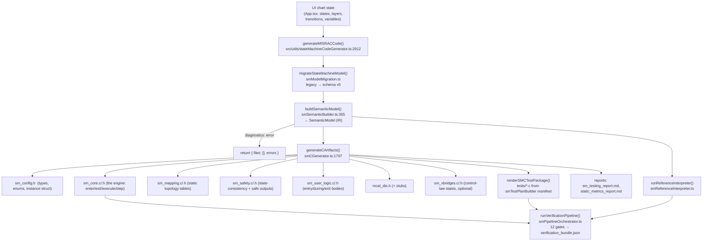
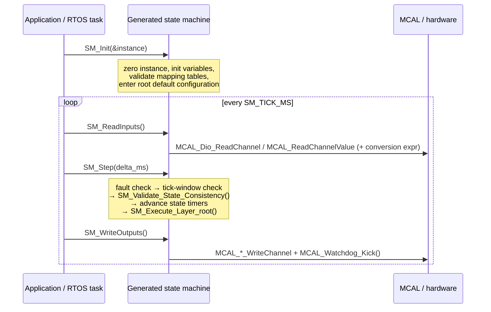
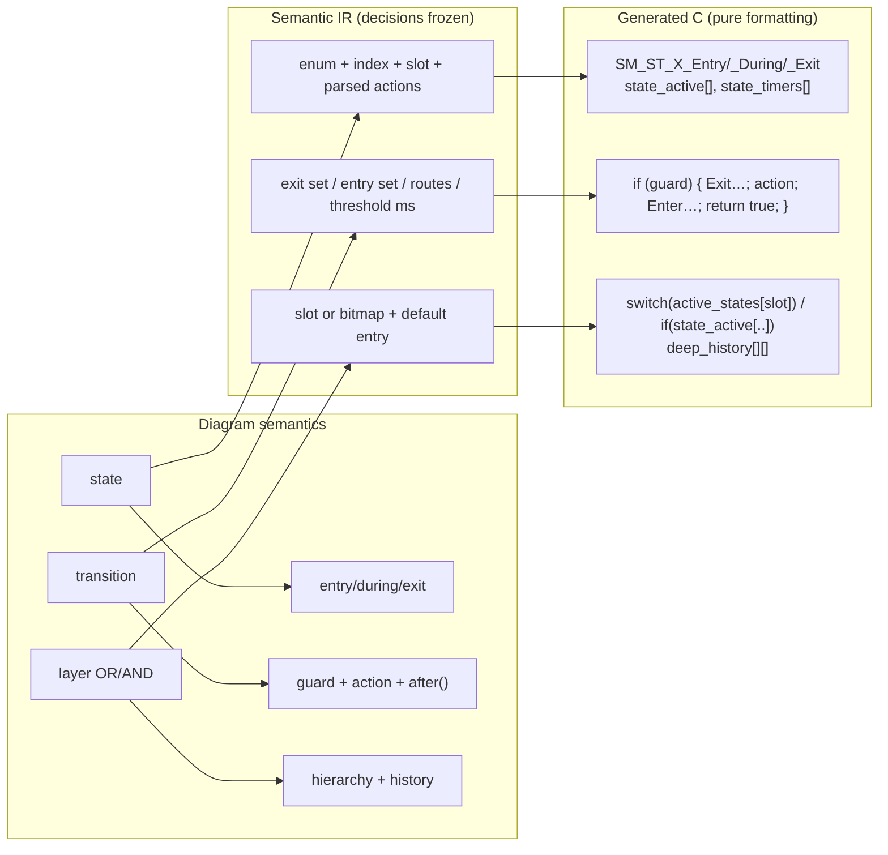

# How ADIA Generates C Code From a State Machine

*A walkthrough of the concept, the logic, and the actual code paths — with real generated output.*

---

## 0. TL;DR — the one-paragraph version

ADIA is a **model-driven code generator**, not an AI code writer. When you press *Generate*, the
drawn chart (states, layers, transitions, variables, actions) is **migrated** to a versioned schema,
**compiled into a Semantic IR** (a normalized, index-based intermediate representation where every
name has become a C identifier, every guard/action string has become an AST, and every transition has
been resolved into an explicit *exit set / entry set* path), **validated** against structural and
semantic rules, and then **rendered** by a set of pure functions that emit deterministic, MISRA-oriented
C99/C11 text. The same IR also drives a reference interpreter, an auto-generated unit-test suite, and a
12-gate verification pipeline that compiles and runs the generated code. **No LLM is involved in the
codegen path** — the output is a pure function of the model, so the same model always produces
byte-identical files.

```
Chart (UI state)  →  Model v5 JSON  →  Semantic IR  →  Renderers  →  C files (+ tests + reports)
                          ▲                 │
                     migration          reference interpreter → differential evidence
```

---

## 1. The concept: why an IR sits in the middle

A state chart is a *graph*; C is a *sequential language*. You cannot translate one to the other
one-node-at-a-time, because a single transition arrow implies:

* which states must run their **exit** actions, in which order (innermost → outermost),
* which states must run their **entry** actions (outermost → innermost),
* which **history** must be recorded on the way out,
* which **default entry** must be taken on the way in if the destination is a composite state,
* what happens to the **sibling regions** of an AND (parallel) decomposition.

So ADIA does what a compiler does: it **lowers** the diagram into an IR where all of that is already
decided and explicit, and only then does a *dumb, total* renderer walk the IR and print C. This split
is the central design idea:

| Stage | Responsibility | Decisions made | Can it fail? |
|---|---|---|---|
| Builder (`smSemanticBuilder.ts`) | Semantics | slot allocation, hierarchy order, LCA, exit/entry sets, AST parsing, C identifiers | yes → diagnostics |
| Validator (`smSemanticValidator.ts`, gates) | Legality | reachability, autostart, safe state, config sanity | yes → errors |
| Renderer (`smCGenerator.ts` + friends) | Text | none — it only formats what the IR already says | (essentially no) |

Because the renderer makes no decisions, the generated code can be argued about, diffed, and traced
back to the model, which is exactly what the safety/qualification story needs.

---

## 2. The pipeline, end to end



Entry points in the app:

| Caller | File | Purpose |
|---|---|---|
| Code-generation panel | `src/App.tsx:8365`, `src/App.tsx:13306` | user-facing "generate" |
| HIL workspace | `src/components/hil/HILWorkspace.tsx:157,248` | generate + build/flash for a target MCU |
| CLI / CI | `scripts/verify_sm_codegen.ts` (`npm run verify:sm:codegen`) | generate + full verification pipeline |

---

## 3. Stage 1 — the model (what the diagram actually is)

`src/types/sm_types.ts` + `src/utils/stateMachine/smModel.ts`

```ts
StateMachineModelV5 = {
  schemaVersion: 5,
  tickMs: number,                 // logical cycle time
  states:      StateData[],       // id, name, entry/during/exit source, priority, autostart, flags
  junctions:   JunctionData[],    // junction | history | deep-history pseudo-states
  transitions: TransitionData[],  // sourceId, targetId, condition, action, type, afterTicks, order
  variables:   VariableDef[],     // id, name, type (bool/int32/uint32/float/double/...), initialValue
  layers:      Layer[],           // containers: parentStateId + stateIds + transitionIds (OR | AND)
  safetyMode:  boolean,
  verification: SMVerificationConfig,   // cStandard, coverage targets, MISRA/static tool, targetId...
}
```

Two things to notice:

* **Layers, not "regions in states"** — hierarchy is expressed as `state → child layers → child states`.
  A layer's `decomposition` (`OR` = exclusive, `AND` = parallel) is what makes the generated code either
  a `switch` on one active slot or an `if` per child.
* **Actions and guards are plain strings** at this point (`"counter = counter + 1;"`, `"temp >= setpoint"`).
  They are user text; nothing is trusted yet.

`migrateStateMachineModel()` upgrades older charts (v≤4) — e.g. it infers `decomposition` from the legacy
`isParallel` flag — so the rest of the compiler only ever sees one shape.

---

## 4. Stage 2 — building the Semantic IR (the interesting part)

`buildSemanticModel()` — `src/utils/stateMachine/smSemanticBuilder.ts:365`

### 4.1 Hierarchy index & deterministic ordering

`buildHierarchyIndex()` walks the tree from the root layer and produces `orderedStateIds` /
`orderedLayerIds`. Children are sorted by **priority, then id** (`byPriorityThenId`), transitions by
**order, then id**. This ordering is the single source of determinism: state numbers, enum values,
function suffixes and array indices are all derived from it.

### 4.2 Active-slot allocation (the state-storage model)

```ts
// smSemanticBuilder.ts:114 — allocateActiveSlots
if (layer.decomposition === 'OR' && layer.stateIds.length > 0) slot = nextSlot++;
else                                                            slot = null;   // AND layers
```

* Every **OR layer** gets one `SM_Node_t` "active slot" → in C, `instance->active_states[slot]` holds
  *which* child is active (a fast `switch` dispatch).
* **AND layers** get no slot; all their children run, so activity is tracked in the per-state bitmap
  `instance->state_active[stateIdx]`.
* Both representations coexist and are cross-checked at runtime (see §7, `SM_Validate_State_Consistency`).

### 4.3 Expressions: string → AST → typed C

`smExpressions.ts` lexes/parses guards and actions into `ExpressionNode` / `ActionNode` trees
(`parseCondition`, `parseActions`). `smCExpressions.ts` renders them back out as C, and this is where
type discipline is injected:

```ts
// smCExpressions.ts — every assignment is emitted with an explicit cast to the target's C type
`instance->data.${target.cName} = (${cType(target.type)})(${renderCExpression(...)});`
```

Literals are typed by context (`80` vs `80U` vs `80.0f`), and every binary node is parenthesised, so the
output never depends on C operator-precedence subtleties. Identifiers go through `toCIdentifier()` +
`smCIdentifierPolicy.ts` (reserved-word and collision policy).

### 4.4 Transition lowering: exit sets, entry sets, routes

For each transition the builder computes the LCA of source and destination and fills in:

```ts
SemanticTransition {
  kind: 'outer' | 'inner' | 'internal-action' | 'external-self',
  lcaStateId, exitStateIds[], entryStateIds[],   // fully resolved paths
  triggerMode: 'condition' | 'after' | 'and' | 'or',
  temporalThresholdMs,                            // afterTicks × tickMs
  guard: ExpressionNode, actions: ActionNode[],
  routes: SemanticTransitionRoute[]               // one route per junction path (chains are flattened)
}
```

Junction chains (`state → junction → junction → state`) are flattened into a **route list**: each route
is a straight-line path with its own combined guard, its own exit set and entry set. That is why the
renderer never has to think about pseudo-states.

### 4.5 The resulting IR

```ts
SemanticModel {
  tickMs, safetyMode, safeStateId, rootLayerId, activeSlotCount,
  states: Record<id, SemanticState>,      // + enumName, activeSlot, activityIndex, ancestorStateIds,
  layers: Record<id, SemanticLayer>,      //   childLayerIds, parsed entry/during/exit actions
  transitions, transitionsBySource, junctions,
  variables: Record<id, SemanticVariable>,// + cName, C type, typed initial value
  ioMappings: SemanticIOMapping[],        // variable ↔ MCAL channel (+ conversion expr, safe value)
  traceableElements: TraceableElement[],  // model element → traceId (used for TRACE- comments)
  verification: ResolvedSMVerificationConfig, modelHash
}
```

---

## 5. Stage 3 — rendering: how text is actually produced

`src/utils/stateMachine/smCGenerator.ts` (~1 900 lines) is a collection of **pure render functions**
composed with a tiny helper:

```ts
const lines = (...parts) => parts.filter(p => typeof p === 'string').join('\n') + '\n';
```

`false`/`null` entries drop out, which is how conditional code (safety mode, xBridges, C90 vs C11,
slots vs no slots) is expressed without templating engines. There is no string-interpolated user text
that isn't escaped: `renderCStringLiteral()` escapes trace labels, `cCommentText()` neutralises `*/`
inside comments.

### 5.1 Naming and indexing conventions (all derived from the IR order)

| IR concept | C artifact | Example |
|---|---|---|
| state | enum constant `SM_ST_<ID>` + index macro `_IDX` | `SM_ST_HEATING`, `SM_ST_HEATING_IDX 2U` |
| state, per phase | 3 user-logic hooks | `SM_ST_HEATING_Entry/_During/_Exit` |
| state, per role | numbered statics | `SM_Enter_Deep_2`, `SM_Restore_State_2`, `SM_Execute_State_2` |
| layer | macro `SM_LYR_<ID>_IDX` + numbered statics | `SM_LYR_ROOT_IDX`, `SM_Execute_Layer_0` |
| OR layer | one entry in `active_states[]` | `instance->active_states[0U]` |
| variable | member of `SM_Data_t` | `instance->data.temp` |
| I/O channel | `MCAL_CH_<ID>` macro + MCAL call | `MCAL_Dio_WriteChannel(MCAL_CH_LED, ...)` |
| traceability | `/* TRACE-BEGIN: traceId=... */` comment pairs | `TRACE-TRANS-T_START` |

### 5.2 The emitted file set

| File | Rendered by | Contents |
|---|---|---|
| `sm_config.h` | `renderConfigHeader` | stdint/bool (or C90 shims), tick macros, state/layer counts and indices, `SM_Node_t`, `SM_Error_t`, `SM_Data_t`, `struct ADIA_Instance` |
| `sm_mapping.c/.h` | `renderMappingSource/Header` | static topology tables (`SM_State_Parent_Layer_Map`, `SM_State_Active_Slot_Map`, `SM_Layer_*`) + `SM_Validate_Mapping_Configuration()` |
| `sm_core.c/.h` | `renderCoreSource/Header` | the engine: enter/exit/restore/execute functions, `SM_Init`, `SM_Reset`, `SM_ReadInputs`, `SM_Step`, `SM_WriteOutputs`, `SM_Sync_IO`, accessors, `ADIA_TESTING` hooks |
| `sm_safety.c/.h` | `renderSafetySource/Header` | `SM_Validate_State_Consistency()` (runtime invariant checker) and `SM_ApplySafeOutputs()` |
| `sm_user_logic.c/.h` | `renderUserLogic*` | one `_Entry/_During/_Exit` function per state, bodies = compiled action ASTs |
| `mcal_dio.h` (+ `mcal_dio_test_stubs.c`) | `renderMcalHeader/TestStubs` | hardware abstraction the generated code calls |
| `sm_xbridges.c/.h` | `xbCGenerator.ts` | numeric/control-law blocks embedded in a state (optional) |
| `tests/*.c`, `verification/test_manifest.json` | `smTestPlanBuilder` + `smCTestSuiteRenderer` | auto-derived unit tests (init, transitions, actions, timing, safety, io, reset, robustness, hierarchy) |
| `*.md` reports | `smReports.ts` | testing report + static metrics report |

---

## 6. Worked example (real output, generated while writing this doc)

### 6.1 The model

```
root (OR layer)
├── Idle      [autostart]  entry: heater_on = false;
└── Heating                entry: heater_on = true;
                           during: temp = temp + 1;
                           exit:  heater_on = false;
    └── heating_sub (OR layer)
        ├── Ramp [autostart]
        └── Hold

t_start : Idle    → Heating   when  start_btn        / cycles = cycles + 1;
t_done  : Heating → Idle      when  temp >= setpoint
t_ramp_hold : Ramp → Hold     after 50 ticks   (tickMs = 10 → 500 ms)

variables: temp int32=0, setpoint int32=80, start_btn bool=false,
           heater_on bool=false, cycles uint32=0
```

### 6.2 What the builder decided (IR)

```
states  : idle→SM_ST_IDLE(idx 1, slot 0), heating→SM_ST_HEATING(idx 2, slot 0),
          ramp→SM_ST_RAMP(idx 3, slot 1),  hold→SM_ST_HOLD(idx 4, slot 1)
layers  : root→SM_LYR_ROOT_IDX 0 (OR, slot 0, default=idle)
          heating_sub→SM_LYR_HEATING_SUB_IDX 1 (OR, slot 1, default=ramp)
activeSlotCount = 2
t_start : kind=outer, exit=[idle], entry=[heating], trigger=condition
t_ramp_hold : trigger=after, temporalThresholdMs = 50 × 10 = 500
```

### 6.3 `sm_config.h` — the model becomes data layout

```c
#define SM_TICK_MS 10U
#define SM_TICK_TOLERANCE_MS 1U
#define SM_TICK_MIN_MS 9U
#define SM_TICK_MAX_MS 11U
#define SM_NUM_STATES 4U
#define SM_NUM_LAYERS 2U
#define SM_NUM_ACTIVE_SLOTS 2U
#define SM_LYR_ROOT_IDX 0U
#define SM_LYR_HEATING_SUB_IDX 1U
/* State: Idle | Model ID: idle | C enum: SM_ST_IDLE */
#define SM_ST_IDLE_IDX 1U
...
typedef enum { SM_NODE_INVALID = 0, SM_ST_IDLE = 1, SM_ST_HEATING = 2,
               SM_ST_RAMP = 3, SM_ST_HOLD = 4 } SM_Node_t;

typedef struct {            /* SM_Data_t: variables, sorted by id for stable layout */
    uint32_t cycles;  bool heater_on;  int32_t setpoint;  bool start_btn;  int32_t temp;
} SM_Data_t;

struct ADIA_Instance {
    SM_Data_t data;
    SM_Node_t active_states[...SM_NUM_ACTIVE_SLOTS...];   /* OR-layer current child   */
    SM_Node_t history_states[...];                        /* shallow history          */
    bool      state_active[SM_NUM_STATES + 1U];           /* AND-safe activity bitmap */
    uint32_t  state_timers[SM_NUM_STATES + 1U];           /* per-state elapsed ms     */
    bool      deep_history[SM_NUM_LAYERS][SM_NUM_STATES + 1U];
    SM_Error_t error_status;  bool fault_latched;
};
```

Everything is **static, fixed-size, no malloc, no recursion** — the instance struct *is* the state
machine's memory, and multiple instances can run side by side.

### 6.4 `sm_user_logic.c` — actions become typed C

Model text `temp = temp + 1;` → AST → typed emission:

```c
void SM_ST_HEATING_During(ADIA_Instance_t *instance)
{
    instance->data.temp = (int32_t)((instance->data.temp + 1));
    SM_TraceAction(instance, "during:HEATING");
}
```

### 6.5 `sm_core.c` — the transition becomes a guarded, ordered commit block

`renderTransitionPhase()` → `renderCommitRoute()` produce exactly the exit/action/entry order that the
IR resolved:

```c
/* TRACE-BEGIN: traceId=TRACE-STATE-IDLE symbol=SM_ST_IDLE */
static bool SM_Execute_State_1(ADIA_Instance_t *instance)
{
    /* TRACE-BEGIN: traceId=TRACE-TRANS-T_START symbol=sm_trans_t_start */
    if (instance->data.start_btn) {
        SM_Exit_State(instance, SM_ST_IDLE, true);              /* 1. exit set (+ record history) */
        instance->data.cycles = (uint32_t)((instance->data.cycles + 1U));  /* 2. transition action */
        SM_TraceAction(instance, "transition:t_start");
        instance->state_active[SM_ST_HEATING_IDX] = true;       /* 3. entry set, outer → inner    */
        instance->state_timers[SM_ST_HEATING_IDX] = 0U;
        instance->active_states[0U] = SM_ST_HEATING;
        SM_ST_HEATING_Entry(instance);
        SM_Enter_Layer_Default_1(instance);                     /* 4. default entry of sub-layer  */
        return true;                                            /* run-to-completion: stop here   */
    }
    /* TRACE-END: traceId=TRACE-TRANS-T_START */
    SM_ST_IDLE_During(instance);
    return false;
}
/* TRACE-END: traceId=TRACE-STATE-IDLE */
```

An `after(...)` trigger becomes a timer comparison against the per-state timer, with the threshold
already converted to milliseconds:

```c
    if (instance->state_timers[SM_ST_RAMP_IDX] >= 500U) {   /* 50 ticks × 10 ms */
        SM_Exit_State(instance, SM_ST_RAMP, true);
        instance->state_active[SM_ST_HOLD_IDX] = true;
        instance->state_timers[SM_ST_HOLD_IDX] = 0U;
        SM_ST_HOLD_Entry(instance);
        return true;
    }
```

### 6.6 Hierarchy: OR layers dispatch, AND layers fan out

OR layer with a slot → `switch` (constant-time dispatch):

```c
static bool SM_Execute_Layer_0(ADIA_Instance_t *instance)     /* root, slot 0 */
{
    switch (instance->active_states[0U]) {
        case SM_ST_IDLE:    return SM_Execute_State_1(instance);
        case SM_ST_HEATING: return SM_Execute_State_2(instance);
        default: return false;
    }
}
```

AND layer (no slot) → every child is executed, with a re-check that the parent is still active after
each child (a child may have caused an outer transition):

```c
static bool SM_Execute_Layer_0(ADIA_Instance_t *instance)     /* same model, AND variant */
{
    bool transitioned = false;
    if (instance->state_active[SM_ST_RAMP_IDX]) {
        transitioned = SM_Execute_State_3(instance) || transitioned;
        if (!instance->state_active[SM_ST_HEATING_IDX]) { return transitioned; }
    }
    ...
}
```

Composite states execute **outer transitions first, then `During`, then inner transitions, then child
layers** (`renderExecuteFunctions`) — the classic Harel/Stateflow precedence:

```c
static bool SM_Execute_State_2(ADIA_Instance_t *instance)    /* Heating */
{
    bool transitioned = false;
    if (instance->data.temp >= instance->data.setpoint) {    /* outer transition t_done */
        SM_Exit_State(instance, SM_ST_HEATING, true);
        instance->state_active[SM_ST_IDLE_IDX] = true; ... SM_ST_IDLE_Entry(instance);
        return true;
    }
    SM_ST_HEATING_During(instance);                          /* during */
    transitioned = SM_Execute_Layer_0(instance) || transitioned;   /* children */
    if (!instance->state_active[SM_ST_HEATING_IDX]) { return transitioned; }
    return transitioned;
}
```

### 6.7 History

Exiting a layer snapshots both shallow and deep history before the children are exited:

```c
static void SM_Record_Layer_History(ADIA_Instance_t *instance, uint32_t layer)
{
    for (state_index = 0U; state_index <= SM_NUM_STATES; ++state_index)
        instance->deep_history[layer][state_index] = false;
    switch (layer) {
        case SM_LYR_ROOT_IDX:
            instance->history_states[0U] = instance->active_states[0U];
            instance->deep_history[SM_LYR_ROOT_IDX][SM_ST_IDLE_IDX]    = instance->state_active[SM_ST_IDLE_IDX];
            instance->deep_history[SM_LYR_ROOT_IDX][SM_ST_HEATING_IDX] = instance->state_active[SM_ST_HEATING_IDX];
            ...
```

A transition into a history junction then calls `SM_Restore_State_n(instance, layerIdx)`
(`renderRestoreLayer` / `renderRestoreStateBody`), which re-enters the recorded configuration
recursively, or falls back to the layer default when nothing was recorded.

---

## 7. The generated runtime contract (how the ECU uses it)



Defensive behaviour baked into every generated `SM_Step` (see `renderCoreSource`):

| Check | Failure mode | Reaction |
|---|---|---|
| `instance == NULL` | API misuse | `SM_ERR_NULL_INSTANCE` |
| `delta_ms` outside `[SM_TICK_MIN_MS, SM_TICK_MAX_MS]` | scheduler jitter | `SM_ERR_TIMING` + fault entry |
| `SM_Validate_State_Consistency()` | corrupted state (parent inactive, slot/bitmap mismatch, bogus history) | `SM_ERR_CONFIGURATION` + fault entry |
| timer overflow | long-lived state | saturate at `UINT32_MAX` (no wrap) |
| any fault, once latched | — | `SM_Exit_All → SM_Enter_Safe_State → SM_ApplySafeOutputs`, latched until reset |

Note the timing philosophy: `delta_ms` is only *validated* as physical jitter; the behaviour always
advances by the **logical** `SM_TICK_MS`, so simulation, host tests and target execution agree
bit-for-bit (`timerPolicy: 'logical-tick'`).

---

## 8. Making the output trustworthy

Generation is only half the story; the same IR feeds the verification chain.

1. **Structure self-check** — `verifyGeneratedCStructure()` (`smCGenerator.ts:1910`) parses the emitted
   `SM_Data_t` and cross-checks every `instance->data.X` reference in the produced text against the
   declared members, i.e. the generator audits its own output.
2. **Reference interpreter** — `smInterpreter.ts` / `smReferenceInterpreter.ts` execute the *same IR* in
   TypeScript. It is the executable specification behind the on-screen simulation and the differential
   evidence.
3. **Auto-derived test suite** — `smTestPlanBuilder.ts` turns the IR into a `SMTestManifest`
   (initialization, transitions true/false, actions, timing, safety, io, reset, robustness, hierarchy),
   and `smCTestSuiteRenderer.ts` renders it into compilable C with traceability headers:
   `Case ID / Requirements / Generated Functions`.
4. **12-gate pipeline** — `runVerificationPipeline()` (`smPipelineOrchestrator.ts`) writes an atomically
   updated `verification_bundle.json` after every gate:

| # | Gate | Adapter |
|---|---|---|
| 1–2 | structural / semantic model validation | in-process |
| 3 | test generation | `buildSMTestManifest` + `generateCArtifacts` |
| 4–6 | host compilation, host test run, sanitizers (ASan/UBSan) | `smCHarness.ts` (gcc) |
| 7 | statement / branch / MC-DC coverage | `smCoverageRunner.ts` |
| 8 | differential (C vs reference interpreter) | `smDifferentialEngine.ts` |
| 9–10 | static analysis, MISRA | `smAnalysisRunner.ts` (tool configured in model) |
| 11 | cross-compilation for the selected target pack | `smTargetCompileRunner.ts` |
| 12 | hardware-in-the-loop | pending physical bench |

`deriveAcceptance()` then decides pass/fail with the model's own policy (MC/DC only if
`requireMcdc`, target compile only if a `targetId` is set).

**Sanity check performed for this document:** the example package above was generated and compiled
clean with `gcc -std=c11 -Wall -Wextra -pedantic -c` on `sm_core.c sm_mapping.c sm_safety.c
sm_user_logic.c mcal_dio_test_stubs.c` — zero warnings.

---

## 9. The other generators in the repo (same concept, different domains)

| Generator | Path | Input → output |
|---|---|---|
| xBridges | `src/utils/stateMachine/xbCGenerator.ts` (+ `xbSemanticBuilder`, `xbShapeResolver`, `xbNumeric`) | control/numeric block diagram inside a state → `sm_xbridges.c/.h` with fixed-step solver code |
| OPM (Entropy) | `src/engine/opm/cGenerator.ts` → `cModelGenerator.ts` + `cRuntimeGenerator.ts` | OPM object-process model → bounded C99 runtime (`-std=c99 -pedantic-errors -Wall -Wextra -Werror`) with static resource limits |
| HIL / HAL | `src/engine/hil/hilCodeGenerator.ts` + `hilDriverTemplates.ts` | pin/channel config + target pack → MCU driver layer implementing `mcal_dio.h` |
| MCAL headers | `src/engine/mcal/mcalHeaderGenerator.ts` | channel model → MCAL interface |
| Delivery packaging | `src/engine/embedded/*` | generated sources → platform project (build files, manifest, content hashes) |

They all follow the identical three-step shape: **normalize → IR → pure renderers**, with the target
specifics isolated in *target packs* (`src/engine/targetPacks/`) rather than in the renderers.

---

## 10. Source map (where to look for what)

| Question | File |
|---|---|
| What does the app call when I press generate? | `src/utils/stateMachineCodeGenerator.ts:2912` (`generateMISRACCode`) |
| How is the diagram normalized? | `src/utils/stateMachine/smModelMigration.ts` |
| Where are the real semantics decided? | `src/utils/stateMachine/smSemanticBuilder.ts` (slots :114, build :365) |
| How are guards/actions parsed and typed? | `smExpressions.ts` → `smCExpressions.ts` |
| Where is the C text produced? | `smCGenerator.ts` (`generateCArtifacts` :1797, `renderCoreSource` :1379, `renderConfigHeader` :843) |
| Transition → C mapping | `renderTransitionPhase` :676, `renderCommitRoute` :582 |
| Enter/exit/history | `renderEnterFunctions` :410, `renderExitFunctions` :448, `renderRestoreLayer` :536 |
| Runtime invariant checking | `renderSafetySource` :1153 |
| Auto tests | `smTestPlanBuilder.ts`, `smCTestSuiteRenderer.ts`, `smCTestRuntimeRenderer.ts` |
| Verification orchestration | `smPipelineOrchestrator.ts`, `smCHarness.ts`, `smCoverageRunner.ts` |
| Golden expectations | `smCGenerator.test.ts` (≈50 k lines of assertions), `smGeneratedVerification.e2e.test.ts` |

---

## 11. Observations worth knowing (found while tracing the code)

These are honest notes about the current state of the pipeline, not blockers:

1. **`smTestPlanBuilder.ts:192/228/249` hard-codes `variableId: 'x'`** as the stimulus for
   transition/action test cases instead of deriving the variable from the transition's guard AST. For
   models whose guard variables aren't literally named `x`, the emitted `tests/test_sm_transitions.c`
   and `tests/test_sm_actions.c` reference `instance.data.x` and fail to compile (reproduced with the
   Heater example: `error: 'SM_Data_t' has no member named 'x'`). The fixtures used by the unit tests
   happen to declare a variable named `x`, which hides it.
2. **Gate 8 (differential) currently compares the reference trace to itself** —
   `smPipelineOrchestrator.ts:312-313` passes `refObservations` as both arguments, so the gate always
   passes. To be meaningful it needs the observations captured from the compiled C harness
   (`smCHarness`/`smHostHarness` already produce traces) as the candidate side.
3. **`verifyGeneratedCStructure()` is only invoked on the flat (non-package) path** —
   `generateCArtifacts` returns early when `includeVerificationPackage` is true (`smCGenerator.ts:1864`),
   so the structural self-audit is skipped for exactly the delivery-grade package.
4. **`modelHash` is hard-coded to `"0000000000000000"`** by the semantic builder
   (`smSemanticBuilder.ts:825`), so the value that flows into the test manifest and the verification
   bundle never identifies the model; wiring `computeModelFingerprint()` (`src/engine/opm/canonicalHash.ts`) into the SM path
   would make the evidence bundle uniquely tied to a model revision.

---

## 12. Mental model in one picture



*Model → IR is where the thinking happens; IR → C is where the typing happens.*
