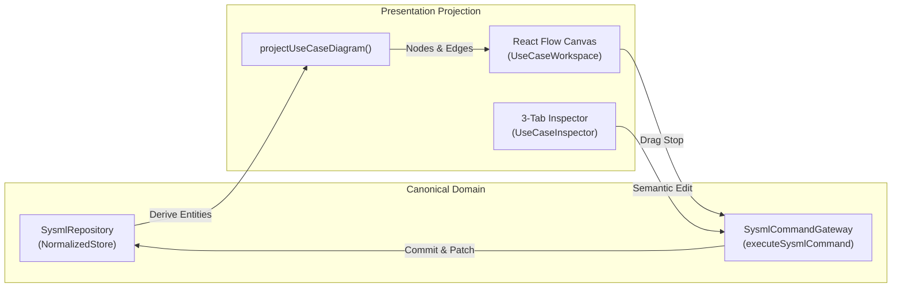

# SysML 1.6 Use-Case Conformance & Architecture Guide

**Profile Identifier:** `OMG-SysML-1.6-ADIA`  
**Normative Reference:** OMG Systems Modeling Language (SysML) v1.6 Clause 16 / ISO/IEC 19514:2017  
**Conformance Level:** `supported` (Capability `SYSML-032`)

---

## 1. Executive Summary

The ADIA SysML Use-Case module provides a first-class, Cameo-style SysML 1.6 use-case modeling environment. Rather than maintaining an isolated or React Flow-owned visual document, use-case artifacts are projected from the canonical `SysmlRepository` and mutations are routed through the central SysML Command Gateway.

This architecture ensures:
1. **Canonical Ownership:** Actors, Subjects, Use Cases, Extension Points, Diagram References, and Relationships reside in the authoritative SysML store.
2. **Fail-Closed Semantic Gate:** Connection policies, deletion cascades, and relationship constraints are enforced before commits; invalid operations trigger explanatory policy diagnostics.
3. **Pure Presentation Projection:** Node positions, bounds, zoom, and selections are separated from semantic definitions. Moving nodes (node drag) updates layout without advancing semantic model revisions or altering transaction histories.
4. **Bidirectional Traceability:** Seamless cross-diagram navigation connects Use Cases to realizing BDD blocks, requirement traces (`refine`, `satisfy`, `verify`, `trace`), and elaborating behavior diagrams (Activity, Sequence, State Machine).
5. **Cameo-Grade Notation:** Standard SysML 1.6 visual markers including stick-figure actors, oval use cases, rectangular subjects, dashed `«include»` and `«extend»` dependency arrows, hollow generalization triangles, and extension point lists.
6. **Persistence & Interchange:** Fully backward-compatible round-trip serialization in project files and `usecase.json`, high-fidelity SVG report generation, and diagnostic-backed PlantUML export.

---

## 2. Metamodel Architecture

### 2.1 Canonical Entities

Defined in `src/engine/sysml/model.ts` and validated in `src/engine/sysml/useCases.ts`:

- **Actor (`ActorDefinition`):** Represents external entities (human, system, device) interacting with the subject system.
  - Fields: `id`, `name`, `isHuman?: boolean`, `namespace?: readonly string[]`.
- **Subject (`SubjectDefinition`):** The boundary classifier or subsystem realized by the use cases.
  - Fields: `id`, `name`, `classifierId?: string`, `namespace?: readonly string[]`.
- **Use Case (`UseCaseDefinition`):** Unit of functional capability provided by the subject.
  - Fields: `id`, `name`, `subjectId?: string`, `extensionPoints?: readonly string[]`, `elaboratingDiagramId?: string`.
- **Extension Point (`ExtensionPoint`):** Declared location in a use case where behaviors may be extended.
  - Fields: `id`, `useCaseId`, `name`, `condition?: string`.
- **Diagram Reference (`DiagramReference`):** Typed link to an Activity, Sequence, or State-Machine diagram detailing behavior.
  - Fields: `id`, `sourceElementId`, `diagramId`, `diagramKind`, `role: 'elaborating' | 'context' | 'verification'`.

### 2.2 Relationship Legality Matrix

All use-case relationships are classified and validated through `src/engine/sysml/connectionPolicy.ts`:

| Relationship Kind | Source Family | Target Family | Stereotype Notation | Line Style | Marker Style |
|---|---|---|---|---|---|
| `useCaseAssociation` | `actor` or `useCase` | `useCase` or `actor` | (none) | Solid | Open arrow / None |
| `include` | `useCase` | `useCase` | `«include»` | Dashed | Open arrow |
| `extend` | `useCase` (extension) | `useCase` (base) | `«extend»` | Dashed | Open arrow |
| `useCaseGeneralization` | `actor` or `useCase` | Same family | (none) | Solid | Hollow closed triangle |
| `refine` / `satisfy` | `useCase` | `requirement` | `«refine»` / `«satisfy»` | Dashed | Open arrow |

---

## 3. Projection & State Synchronization

- **Projection:** `projectUseCaseDiagram(repo, options)` projects canonical actors, subjects, use cases, and relationships into React Flow nodes and edges, overlaying persisted presentation coordinates.
- **Drag & Presentation Updates:** Layout modifications dispatch `updatePresentation` commands. The normalized store updates spatial coordinates without bumping `repository.revision` or altering transaction records.
- **Semantic Mutations:** Creating elements, editing stereotypes, renaming, adding extension points, or reconnecting edges executes semantic commands (`createElement`, `updateElement`, `deleteElements`) with undo/redo patch tracking.

---

## 4. Cross-Diagram Traceability & Navigation

The module integrates natively with all SysML viewpoints:

1. **BDD / IBD Realization:**
   - Use cases and subjects can link to a realizing SysML Block via `subjectBlockId`.
   - The inspector provides an "Open Realizing Block in BDD" action jumping directly to the classifier.
2. **Requirements / RTM Matrix:**
   - Use cases link to requirements through `refine`, `satisfy`, `verify`, and `trace` relationships.
   - Traceability links appear in the inspector and in the global Requirements Traceability Matrix (`src/components/sysml/TraceabilityMatrix.tsx`).
3. **Elaborating Behavior Diagrams:**
   - The `UseCaseReferencePicker` inspects the project for Activity, Sequence, and State Machine diagrams.
   - Dangling or missing diagram IDs are flagged with explicit warning diagnostics.

---

## 5. Engineering Reports & PlantUML Export

- **HTML / SVG Reports (`src/features/reporting/reportDiagrams.ts`):**
  - `renderUseCaseDiagram(source)` outputs publication-grade SVG figures with Cameo-style typography, boundary outlines, dashed dependency styling, and extension point callouts.
  - Automatically included in comprehensive system architecture snapshots and DOCX/PDF export pipelines.
- **PlantUML Export (`src/features/plantuml/adapters/useCaseAdapter.ts`):**
  - `generateUseCasePlantUmlFromRepository(repo)` translates canonical use-case models into clean PlantUML syntax with `rectangle` subjects, `<<include>>`, `<<extend>>`, and extension points.
  - Produces diagnostic records for dangling endpoints or unrecognized structures.

---

## 6. Automated Verification Matrix

| Verification Scope | Test File | Key Assurances |
|---|---|---|
| **Metamodel & Legality** | `src/engine/sysml/useCases.test.ts` | Type safety, field validation, relationship rules, self-connection rejection. |
| **Store & Migration** | `src/engine/sysml/useCaseMigration.test.ts` | Legacy `useCaseDiagrams` JSON conversion, deterministic IDs, zero data loss. |
| **Command Lifecycle** | `src/engine/sysml/useCaseLifecycle.test.ts` | Create, update, connect, disconnect, delete cascade, undo/redo through gateway. |
| **Visual Projection** | `src/components/usecase/useCaseProjection.test.ts` | Cameo edge styles, presentation coordinates merge, filtering. |
| **Inspector & UI** | `src/components/usecase/UseCaseInspector.test.tsx` | 3-tab inspector, typed selectors, extension points, navigation actions. |
| **Reports & Export** | `src/features/reporting/reportDiagrams.usecase.test.ts` | SVG generation, multi-page chunking, relationship markers. |
| **PlantUML Adapter** | `src/features/plantuml/adapters/useCaseAdapter.test.ts` | PlantUML syntax generation, diagnostic error recording. |
| **Large Model Perf** | `src/engine/sysml/useCaseLargeModel.test.ts` | 1000+ elements projection < 100ms, O(1) index lookups, zero revision advance on drag. |
| **Browser E2E** | `tests/e2e/sysml-usecase-conformance.spec.ts` | Real-browser creation, toolbar actions, 3-tab inspector, save/load persistence. |

---

## 7. Operational Guidelines for Modelers

1. **Creating Actors & Use Cases:** Use the toolbar buttons (`+ Actor`, `+ Use Case`, `+ Subject`) or right-click context menu on the canvas.
2. **Connecting Elements:** Drag from handle to handle. The connection policy will only allow legal SysML relationships (e.g. Actor to Use Case, Use Case to Use Case). Illegal connections display a diagnostic explanation modal.
3. **Specifying Details:** Select any use case to open the Inspector:
   - *Properties:* Rename, inspect stereotype, add/remove extension points.
   - *SysML Architecture:* Associate the realizing BDD block and link an elaborating Activity/Sequence diagram.
   - *Traceability:* Add and manage requirement satisfaction and refinement links.
