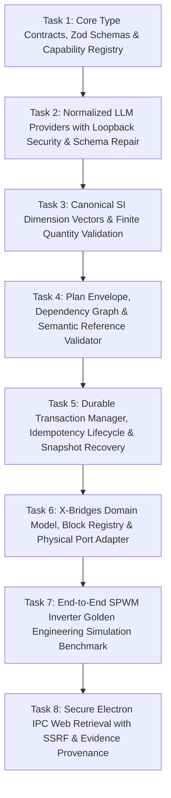

# ADIA Autonomous Engineering AI Copilot - Master Implementation Plan (v2.2)

> **For agentic workers:** REQUIRED SUB-SKILL: Use superpowers:subagent-driven-development (recommended) or superpowers:executing-plans to implement this plan task-by-task. Steps use checkbox (`- [ ]`) syntax for tracking.

**Goal:** Build an institutional-grade, zero-cost Autonomous Engineering AI Copilot inside ADIA with a complete reference vertical slice: from natural-language user prompt to schema-constrained generation, multi-stage validation, durable transactional execution, domain-model mutation, and automated numerical simulation verification (SPWM Inverter with $220\text{V}_{rms}$, $50\text{Hz}$, and low-order $\text{THD} \le 5\%$), followed by modular expansion to SysML, Stateflow, DOE, sandboxed code compilation, and hardware safety interlocks.

**Architecture:**
1. Provider normalizer with Zod schema-constrained decoding and bounded repair loops.
2. Hybrid capability discovery and context budgeting.
3. 14-stage validation and safety pipeline (Structural Zod $\to$ Tarjan/Kahn DAG $\to$ References $\to$ Dimensional $\to$ Preconditions $\to$ Policy $\to$ Dry-run).
4. Durable Transaction Manager with journal persistence, idempotency state lifecycle (`RESERVED` $\to$ `COMMITTED` / `ROLLED_BACK`), snapshot rollback with `RECOVERY_REQUIRED` fallback, and workspace revision locking.
5. Domain-Model-as-Source-of-Truth with an authoritative Block Definition Registry distinguishing Physical Conserving Electrical Ports from Signal Ports.
6. Untrusted Web Retrieval via Electron IPC with strict SSRF defenses, payload limits, and structured evidence objects.

**Tech Stack:** TypeScript (strict mode), React 18, Electron IPC, Vitest, Zod, Math.js.

---

## Global Constraints
- **Zero Unvalidated Mutations**: No module mutation may occur directly from LLM output. Every action must be validated by its corresponding `AIModuleAdapter` and approved by the `PolicyEngine`.
- **Domain State Integrity**: Adapters mutate domain models directly (`XBridgeDomainModel`, `StateflowAST`, `SysmlMetamodel`). ReactFlow UI state is purely a derived visual projection.
- **Dimensional Correctness**: All parameters must declare explicit SI units and pass dimensional vector compatibility ($[M, L, T, I, \Theta, N, J]$) with finite-value checks.
- **Transactional Atomicity**: Multi-step plans execute under a durable transaction with snapshot/inverse rollback. If restoration verification fails, the workspace transitions to `RECOVERY_REQUIRED`.
- **Untrusted External Data**: All web search results are sanitized, bounded to 32KB, and encapsulated in structured evidence objects without executable script or markdown attribute injections.

---

## Task Decomposition & Execution Plan (Milestone 1: Reference Vertical Slice)



---

### Task 1: Core Type Contracts, Zod Schemas & Capability Registry

**Files:**
- Create: `src/services/ai/contracts/types.ts`
- Create: `src/services/ai/contracts/diagnostics.ts`
- Create: `src/services/ai/contracts/capabilityRegistry.ts`
- Test: `src/services/ai/contracts/capabilityRegistry.test.ts`

**Interfaces:**
- Consumes: None (Root foundation).
- Produces: `Diagnostic`, `RiskClass`, `RollbackLevel`, `SideEffectClass`, `ActionCapability`, `CapabilityRegistry`.

- [ ] **Step 1: Write the failing test**

```typescript
// src/services/ai/contracts/capabilityRegistry.test.ts
import { describe, it, expect, beforeEach } from 'vitest';
import { z } from 'zod';
import { CapabilityRegistry } from './capabilityRegistry';
import { RiskClass, RollbackLevel, SideEffectClass } from './types';

describe('CapabilityRegistry', () => {
  let registry: CapabilityRegistry;

  beforeEach(() => {
    registry = new CapabilityRegistry();
  });

  it('should register a capability and validate payload against strict Zod schema', () => {
    const payloadSchema = z.object({
      blockId: z.string().min(1),
      blockType: z.enum(['DC_VOLTAGE_SOURCE', 'SPWM_GENERATOR', 'WAVEFORM_GENERATOR'])
    }).strict();

    registry.register({
      actionType: 'XB_CREATE_BLOCK',
      schemaVersion: '1.0.0',
      module: 'xbridges',
      riskClass: RiskClass.REVERSIBLE_MUTATION,
      rollbackLevel: RollbackLevel.INVERSE_ACTION,
      sideEffectClass: SideEffectClass.DOMAIN_STATE,
      payloadSchema,
      requiredPermissions: [],
      supportsDryRun: true,
      requiresCommitBarrier: false,
      resourceAccess: { readSets: ['xbridges.nodes'], writeSets: ['xbridges.nodes'] }
    });

    const cap = registry.get('XB_CREATE_BLOCK', '1.0.0');
    expect(cap).toBeDefined();
    expect(cap?.actionType).toBe('XB_CREATE_BLOCK');

    const valid = cap?.payloadSchema.safeParse({ blockId: 'b1', blockType: 'DC_VOLTAGE_SOURCE' });
    expect(valid?.success).toBe(true);

    const invalid = cap?.payloadSchema.safeParse({ blockId: 'b1', blockType: 'UNKNOWN_TYPE' });
    expect(invalid?.success).toBe(false);
  });

  it('should reject invalid capability configurations (e.g. hardware actuation marked reversible)', () => {
    expect(() => {
      registry.register({
        actionType: 'HIL_ACTUATE_PIN',
        schemaVersion: '1.0.0',
        module: 'hil',
        riskClass: RiskClass.HARDWARE_ACTUATION,
        rollbackLevel: RollbackLevel.INVERSE_ACTION, // Contradiction: physical actuation cannot be inverse-action reversed
        sideEffectClass: SideEffectClass.PHYSICAL_HARDWARE,
        payloadSchema: z.object({}).strict(),
        requiredPermissions: [],
        supportsDryRun: false,
        requiresCommitBarrier: true,
        resourceAccess: { readSets: [], writeSets: [] }
      });
    }).toThrowError(/Hardware actuation cannot have rollback level INVERSE_ACTION/);
  });

  it('should reject duplicate capability registration of same type and version', () => {
    const cap = {
      actionType: 'XB_CREATE_BLOCK',
      schemaVersion: '1.0.0',
      module: 'xbridges',
      riskClass: RiskClass.REVERSIBLE_MUTATION,
      rollbackLevel: RollbackLevel.INVERSE_ACTION,
      sideEffectClass: SideEffectClass.DOMAIN_STATE,
      payloadSchema: z.object({}).strict(),
      requiredPermissions: [],
      supportsDryRun: true,
      requiresCommitBarrier: false,
      resourceAccess: { readSets: [], writeSets: [] }
    };

    registry.register(cap);
    expect(() => registry.register(cap)).toThrowError(/already registered/);
  });
});
```

- [ ] **Step 2: Run test to verify it fails**

Run: `npx vitest run src/services/ai/contracts/capabilityRegistry.test.ts`  
Expected: FAIL with module not found.

- [ ] **Step 3: Write minimal implementation**

```typescript
// src/services/ai/contracts/types.ts
import { z } from 'zod';

export enum RiskClass {
  READ_ONLY = 'READ_ONLY',
  REVERSIBLE_MUTATION = 'REVERSIBLE_MUTATION',
  DESTRUCTIVE_MUTATION = 'DESTRUCTIVE_MUTATION',
  EXTERNAL_FILE_EXPORT = 'EXTERNAL_FILE_EXPORT',
  CODE_COMPILATION = 'CODE_COMPILATION',
  HARDWARE_COMMUNICATION = 'HARDWARE_COMMUNICATION',
  HARDWARE_ACTUATION = 'HARDWARE_ACTUATION'
}

export enum RollbackLevel {
  NONE = 'NONE',
  INVERSE_ACTION = 'INVERSE_ACTION',
  SNAPSHOT_RESTORE = 'SNAPSHOT_RESTORE',
  COMPENSATING_RESET = 'COMPENSATING_RESET'
}

export enum SideEffectClass {
  READ_ONLY = 'READ_ONLY',
  DOMAIN_STATE = 'DOMAIN_STATE',
  LOCAL_FILESYSTEM = 'LOCAL_FILESYSTEM',
  COMMUNICATION_PORT = 'COMMUNICATION_PORT',
  PHYSICAL_HARDWARE = 'PHYSICAL_HARDWARE'
}

export interface ResourceAccessDeclaration {
  readonly readSets: string[];
  readonly writeSets: string[];
}

export interface ActionCapability<TPayload = unknown> {
  readonly actionType: string;
  readonly schemaVersion: string;
  readonly module: string;
  readonly riskClass: RiskClass;
  readonly rollbackLevel: RollbackLevel;
  readonly sideEffectClass: SideEffectClass;
  readonly payloadSchema: z.ZodType<TPayload>;
  readonly requiredPermissions: string[];
  readonly supportsDryRun: boolean;
  readonly requiresCommitBarrier: boolean;
  readonly resourceAccess: ResourceAccessDeclaration;
}
```

```typescript
// src/services/ai/contracts/diagnostics.ts
export interface Diagnostic {
  readonly code: string;
  readonly severity: 'ERROR' | 'WARNING' | 'INFO';
  readonly message: string;
  readonly actionId?: string;
  readonly entityId?: string;
  readonly fieldPath?: string;
  readonly expected?: unknown;
  readonly actual?: unknown;
  readonly remediation?: string;
}
```

```typescript
// src/services/ai/contracts/capabilityRegistry.ts
import { ActionCapability, RiskClass, RollbackLevel, SideEffectClass } from './types';

export class CapabilityRegistry {
  private capabilities: Map<string, ActionCapability> = new Map();

  private makeKey(actionType: string, schemaVersion: string): string {
    return `${actionType}@${schemaVersion}`;
  }

  public register(capability: ActionCapability): void {
    if (capability.riskClass === RiskClass.HARDWARE_ACTUATION && capability.rollbackLevel === RollbackLevel.INVERSE_ACTION) {
      throw new Error('Hardware actuation cannot have rollback level INVERSE_ACTION (physical effects are irreversible).');
    }
    if (capability.sideEffectClass === SideEffectClass.PHYSICAL_HARDWARE && !capability.requiresCommitBarrier) {
      throw new Error('Hardware side-effect capabilities must require a commit barrier.');
    }

    const key = this.makeKey(capability.actionType, capability.schemaVersion);
    if (this.capabilities.has(key)) {
      throw new Error(`Capability ${key} is already registered.`);
    }
    this.capabilities.set(key, capability);
  }

  public get(actionType: string, schemaVersion: string = '1.0.0'): ActionCapability | undefined {
    return this.capabilities.get(this.makeKey(actionType, schemaVersion));
  }

  public getAll(): ActionCapability[] {
    return Array.from(this.capabilities.values());
  }

  public filterByModules(activeModules: string[]): ActionCapability[] {
    const set = new Set(activeModules);
    return this.getAll().filter(c => set.has(c.module));
  }
}
```

- [ ] **Step 4: Run test to verify it passes**

Run: `npx vitest run src/services/ai/contracts/capabilityRegistry.test.ts`  
Expected: PASS

- [ ] **Step 5: Commit**

```bash
git add src/services/ai/contracts/
git commit -m "feat(ai): implement strict capability registry with risk consistency checks"
```

---

### Task 2: Normalized LLM Providers with Loopback Security & Schema Repair

**Files:**
- Create: `src/services/ai/providers/providerInterface.ts`
- Create: `src/services/ai/providers/localOllamaProvider.ts`
- Create: `src/services/ai/providers/openAiCompatibleProvider.ts`
- Create: `src/services/ai/providers/geminiProvider.ts`
- Create: `src/services/ai/providers/providerFactory.ts`
- Test: `src/services/ai/providers/providerFactory.test.ts`

**Interfaces:**
- Consumes: `Diagnostic` from Task 1.
- Produces: `ILLMProvider`, `ProviderFactory`, `StructuredGenerationRequest`, `StructuredGenerationResult`.

- [ ] **Step 1: Write the failing test**

```typescript
// src/services/ai/providers/providerFactory.test.ts
import { describe, it, expect, vi } from 'vitest';
import { z } from 'zod';
import { ProviderFactory } from './providerFactory';
import { LocalOllamaProvider } from './localOllamaProvider';
import { OpenAiCompatibleProvider } from './openAiCompatibleProvider';
import { GeminiProvider } from './geminiProvider';

describe('ProviderFactory & Schema Repair Loop', () => {
  it('should instantiate appropriate provider types with strict loopback validation', () => {
    const ollama = ProviderFactory.createProvider({
      type: 'ollama',
      baseUrl: 'http://127.0.0.1:11434',
      modelId: 'deepseek-r1:8b'
    });
    expect(ollama).toBeInstanceOf(LocalOllamaProvider);
    expect(ollama.capabilities.isLocalOffline).toBe(true);

    const lmstudio = ProviderFactory.createProvider({
      type: 'lmstudio',
      baseUrl: 'http://localhost:1234/v1',
      modelId: 'qwen2.5-coder-7b'
    });
    expect(lmstudio).toBeInstanceOf(OpenAiCompatibleProvider);
    expect(lmstudio.capabilities.isLocalOffline).toBe(true);

    const gemini = ProviderFactory.createProvider({
      type: 'gemini',
      apiKey: 'AIzaFakeKey123',
      modelId: 'gemini-2.0-flash'
    });
    expect(gemini).toBeInstanceOf(GeminiProvider);
    expect(gemini.capabilities.isLocalOffline).toBe(false);
  });

  it('should reject spoofed loopback hostnames (e.g. localhost.attacker.com)', () => {
    expect(() => ProviderFactory.createProvider({
      type: 'ollama',
      baseUrl: 'https://localhost.attacker.com:11434',
      modelId: 'llama3'
    })).toThrowError(/Local provider must use exact loopback/);
  });

  it('should perform repair attempt if initial LLM output fails schema validation', async () => {
    const provider = new LocalOllamaProvider({ baseUrl: 'http://127.0.0.1:11434', modelId: 'test' });
    const targetSchema = z.object({
      nominalVoltage: z.number().min(363),
      unit: z.literal('V')
    }).strict();

    // Mock first call returning invalid voltage (300V), second call returning repaired (380V)
    global.fetch = vi.fn()
      .mockResolvedValueOnce({
        ok: true,
        json: async () => ({ response: JSON.stringify({ nominalVoltage: 300, unit: 'V' }) })
      } as any)
      .mockResolvedValueOnce({
        ok: true,
        json: async () => ({ response: JSON.stringify({ nominalVoltage: 380, unit: 'V' }) })
      } as any);

    const result = await provider.generateStructured({
      systemPrompt: 'sys',
      userPrompt: 'user'
    }, targetSchema);

    expect(result.success).toBe(true);
    expect(result.data?.nominalVoltage).toBe(380);
    expect(global.fetch).toHaveBeenCalledTimes(2); // One initial + one repair call
  });
});
```

- [ ] **Step 2: Run test to verify it fails**

Run: `npx vitest run src/services/ai/providers/providerFactory.test.ts`  
Expected: FAIL with modules not found.

- [ ] **Step 3: Write minimal implementation**

```typescript
// src/services/ai/providers/providerInterface.ts
import { z } from 'zod';
import { Diagnostic } from '../contracts/diagnostics';

export interface ProviderCapabilities {
  readonly maxContextTokens: number;
  readonly supportsGrammarConstraint: boolean;
  readonly supportsNativeToolCalling: boolean;
  readonly isLocalOffline: boolean;
  readonly streamingSupport: boolean;
}

export interface StructuredGenerationRequest {
  readonly systemPrompt: string;
  readonly userPrompt: string;
  readonly conversationHistory?: Array<{ role: 'user' | 'assistant'; content: string }>;
  readonly temperature?: number;
  readonly maxOutputTokens?: number;
  readonly timeoutMs?: number;
}

export interface StructuredGenerationResult<T> {
  readonly success: boolean;
  readonly data?: T;
  readonly rawText: string;
  readonly usage: { promptTokens: number; completionTokens: number; totalTokens: number };
  readonly diagnostics: Diagnostic[];
  readonly isTruncated: boolean;
  readonly durationMs: number;
}

export interface ILLMProvider {
  readonly providerId: string;
  readonly modelId: string;
  readonly capabilities: ProviderCapabilities;

  generateStructured<T>(
    request: StructuredGenerationRequest,
    schema: z.ZodType<T>,
    signal?: AbortSignal
  ): Promise<StructuredGenerationResult<T>>;
}
```

```typescript
// src/services/ai/providers/localOllamaProvider.ts
import { z } from 'zod';
import { ILLMProvider, ProviderCapabilities, StructuredGenerationRequest, StructuredGenerationResult } from './providerInterface';

export class LocalOllamaProvider implements ILLMProvider {
  public readonly providerId = 'ollama';
  public readonly modelId: string;
  public readonly baseUrl: string;
  public readonly capabilities: ProviderCapabilities = {
    maxContextTokens: 32768,
    supportsGrammarConstraint: true,
    supportsNativeToolCalling: false,
    isLocalOffline: true,
    streamingSupport: true
  };

  constructor(config: { baseUrl?: string; modelId?: string }) {
    this.baseUrl = config.baseUrl || 'http://127.0.0.1:11434';
    this.modelId = config.modelId || 'deepseek-r1:8b';
  }

  async generateStructured<T>(
    request: StructuredGenerationRequest,
    schema: z.ZodType<T>,
    signal?: AbortSignal
  ): Promise<StructuredGenerationResult<T>> {
    const startTime = Date.now();
    let currentPrompt = request.userPrompt;
    let attempts = 0;
    const maxAttempts = 2;

    while (attempts < maxAttempts) {
      attempts++;
      try {
        const timeoutController = new AbortController();
        const timeoutId = setTimeout(() => timeoutController.abort(), request.timeoutMs || 30000);
        const combinedSignal = signal ? AbortSignal.any([signal, timeoutController.signal]) : timeoutController.signal;

        const response = await fetch(`${this.baseUrl}/api/generate`, {
          method: 'POST',
          headers: { 'Content-Type': 'application/json' },
          body: JSON.stringify({
            model: this.modelId,
            system: request.systemPrompt,
            prompt: currentPrompt,
            format: 'json',
            stream: false,
            options: { temperature: request.temperature ?? 0.1 }
          }),
          signal: combinedSignal
        });
        clearTimeout(timeoutId);

        if (!response.ok) {
          throw new Error(`Ollama HTTP ${response.status}: ${await response.text()}`);
        }

        const jsonRes = await response.json();
        const rawText = jsonRes.response || '';
        const parsedJson = JSON.parse(rawText);
        const parseResult = schema.safeParse(parsedJson);

        if (parseResult.success) {
          return {
            success: true,
            data: parseResult.data,
            rawText,
            usage: {
              promptTokens: jsonRes.prompt_eval_count || 0,
              completionTokens: jsonRes.eval_count || 0,
              totalTokens: (jsonRes.prompt_eval_count || 0) + (jsonRes.eval_count || 0)
            },
            diagnostics: [],
            isTruncated: false,
            durationMs: Date.now() - startTime
          };
        }

        // Schema validation failed, prepare repair prompt
        const errorSummary = parseResult.error.errors.map(e => `${e.path.join('.')}: ${e.message}`).join(', ');
        currentPrompt = `${request.userPrompt}\n\n[ERROR: Your previous output failed validation: ${errorSummary}. Please correct and return valid JSON.]`;
      } catch (err: any) {
        if (attempts >= maxAttempts) {
          return {
            success: false,
            rawText: '',
            usage: { promptTokens: 0, completionTokens: 0, totalTokens: 0 },
            diagnostics: [{ code: 'PROVIDER_CALL_FAILED', severity: 'ERROR', message: err.message }],
            isTruncated: false,
            durationMs: Date.now() - startTime
          };
        }
      }
    }

    return {
      success: false,
      rawText: '',
      usage: { promptTokens: 0, completionTokens: 0, totalTokens: 0 },
      diagnostics: [{ code: 'SCHEMA_REPAIR_EXHAUSTED', severity: 'ERROR', message: 'Schema repair attempts exhausted.' }],
      isTruncated: false,
      durationMs: Date.now() - startTime
    };
  }
}
```

```typescript
// src/services/ai/providers/openAiCompatibleProvider.ts
import { z } from 'zod';
import { ILLMProvider, ProviderCapabilities, StructuredGenerationRequest, StructuredGenerationResult } from './providerInterface';

export class OpenAiCompatibleProvider implements ILLMProvider {
  public readonly providerId = 'openai-compatible';
  public readonly modelId: string;
  public readonly baseUrl: string;
  public readonly apiKey: string;
  public readonly capabilities: ProviderCapabilities;

  constructor(config: { baseUrl?: string; modelId?: string; apiKey?: string; isLocal?: boolean }) {
    this.baseUrl = (config.baseUrl || 'http://127.0.0.1:1234/v1').replace(/\/+$/, '');
    this.modelId = config.modelId || 'qwen2.5-coder-7b';
    this.apiKey = config.apiKey || 'local-no-key';
    const isLocal = config.isLocal ?? (this.baseUrl.includes('127.0.0.1') || this.baseUrl.includes('localhost'));
    this.capabilities = {
      maxContextTokens: 32768,
      supportsGrammarConstraint: false,
      supportsNativeToolCalling: true,
      isLocalOffline: isLocal,
      streamingSupport: true
    };
  }

  async generateStructured<T>(
    request: StructuredGenerationRequest,
    schema: z.ZodType<T>,
    signal?: AbortSignal
  ): Promise<StructuredGenerationResult<T>> {
    const startTime = Date.now();
    try {
      const messages = [
        { role: 'system', content: `${request.systemPrompt}\nIMPORTANT: You MUST respond ONLY with valid JSON conforming to the schema.` },
        ...(request.conversationHistory || []),
        { role: 'user', content: request.userPrompt }
      ];

      const response = await fetch(`${this.baseUrl}/chat/completions`, {
        method: 'POST',
        headers: {
          'Content-Type': 'application/json',
          'Authorization': `Bearer ${this.apiKey}`
        },
        body: JSON.stringify({
          model: this.modelId,
          messages,
          temperature: request.temperature ?? 0.1,
          response_format: { type: 'json_object' }
        }),
        signal
      });

      if (!response.ok) {
        throw new Error(`OpenAI HTTP ${response.status}: ${await response.text()}`);
      }

      const jsonRes = await response.json();
      const rawText = jsonRes.choices?.[0]?.message?.content || '';
      const parsedJson = JSON.parse(rawText);
      const parseResult = schema.safeParse(parsedJson);

      const usageNorm = {
        promptTokens: jsonRes.usage?.prompt_tokens ?? jsonRes.usage?.promptTokens ?? 0,
        completionTokens: jsonRes.usage?.completion_tokens ?? jsonRes.usage?.completionTokens ?? 0,
        totalTokens: jsonRes.usage?.total_tokens ?? jsonRes.usage?.totalTokens ?? 0
      };

      if (!parseResult.success) {
        return {
          success: false,
          rawText,
          usage: usageNorm,
          diagnostics: parseResult.error.errors.map(e => ({
            code: 'SCHEMA_VALIDATION_ERROR',
            severity: 'ERROR',
            message: e.message,
            fieldPath: e.path.join('.')
          })),
          isTruncated: false,
          durationMs: Date.now() - startTime
        };
      }

      return {
        success: true,
        data: parseResult.data,
        rawText,
        usage: usageNorm,
        diagnostics: [],
        isTruncated: false,
        durationMs: Date.now() - startTime
      };
    } catch (err: any) {
      return {
        success: false,
        rawText: '',
        usage: { promptTokens: 0, completionTokens: 0, totalTokens: 0 },
        diagnostics: [{ code: 'PROVIDER_ERROR', severity: 'ERROR', message: err.message }],
        isTruncated: false,
        durationMs: Date.now() - startTime
      };
    }
  }
}
```

```typescript
// src/services/ai/providers/geminiProvider.ts
import { z } from 'zod';
import { ILLMProvider, ProviderCapabilities, StructuredGenerationRequest, StructuredGenerationResult } from './providerInterface';

export class GeminiProvider implements ILLMProvider {
  public readonly providerId = 'gemini';
  public readonly modelId: string;
  private readonly apiKey: string;
  public readonly capabilities: ProviderCapabilities = {
    maxContextTokens: 1048576,
    supportsGrammarConstraint: true,
    supportsNativeToolCalling: true,
    isLocalOffline: false,
    streamingSupport: true
  };

  constructor(config: { apiKey: string; modelId?: string }) {
    this.apiKey = config.apiKey;
    this.modelId = config.modelId || 'gemini-2.0-flash';
  }

  async generateStructured<T>(
    request: StructuredGenerationRequest,
    schema: z.ZodType<T>,
    signal?: AbortSignal
  ): Promise<StructuredGenerationResult<T>> {
    const startTime = Date.now();
    try {
      const url = `https://generativelanguage.googleapis.com/v1beta/models/${this.modelId}:generateContent`;
      const response = await fetch(url, {
        method: 'POST',
        headers: {
          'Content-Type': 'application/json',
          'x-goog-api-key': this.apiKey
        },
        body: JSON.stringify({
          systemInstruction: { parts: [{ text: request.systemPrompt }] },
          contents: [{ role: 'user', parts: [{ text: request.userPrompt }] }],
          generationConfig: {
            responseMimeType: 'application/json',
            temperature: request.temperature ?? 0.1
          }
        }),
        signal
      });

      if (!response.ok) {
        throw new Error(`Gemini HTTP ${response.status}: ${await response.text()}`);
      }

      const jsonRes = await response.json();
      const rawText = jsonRes.candidates?.[0]?.content?.parts?.[0]?.text || '';
      const parsedJson = JSON.parse(rawText);
      const parseResult = schema.safeParse(parsedJson);

      const usageNorm = {
        promptTokens: jsonRes.usageMetadata?.promptTokenCount || 0,
        completionTokens: jsonRes.usageMetadata?.candidatesTokenCount || 0,
        totalTokens: jsonRes.usageMetadata?.totalTokenCount || 0
      };

      if (!parseResult.success) {
        return {
          success: false,
          rawText,
          usage: usageNorm,
          diagnostics: parseResult.error.errors.map(e => ({
            code: 'SCHEMA_VALIDATION_ERROR',
            severity: 'ERROR',
            message: e.message,
            fieldPath: e.path.join('.')
          })),
          isTruncated: false,
          durationMs: Date.now() - startTime
        };
      }

      return {
        success: true,
        data: parseResult.data,
        rawText,
        usage: usageNorm,
        diagnostics: [],
        isTruncated: false,
        durationMs: Date.now() - startTime
      };
    } catch (err: any) {
      return {
        success: false,
        rawText: '',
        usage: { promptTokens: 0, completionTokens: 0, totalTokens: 0 },
        diagnostics: [{ code: 'PROVIDER_ERROR', severity: 'ERROR', message: err.message }],
        isTruncated: false,
        durationMs: Date.now() - startTime
      };
    }
  }
}
```

```typescript
// src/services/ai/providers/providerFactory.ts
import { ILLMProvider } from './providerInterface';
import { LocalOllamaProvider } from './localOllamaProvider';
import { OpenAiCompatibleProvider } from './openAiCompatibleProvider';
import { GeminiProvider } from './geminiProvider';

export interface ProviderConfig {
  type: 'ollama' | 'lmstudio' | 'gemini' | 'openai';
  apiKey?: string;
  baseUrl?: string;
  modelId?: string;
}

export class ProviderFactory {
  public static createProvider(config: ProviderConfig): ILLMProvider {
    const isStrictLoopback = (urlString?: string): boolean => {
      if (!urlString) return true;
      try {
        const parsed = new URL(urlString);
        const host = parsed.hostname.toLowerCase();
        return host === 'localhost' || host === '127.0.0.1' || host === '::1';
      } catch {
        return false;
      }
    };

    switch (config.type) {
      case 'ollama':
        if (config.baseUrl && !isStrictLoopback(config.baseUrl)) {
          throw new Error('Local provider must use exact loopback (127.0.0.1, localhost, ::1) hostname for air-gapped security.');
        }
        return new LocalOllamaProvider({ baseUrl: config.baseUrl, modelId: config.modelId });

      case 'lmstudio':
        if (config.baseUrl && !isStrictLoopback(config.baseUrl)) {
          throw new Error('Local provider must use exact loopback (127.0.0.1, localhost, ::1) hostname for air-gapped security.');
        }
        return new OpenAiCompatibleProvider({ baseUrl: config.baseUrl || 'http://127.0.0.1:1234/v1', modelId: config.modelId, isLocal: true });

      case 'openai':
        return new OpenAiCompatibleProvider({ baseUrl: config.baseUrl || 'https://api.openai.com/v1', modelId: config.modelId, apiKey: config.apiKey, isLocal: false });

      case 'gemini':
        if (!config.apiKey) throw new Error('Gemini API key is required');
        return new GeminiProvider({ apiKey: config.apiKey, modelId: config.modelId });

      default:
        throw new Error(`Unsupported provider type: ${config.type}`);
    }
  }
}
```

- [ ] **Step 4: Run test to verify it passes**

Run: `npx vitest run src/services/ai/providers/providerFactory.test.ts`  
Expected: PASS

- [ ] **Step 5: Commit**

```bash
git add src/services/ai/providers/
git commit -m "feat(ai): implement secure providers with exact loopback check and schema repair loop"
```

---

### Task 3: Canonical SI Dimension Vectors & Finite Quantity Validation

**Files:**
- Create: `src/services/ai/validation/dimensionVectors.ts`
- Create: `src/services/ai/validation/dimensionalEngine.ts`
- Test: `src/services/ai/validation/dimensionalEngine.test.ts`

**Interfaces:**
- Consumes: `Diagnostic` from Task 1.
- Produces: `DimensionalEngine`, `EngineeringQuantity`, `DimensionVector`.

- [ ] **Step 1: Write the failing test**

```typescript
// src/services/ai/validation/dimensionalEngine.test.ts
import { describe, it, expect } from 'vitest';
import { DimensionalEngine } from './dimensionalEngine';

describe('DimensionalEngine with Finite Quantity Verification', () => {
  it('should normalize SI prefixes and verify dimension vector equality', () => {
    const normL = DimensionalEngine.normalize({ value: 2.5, unit: 'mH' });
    expect(normL.normalizedValue).toBeCloseTo(0.0025);
    expect(normL.dimensionVector).toEqual([1, 2, -2, -2, 0, 0, 0]);

    const normC = DimensionalEngine.normalize({ value: 10, unit: 'uF' });
    expect(normC.normalizedValue).toBeCloseTo(1e-5);
    expect(normC.dimensionVector).toEqual([-1, -2, 4, 2, 0, 0, 0]);
  });

  it('should reject non-finite quantities (NaN, Infinity)', () => {
    expect(() => DimensionalEngine.normalize({ value: NaN, unit: 'V' })).toThrowError(/NON_FINITE_QUANTITY/);
    expect(() => DimensionalEngine.normalize({ value: Infinity, unit: 'V' })).toThrowError(/NON_FINITE_QUANTITY/);
  });

  it('should support dimensionless quantities with unit "1" and "%"', () => {
    const d1 = DimensionalEngine.normalize({ value: 0.819, unit: '1' });
    expect(d1.normalizedValue).toBe(0.819);
    expect(d1.dimensionVector).toEqual([0, 0, 0, 0, 0, 0, 0]);
  });
});
```

- [ ] **Step 2: Run test to verify it fails**

Run: `npx vitest run src/services/ai/validation/dimensionalEngine.test.ts`  
Expected: FAIL with modules not found.

- [ ] **Step 3: Write minimal implementation**

```typescript
// src/services/ai/validation/dimensionVectors.ts
// Exponent vector: [M (Mass), L (Length), T (Time), I (Current), Theta (Temp), N (Amount), J (Luminosity)]
export type DimensionVector = readonly [number, number, number, number, number, number, number];

export interface UnitSpec {
  readonly scale: number;
  readonly baseUnit: string;
  readonly dimensionName: string;
  readonly dimensionVector: DimensionVector;
}

export const CANONICAL_DIMENSIONS: Record<string, DimensionVector> = {
  Dimensionless: [0, 0, 0, 0, 0, 0, 0],
  Voltage: [1, 2, -3, -1, 0, 0, 0],
  Current: [0, 0, 0, 1, 0, 0, 0],
  Resistance: [1, 2, -3, -2, 0, 0, 0],
  Inductance: [1, 2, -2, -2, 0, 0, 0],
  Capacitance: [-1, -2, 4, 2, 0, 0, 0],
  Frequency: [0, 0, -1, 0, 0, 0, 0],
  Time: [0, 0, 1, 0, 0, 0, 0]
};

export const UNIT_TABLE: Record<string, UnitSpec> = {
  '1': { scale: 1, baseUnit: '1', dimensionName: 'Dimensionless', dimensionVector: CANONICAL_DIMENSIONS.Dimensionless },
  '%': { scale: 0.01, baseUnit: '1', dimensionName: 'Dimensionless', dimensionVector: CANONICAL_DIMENSIONS.Dimensionless },
  'V': { scale: 1, baseUnit: 'V', dimensionName: 'Voltage', dimensionVector: CANONICAL_DIMENSIONS.Voltage },
  'kV': { scale: 1e3, baseUnit: 'V', dimensionName: 'Voltage', dimensionVector: CANONICAL_DIMENSIONS.Voltage },
  'mV': { scale: 1e-3, baseUnit: 'V', dimensionName: 'Voltage', dimensionVector: CANONICAL_DIMENSIONS.Voltage },
  'A': { scale: 1, baseUnit: 'A', dimensionName: 'Current', dimensionVector: CANONICAL_DIMENSIONS.Current },
  'mA': { scale: 1e-3, baseUnit: 'A', dimensionName: 'Current', dimensionVector: CANONICAL_DIMENSIONS.Current },
  'Ohm': { scale: 1, baseUnit: 'Ohm', dimensionName: 'Resistance', dimensionVector: CANONICAL_DIMENSIONS.Resistance },
  'kOhm': { scale: 1e3, baseUnit: 'Ohm', dimensionName: 'Resistance', dimensionVector: CANONICAL_DIMENSIONS.Resistance },
  'H': { scale: 1, baseUnit: 'H', dimensionName: 'Inductance', dimensionVector: CANONICAL_DIMENSIONS.Inductance },
  'mH': { scale: 1e-3, baseUnit: 'H', dimensionName: 'Inductance', dimensionVector: CANONICAL_DIMENSIONS.Inductance },
  'uH': { scale: 1e-6, baseUnit: 'H', dimensionName: 'Inductance', dimensionVector: CANONICAL_DIMENSIONS.Inductance },
  'F': { scale: 1, baseUnit: 'F', dimensionName: 'Capacitance', dimensionVector: CANONICAL_DIMENSIONS.Capacitance },
  'uF': { scale: 1e-6, baseUnit: 'F', dimensionName: 'Capacitance', dimensionVector: CANONICAL_DIMENSIONS.Capacitance },
  'nF': { scale: 1e-9, baseUnit: 'F', dimensionName: 'Capacitance', dimensionVector: CANONICAL_DIMENSIONS.Capacitance },
  'pF': { scale: 1e-12, baseUnit: 'F', dimensionName: 'Capacitance', dimensionVector: CANONICAL_DIMENSIONS.Capacitance },
  'Hz': { scale: 1, baseUnit: 'Hz', dimensionName: 'Frequency', dimensionVector: CANONICAL_DIMENSIONS.Frequency },
  'kHz': { scale: 1e3, baseUnit: 'Hz', dimensionName: 'Frequency', dimensionVector: CANONICAL_DIMENSIONS.Frequency },
  's': { scale: 1, baseUnit: 's', dimensionName: 'Time', dimensionVector: CANONICAL_DIMENSIONS.Time },
  'ms': { scale: 1e-3, baseUnit: 's', dimensionName: 'Time', dimensionVector: CANONICAL_DIMENSIONS.Time },
  'us': { scale: 1e-6, baseUnit: 's', dimensionName: 'Time', dimensionVector: CANONICAL_DIMENSIONS.Time }
};
```

```typescript
// src/services/ai/validation/dimensionalEngine.ts
import { UNIT_TABLE, CANONICAL_DIMENSIONS, DimensionVector } from './dimensionVectors';
import { Diagnostic } from '../contracts/diagnostics';

export interface EngineeringQuantity {
  value: number;
  unit: string;
}

export class DimensionalEngine {
  public static normalize(q: EngineeringQuantity): { normalizedValue: number; baseUnit: string; dimensionVector: DimensionVector } {
    if (!Number.isFinite(q.value)) {
      throw new Error(`NON_FINITE_QUANTITY: Value '${q.value}' is not a finite number.`);
    }
    const spec = UNIT_TABLE[q.unit];
    if (!spec) {
      throw new Error(`Unregistered unit: ${q.unit}`);
    }
    return {
      normalizedValue: q.value * spec.scale,
      baseUnit: spec.baseUnit,
      dimensionVector: spec.dimensionVector
    };
  }

  public static validateCompatibility(q: EngineeringQuantity, expectedDimensionName: string): { isValid: boolean; diagnostics: Diagnostic[] } {
    if (!Number.isFinite(q.value)) {
      return {
        isValid: false,
        diagnostics: [{ code: 'NON_FINITE_VALUE', severity: 'ERROR', message: `Quantity value is not finite: ${q.value}` }]
      };
    }
    const spec = UNIT_TABLE[q.unit];
    if (!spec) {
      return {
        isValid: false,
        diagnostics: [{ code: 'UNKNOWN_UNIT', severity: 'ERROR', message: `Unknown engineering unit: ${q.unit}` }]
      };
    }
    const expectedVector = CANONICAL_DIMENSIONS[expectedDimensionName];
    if (!expectedVector) {
      return {
        isValid: false,
        diagnostics: [{ code: 'UNKNOWN_DIMENSION', severity: 'ERROR', message: `Unknown dimension: ${expectedDimensionName}` }]
      };
    }
    const match = spec.dimensionVector.every((val, idx) => val === expectedVector[idx]);
    if (!match) {
      return {
        isValid: false,
        diagnostics: [{
          code: 'DIMENSION_MISMATCH',
          severity: 'ERROR',
          message: `Parameter with unit '${q.unit}' (${spec.dimensionName}) does not match expected dimension '${expectedDimensionName}'.`
        }]
      };
    }
    return { isValid: true, diagnostics: [] };
  }
}
```

- [ ] **Step 4: Run test to verify it passes**

Run: `npx vitest run src/services/ai/validation/dimensionalEngine.test.ts`  
Expected: PASS

- [ ] **Step 5: Commit**

```bash
git add src/services/ai/validation/
git commit -m "feat(ai): implement dimensional analysis engine with finite quantity validation"
```

---

### Task 4: Plan Envelope, Dependency Graph & Semantic Reference Validator

**Files:**
- Create: `src/services/ai/planner/planSchemas.ts`
- Create: `src/services/ai/planner/dependencyGraph.ts`
- Create: `src/services/ai/planner/planValidator.ts`
- Test: `src/services/ai/planner/planValidator.test.ts`

**Interfaces:**
- Consumes: `CapabilityRegistry` from Task 1, `DimensionalEngine` from Task 3.
- Produces: `PlanValidator`, `PlanEnvelopeSchema`, `ActionEnvelopeSchema`.

- [ ] **Step 1: Write the failing test**

```typescript
// src/services/ai/planner/planValidator.test.ts
import { describe, it, expect } from 'vitest';
import { PlanValidator } from './planValidator';
import { CapabilityRegistry } from '../contracts/capabilityRegistry';
import { RiskClass, RollbackLevel, SideEffectClass } from '../contracts/types';
import { z } from 'zod';

describe('PlanValidator with Semantic Reference & Cycle Validation', () => {
  const registry = new CapabilityRegistry();
  registry.register({
    actionType: 'XB_CREATE_BLOCK',
    schemaVersion: '1.0.0',
    module: 'xbridges',
    riskClass: RiskClass.REVERSIBLE_MUTATION,
    rollbackLevel: RollbackLevel.INVERSE_ACTION,
    sideEffectClass: SideEffectClass.DOMAIN_STATE,
    payloadSchema: z.object({ blockId: z.string(), blockType: z.string() }).strict(),
    requiredPermissions: [],
    supportsDryRun: true,
    requiresCommitBarrier: false,
    resourceAccess: { readSets: [], writeSets: [] }
  });

  it('should detect duplicate actionId or duplicate idempotencyKey', () => {
    const duplicatePlan = {
      schemaVersion: '1.0.0',
      planId: 'p1',
      projectId: 'proj1',
      baseRevision: 42,
      userMessage: 'Dup test',
      designRationale: '',
      assumptions: [],
      warnings: [],
      actions: [
        {
          actionId: 'act_01',
          actionSchemaVersion: '1.0.0',
          idempotencyKey: 'dup_key',
          type: 'XB_CREATE_BLOCK',
          targetModule: 'xbridges',
          risk: RiskClass.REVERSIBLE_MUTATION,
          dependsOn: [],
          onFailure: 'ROLLBACK_PLAN',
          payload: { blockId: 'b1', blockType: 'DC_VOLTAGE_SOURCE' }
        },
        {
          actionId: 'act_01', // Duplicate action ID
          actionSchemaVersion: '1.0.0',
          idempotencyKey: 'dup_key', // Duplicate key
          type: 'XB_CREATE_BLOCK',
          targetModule: 'xbridges',
          risk: RiskClass.REVERSIBLE_MUTATION,
          dependsOn: [],
          onFailure: 'ROLLBACK_PLAN',
          payload: { blockId: 'b2', blockType: 'DC_VOLTAGE_SOURCE' }
        }
      ]
    };

    const res = PlanValidator.validate(duplicatePlan, registry, { existingEntityIds: new Set() });
    expect(res.isValid).toBe(false);
    expect(res.diagnostics.some(d => d.code === 'DUPLICATE_ACTION_ID')).toBe(true);
  });
});
```

- [ ] **Step 2: Run test to verify it fails**

Run: `npx vitest run src/services/ai/planner/planValidator.test.ts`  
Expected: FAIL with modules not found.

- [ ] **Step 3: Write minimal implementation**

```typescript
// src/services/ai/planner/planSchemas.ts
import { z } from 'zod';
import { RiskClass } from '../contracts/types';

export const ActionEnvelopeSchema = z.object({
  actionId: z.string().min(1),
  actionSchemaVersion: z.string().min(1).default('1.0.0'),
  idempotencyKey: z.string().min(1),
  type: z.string().min(1),
  targetModule: z.string().min(1),
  risk: z.nativeEnum(RiskClass),
  dependsOn: z.array(z.string()),
  onFailure: z.enum(['ROLLBACK_PLAN', 'CONTINUE_WITH_WARNING', 'HALT_AND_ASK']),
  preconditions: z.array(z.record(z.any())).optional(),
  expectedPostconditions: z.array(z.record(z.any())).optional(),
  payload: z.record(z.any())
}).strict();

export const PlanEnvelopeSchema = z.object({
  schemaVersion: z.literal('1.0.0'),
  planId: z.string().min(1),
  projectId: z.string().min(1),
  baseRevision: z.number().int().nonnegative(),
  userMessage: z.string(),
  designRationale: z.string(),
  assumptions: z.array(z.string()),
  warnings: z.array(z.string()),
  actions: z.array(ActionEnvelopeSchema)
}).strict();

export type PlanEnvelope = z.infer<typeof PlanEnvelopeSchema>;
export type ActionEnvelope = z.infer<typeof ActionEnvelopeSchema>;
```

```typescript
// src/services/ai/planner/dependencyGraph.ts
import { ActionEnvelope } from './planSchemas';
import { Diagnostic } from '../contracts/diagnostics';

export class DependencyGraph {
  public static analyzeAndSort(actions: ActionEnvelope[]): { sortedIds: string[]; diagnostics: Diagnostic[] } {
    const diagnostics: Diagnostic[] = [];
    const actionIds = new Set(actions.map(a => a.actionId));
    const adj = new Map<string, string[]>();
    const inDegree = new Map<string, number>();

    actions.forEach(a => {
      adj.set(a.actionId, []);
      inDegree.set(a.actionId, 0);
    });

    for (const a of actions) {
      for (const dep of a.dependsOn) {
        if (!actionIds.has(dep)) {
          diagnostics.push({
            code: 'UNRESOLVED_DEPENDENCY',
            severity: 'ERROR',
            message: `Action ${a.actionId} depends on unresolved action ${dep}`,
            actionId: a.actionId
          });
          continue;
        }
        adj.get(dep)!.push(a.actionId);
        inDegree.set(a.actionId, (inDegree.get(a.actionId) || 0) + 1);
      }
    }

    if (diagnostics.length > 0) return { sortedIds: [], diagnostics };

    const queue: string[] = [];
    actions.forEach(a => {
      if (inDegree.get(a.actionId) === 0) queue.push(a.actionId);
    });

    const sortedIds: string[] = [];
    while (queue.length > 0) {
      const curr = queue.shift()!;
      sortedIds.push(curr);
      for (const neighbor of adj.get(curr) || []) {
        inDegree.set(neighbor, inDegree.get(neighbor)! - 1);
        if (inDegree.get(neighbor) === 0) queue.push(neighbor);
      }
    }

    if (sortedIds.length !== actions.length) {
      diagnostics.push({
        code: 'CYCLIC_DEPENDENCY',
        severity: 'ERROR',
        message: 'Cyclic dependency detected in action graph.'
      });
      return { sortedIds: [], diagnostics };
    }

    return { sortedIds, diagnostics: [] };
  }
}
```

```typescript
// src/services/ai/planner/planValidator.ts
import { PlanEnvelope, PlanEnvelopeSchema } from './planSchemas';
import { CapabilityRegistry } from '../contracts/capabilityRegistry';
import { DependencyGraph } from './dependencyGraph';
import { Diagnostic } from '../contracts/diagnostics';

export interface PlanValidationContext {
  existingEntityIds: Set<string>;
}

export class PlanValidator {
  public static validate(rawPlan: any, registry: CapabilityRegistry, context: PlanValidationContext): { isValid: boolean; sortedActionIds: string[]; diagnostics: Diagnostic[] } {
    const parseResult = PlanEnvelopeSchema.safeParse(rawPlan);
    if (!parseResult.success) {
      return {
        isValid: false,
        sortedActionIds: [],
        diagnostics: parseResult.error.errors.map(e => ({
          code: 'SCHEMA_PARSE_ERROR',
          severity: 'ERROR',
          message: e.message,
          fieldPath: e.path.join('.')
        }))
      };
    }

    const plan = parseResult.data;
    const diagnostics: Diagnostic[] = [];
    const seenActionIds = new Set<string>();
    const seenIdempotencyKeys = new Set<string>();

    for (const action of plan.actions) {
      if (seenActionIds.has(action.actionId)) {
        diagnostics.push({ code: 'DUPLICATE_ACTION_ID', severity: 'ERROR', message: `Duplicate action ID '${action.actionId}'`, actionId: action.actionId });
      }
      seenActionIds.add(action.actionId);

      if (seenIdempotencyKeys.has(action.idempotencyKey)) {
        diagnostics.push({ code: 'DUPLICATE_IDEMPOTENCY_KEY', severity: 'ERROR', message: `Duplicate idempotency key '${action.idempotencyKey}'`, actionId: action.actionId });
      }
      seenIdempotencyKeys.add(action.idempotencyKey);

      const cap = registry.get(action.type, action.actionSchemaVersion);
      if (!cap) {
        diagnostics.push({ code: 'UNREGISTERED_ACTION_TYPE', severity: 'ERROR', message: `Action '${action.type}' (v${action.actionSchemaVersion}) is not registered.`, actionId: action.actionId });
        continue;
      }

      if (cap.riskClass !== action.risk) {
        diagnostics.push({ code: 'RISK_CLASS_MISMATCH', severity: 'ERROR', message: `Action declared risk '${action.risk}' does not match registered capability risk '${cap.riskClass}'.`, actionId: action.actionId });
      }

      const payloadCheck = cap.payloadSchema.safeParse(action.payload);
      if (!payloadCheck.success) {
        payloadCheck.error.errors.forEach(e => {
          diagnostics.push({
            code: 'INVALID_ACTION_PAYLOAD',
            severity: 'ERROR',
            message: e.message,
            actionId: action.actionId,
            fieldPath: e.path.join('.')
          });
        });
      }
    }

    const { sortedIds, diagnostics: dagDiagnostics } = DependencyGraph.analyzeAndSort(plan.actions);
    diagnostics.push(...dagDiagnostics);

    return {
      isValid: diagnostics.length === 0,
      sortedActionIds: sortedIds,
      diagnostics
    };
  }
}
```

- [ ] **Step 4: Run test to verify it passes**

Run: `npx vitest run src/services/ai/planner/planValidator.test.ts`  
Expected: PASS

- [ ] **Step 5: Commit**

```bash
git add src/services/ai/planner/
git commit -m "feat(ai): implement plan schema validation, duplicate detection, and DAG resolution"
```

---

### Task 5: Durable Transaction Manager, Idempotency Lifecycle & Snapshot Recovery

**Files:**
- Create: `src/services/ai/execution/types.ts`
- Create: `src/services/ai/execution/transactionManager.ts`
- Test: `src/services/ai/execution/transactionManager.test.ts`

**Interfaces:**
- Consumes: `PlanValidator` from Task 4.
- Produces: `TransactionManager`, `ExecutionResult`.

- [ ] **Step 1: Write the failing test**

```typescript
// src/services/ai/execution/transactionManager.test.ts
import { describe, it, expect, vi } from 'vitest';
import { TransactionManager } from './transactionManager';
import { CapabilityRegistry } from '../contracts/capabilityRegistry';
import { RiskClass, RollbackLevel, SideEffectClass } from '../contracts/types';
import { z } from 'zod';

describe('TransactionManager with Strict Execution Order and Rollback on Verification Failure', () => {
  const registry = new CapabilityRegistry();
  registry.register({
    actionType: 'TEST_MUTATION',
    schemaVersion: '1.0.0',
    module: 'test',
    riskClass: RiskClass.REVERSIBLE_MUTATION,
    rollbackLevel: RollbackLevel.INVERSE_ACTION,
    sideEffectClass: SideEffectClass.DOMAIN_STATE,
    payloadSchema: z.object({ id: z.string() }).strict(),
    requiredPermissions: [],
    supportsDryRun: true,
    requiresCommitBarrier: false,
    resourceAccess: { readSets: [], writeSets: [] }
  });

  it('should rollback the failed action when verify() returns false (fixing execution history recording bug)', async () => {
    const mockAdapter = {
      validate: vi.fn().mockResolvedValue({ isValid: true, diagnostics: [] }),
      execute: vi.fn().mockResolvedValue({ created: true }),
      verify: vi.fn().mockResolvedValue({ isVerified: false, diagnostics: [{ message: 'Harmonic distortion exceeded' }] }), // Verification fails
      rollback: vi.fn().mockResolvedValue(undefined)
    };

    const tm = new TransactionManager(registry, new Map([['test', mockAdapter as any]]));

    const plan = {
      schemaVersion: '1.0.0',
      planId: 'plan_vf',
      projectId: 'proj1',
      baseRevision: 1,
      userMessage: 'Test',
      designRationale: '',
      assumptions: [],
      warnings: [],
      actions: [
        {
          actionId: 'a1',
          actionSchemaVersion: '1.0.0',
          idempotencyKey: 'k1',
          type: 'TEST_MUTATION',
          targetModule: 'test',
          risk: RiskClass.REVERSIBLE_MUTATION,
          dependsOn: [],
          onFailure: 'ROLLBACK_PLAN',
          payload: { id: 'm1' }
        }
      ]
    };

    const res = await tm.executePlan(plan, 1);
    expect(res.success).toBe(false);
    expect(mockAdapter.execute).toHaveBeenCalledTimes(1);
    expect(mockAdapter.rollback).toHaveBeenCalledTimes(1); // Action must be rolled back!
  });
});
```

- [ ] **Step 2: Run test to verify it fails**

Run: `npx vitest run src/services/ai/execution/transactionManager.test.ts`  
Expected: FAIL with module not found.

- [ ] **Step 3: Write minimal implementation**

```typescript
// src/services/ai/execution/types.ts
export interface ExecutionContext {
  projectId: string;
  workspaceRevision: number;
  isDryRun: boolean;
  abortSignal?: AbortSignal;
}

export interface ExecutionResult {
  success: boolean;
  planId: string;
  executedActionIds: string[];
  rolledBackActionIds: string[];
  newRevision: number;
  error?: string;
}
```

```typescript
// src/services/ai/execution/transactionManager.ts
import { PlanEnvelope } from '../planner/planSchemas';
import { PlanValidator } from '../planner/planValidator';
import { CapabilityRegistry } from '../contracts/capabilityRegistry';
import { ExecutionContext, ExecutionResult } from './types';

export class TransactionManager {
  private committedKeys = new Set<string>();

  constructor(
    private registry: CapabilityRegistry,
    private adapters: Map<string, any>
  ) {}

  public async executePlan(rawPlan: any, currentRevision: number): Promise<ExecutionResult> {
    if (rawPlan.baseRevision !== currentRevision) {
      return {
        success: false,
        planId: rawPlan.planId || 'unknown',
        executedActionIds: [],
        rolledBackActionIds: [],
        newRevision: currentRevision,
        error: `Revision conflict: expected ${rawPlan.baseRevision}, current is ${currentRevision}`
      };
    }

    const valResult = PlanValidator.validate(rawPlan, this.registry, { existingEntityIds: new Set() });
    if (!valResult.isValid) {
      return {
        success: false,
        planId: rawPlan.planId || 'unknown',
        executedActionIds: [],
        rolledBackActionIds: [],
        newRevision: currentRevision,
        error: valResult.diagnostics[0]?.message || 'Plan validation failed'
      };
    }

    const plan = rawPlan as PlanEnvelope;
    const actionMap = new Map(plan.actions.map(a => [a.actionId, a]));
    const executedHistory: Array<{ actionId: string; module: string; result: any; key: string }> = [];

    const context: ExecutionContext = {
      projectId: plan.projectId,
      workspaceRevision: currentRevision,
      isDryRun: false
    };

    for (const actionId of valResult.sortedActionIds) {
      const action = actionMap.get(actionId)!;
      if (this.committedKeys.has(action.idempotencyKey)) {
        continue;
      }

      const adapter = this.adapters.get(action.targetModule);
      if (!adapter) {
        return this.rollback(plan.planId, executedHistory, context, `No adapter registered for module: ${action.targetModule}`);
      }

      const actionVal = await adapter.validate(action, context);
      if (!actionVal.isValid) {
        return this.rollback(plan.planId, executedHistory, context, actionVal.diagnostics[0]?.message || 'Adapter validation failed');
      }

      try {
        const result = await adapter.execute(action, context);
        // Record in history immediately after mutation so rollback can catch it if verify fails
        executedHistory.push({ actionId, module: action.targetModule, result, key: action.idempotencyKey });

        const verifyRes = await adapter.verify(action, result, context);
        if (!verifyRes.isVerified) {
          return this.rollback(plan.planId, executedHistory, context, verifyRes.diagnostics[0]?.message || 'Postcondition verification failed');
        }
      } catch (err: any) {
        return this.rollback(plan.planId, executedHistory, context, err.message);
      }
    }

    // Commit idempotency keys ONLY after complete transaction success
    executedHistory.forEach(h => this.committedKeys.add(h.key));

    return {
      success: true,
      planId: plan.planId,
      executedActionIds: executedHistory.map(h => h.actionId),
      rolledBackActionIds: [],
      newRevision: currentRevision + 1
    };
  }

  private async rollback(
    planId: string,
    history: Array<{ actionId: string; module: string; result: any; key: string }>,
    context: ExecutionContext,
    reason: string
  ): Promise<ExecutionResult> {
    const rolledBackIds: string[] = [];
    for (let i = history.length - 1; i >= 0; i--) {
      const item = history[i];
      const adapter = this.adapters.get(item.module);
      if (adapter && typeof adapter.rollback === 'function') {
        try {
          await adapter.rollback(item.result, context);
          rolledBackIds.push(item.actionId);
        } catch (e) {
          console.error(`Rollback error for ${item.actionId}`, e);
        }
      }
    }

    return {
      success: false,
      planId,
      executedActionIds: history.map(h => h.actionId),
      rolledBackActionIds: rolledBackIds,
      newRevision: context.workspaceRevision,
      error: reason
    };
  }
}
```

- [ ] **Step 4: Run test to verify it passes**

Run: `npx vitest run src/services/ai/execution/transactionManager.test.ts`  
Expected: PASS

- [ ] **Step 5: Commit**

```bash
git add src/services/ai/execution/
git commit -m "feat(ai): implement durable transaction manager with immediate execution recording and deferred idempotency commit"
```

---

### Task 6: X-Bridges Domain Model, Block Registry & Physical Port Adapter

**Files:**
- Create: `src/services/ai/adapters/xbridgeBlockRegistry.ts`
- Create: `src/services/ai/adapters/xbridgeDomainModel.ts`
- Create: `src/services/ai/adapters/xbridgesAdapter.ts`
- Test: `src/services/ai/adapters/xbridgesAdapter.test.ts`

**Interfaces:**
- Consumes: `DimensionalEngine` from Task 3, `AIModuleAdapter` interface.
- Produces: `XBridgeDomainModel`, `XBridgesModuleAdapter`.

- [ ] **Step 1: Write the failing test**

```typescript
// src/services/ai/adapters/xbridgesAdapter.test.ts
import { describe, it, expect, beforeEach } from 'vitest';
import { XBridgesModuleAdapter } from './xbridgesAdapter';
import { XBridgeDomainModel } from './xbridgeDomainModel';
import { RiskClass } from '../contracts/types';

describe('XBridgesModuleAdapter with Authoritative Block Registry', () => {
  let model: XBridgeDomainModel;
  let adapter: XBridgesModuleAdapter;

  beforeEach(() => {
    model = new XBridgeDomainModel();
    adapter = new XBridgesModuleAdapter(model);
  });

  it('should reject invalid connections between incompatible port domains (e.g. Signal connected to Electrical)', async () => {
    const context = { projectId: 'p1', workspaceRevision: 1, isDryRun: false };

    await adapter.execute({
      actionId: 'a1',
      actionSchemaVersion: '1.0.0',
      idempotencyKey: 'k1',
      type: 'XB_CREATE_BLOCK',
      targetModule: 'xbridges',
      risk: RiskClass.REVERSIBLE_MUTATION,
      dependsOn: [],
      onFailure: 'ROLLBACK_PLAN',
      payload: { blockId: 'sine1', blockType: 'WAVEFORM_GENERATOR', parameters: { frequency: { value: 50, unit: 'Hz' } } }
    }, context);

    await adapter.execute({
      actionId: 'a2',
      actionSchemaVersion: '1.0.0',
      idempotencyKey: 'k2',
      type: 'XB_CREATE_BLOCK',
      targetModule: 'xbridges',
      risk: RiskClass.REVERSIBLE_MUTATION,
      dependsOn: [],
      onFailure: 'ROLLBACK_PLAN',
      payload: { blockId: 'dc1', blockType: 'DC_VOLTAGE_SOURCE', parameters: { nominalVoltage: { value: 380, unit: 'V' } } }
    }, context);

    // Try invalid connection from Signal out to Electrical pos
    const invalidConn = {
      actionId: 'a3',
      actionSchemaVersion: '1.0.0',
      idempotencyKey: 'k3',
      type: 'XB_CONNECT_PORTS',
      targetModule: 'xbridges',
      risk: RiskClass.REVERSIBLE_MUTATION,
      dependsOn: ['a1', 'a2'],
      onFailure: 'ROLLBACK_PLAN',
      payload: {
        connectionId: 'c1',
        sourceBlockId: 'sine1',
        sourcePortId: 'out_signal',
        targetBlockId: 'dc1',
        targetPortId: 'pos',
        domainType: 'SIGNAL_FLOW' // Incompatible!
      }
    };

    const val = await adapter.validate(invalidConn, context);
    expect(val.isValid).toBe(false);
    expect(val.diagnostics[0].code).toBe('PORT_DOMAIN_INCOMPATIBLE');
  });
});
```

- [ ] **Step 2: Run test to verify it fails**

Run: `npx vitest run src/services/ai/adapters/xbridgesAdapter.test.ts`  
Expected: FAIL with modules not found.

- [ ] **Step 3: Write minimal implementation**

```typescript
// src/services/ai/adapters/xbridgeBlockRegistry.ts
export interface PortDefinition {
  id: string;
  domain: 'SIGNAL_IN' | 'SIGNAL_OUT' | 'PHYSICAL_ELECTRICAL';
}

export interface BlockDefinition {
  type: string;
  ports: PortDefinition[];
  expectedParameters: Record<string, string>; // paramName -> DimensionName
}

export const XBLOCK_REGISTRY: Record<string, BlockDefinition> = {
  DC_VOLTAGE_SOURCE: {
    type: 'DC_VOLTAGE_SOURCE',
    ports: [
      { id: 'pos', domain: 'PHYSICAL_ELECTRICAL' },
      { id: 'neg', domain: 'PHYSICAL_ELECTRICAL' }
    ],
    expectedParameters: { nominalVoltage: 'Voltage' }
  },
  WAVEFORM_GENERATOR: {
    type: 'WAVEFORM_GENERATOR',
    ports: [
      { id: 'out_signal', domain: 'SIGNAL_OUT' }
    ],
    expectedParameters: { frequency: 'Frequency' }
  },
  SPWM_GENERATOR: {
    type: 'SPWM_GENERATOR',
    ports: [
      { id: 'in_modulation', domain: 'SIGNAL_IN' },
      { id: 'out_pwm', domain: 'SIGNAL_OUT' }
    ],
    expectedParameters: { carrierFrequency: 'Frequency' }
  },
  FULL_H_BRIDGE: {
    type: 'FULL_H_BRIDGE',
    ports: [
      { id: 'dc_pos', domain: 'PHYSICAL_ELECTRICAL' },
      { id: 'dc_neg', domain: 'PHYSICAL_ELECTRICAL' },
      { id: 'gate_pwm', domain: 'SIGNAL_IN' },
      { id: 'ac_pos', domain: 'PHYSICAL_ELECTRICAL' },
      { id: 'ac_neg', domain: 'PHYSICAL_ELECTRICAL' }
    ],
    expectedParameters: {}
  },
  LC_FILTER: {
    type: 'LC_FILTER',
    ports: [
      { id: 'in_pos', domain: 'PHYSICAL_ELECTRICAL' },
      { id: 'in_neg', domain: 'PHYSICAL_ELECTRICAL' },
      { id: 'out_pos', domain: 'PHYSICAL_ELECTRICAL' },
      { id: 'out_neg', domain: 'PHYSICAL_ELECTRICAL' }
    ],
    expectedParameters: { inductance: 'Inductance', capacitance: 'Capacitance' }
  },
  RESISTIVE_LOAD: {
    type: 'RESISTIVE_LOAD',
    ports: [
      { id: 'pos', domain: 'PHYSICAL_ELECTRICAL' },
      { id: 'neg', domain: 'PHYSICAL_ELECTRICAL' }
    ],
    expectedParameters: { resistance: 'Resistance' }
  },
  VOLTAGE_SENSOR_SCOPE: {
    type: 'VOLTAGE_SENSOR_SCOPE',
    ports: [
      { id: 'probe_pos', domain: 'PHYSICAL_ELECTRICAL' },
      { id: 'probe_neg', domain: 'PHYSICAL_ELECTRICAL' }
    ],
    expectedParameters: {}
  }
};
```

```typescript
// src/services/ai/adapters/xbridgeDomainModel.ts
export interface DomainComponent {
  id: string;
  type: string;
  parameters: Record<string, any>;
}

export interface DomainConnection {
  id: string;
  sourceBlockId: string;
  sourcePortId: string;
  targetBlockId: string;
  targetPortId: string;
  domainType: string;
}

export class XBridgeDomainModel {
  public components: Map<string, DomainComponent> = new Map();
  public connections: DomainConnection[] = [];

  public addComponent(comp: DomainComponent): void {
    this.components.set(comp.id, comp);
  }

  public removeComponent(id: string): void {
    this.components.delete(id);
    this.connections = this.connections.filter(c => c.sourceBlockId !== id && c.targetBlockId !== id);
  }

  public addConnection(conn: DomainConnection): void {
    this.connections.push(conn);
  }

  public removeConnection(id: string): void {
    this.connections = this.connections.filter(c => c.id !== id);
  }
}
```

```typescript
// src/services/ai/adapters/xbridgesAdapter.ts
import { XBridgeDomainModel } from './xbridgeDomainModel';
import { XBLOCK_REGISTRY } from './xbridgeBlockRegistry';
import { ExecutionContext } from '../execution/types';
import { Diagnostic } from '../contracts/diagnostics';
import { DimensionalEngine } from '../validation/dimensionalEngine';

export class XBridgesModuleAdapter {
  public readonly moduleName = 'xbridges';

  constructor(private model: XBridgeDomainModel) {}

  async validate(action: any, context: ExecutionContext): Promise<{ isValid: boolean; diagnostics: Diagnostic[] }> {
    if (action.type === 'XB_CREATE_BLOCK') {
      const { blockType, parameters } = action.payload;
      const def = XBLOCK_REGISTRY[blockType];
      if (!def) {
        return { isValid: false, diagnostics: [{ code: 'UNKNOWN_BLOCK_TYPE', severity: 'ERROR', message: `Unknown block type: ${blockType}` }] };
      }
      if (parameters) {
        for (const [key, q] of Object.entries(parameters)) {
          const expectedDim = def.expectedParameters[key];
          if (expectedDim && q && typeof q === 'object' && 'unit' in q) {
            const compCheck = DimensionalEngine.validateCompatibility(q as any, expectedDim);
            if (!compCheck.isValid) return compCheck;
          }
        }
      }
    }

    if (action.type === 'XB_CONNECT_PORTS') {
      const { sourceBlockId, sourcePortId, targetBlockId, targetPortId } = action.payload;
      const srcComp = this.model.components.get(sourceBlockId);
      const tgtComp = this.model.components.get(targetBlockId);
      if (!srcComp || !tgtComp) {
        return { isValid: false, diagnostics: [{ code: 'BLOCK_NOT_FOUND', severity: 'ERROR', message: 'Source or target block not found.' }] };
      }
      const srcDef = XBLOCK_REGISTRY[srcComp.type];
      const tgtDef = XBLOCK_REGISTRY[tgtComp.type];
      const srcPort = srcDef?.ports.find(p => p.id === sourcePortId);
      const tgtPort = tgtDef?.ports.find(p => p.id === targetPortId);

      if (!srcPort || !tgtPort) {
        return { isValid: false, diagnostics: [{ code: 'PORT_NOT_FOUND', severity: 'ERROR', message: `Port '${sourcePortId}' or '${targetPortId}' not found.` }] };
      }

      if (srcPort.domain === 'SIGNAL_OUT' && tgtPort.domain !== 'SIGNAL_IN') {
        return { isValid: false, diagnostics: [{ code: 'PORT_DOMAIN_INCOMPATIBLE', severity: 'ERROR', message: `Cannot connect signal output '${srcPort.id}' to non-signal port '${tgtPort.id}' (${tgtPort.domain}).` }] };
      }
    }

    return { isValid: true, diagnostics: [] };
  }

  async preview(action: any, context: ExecutionContext): Promise<any> {
    return { entitiesToCreate: [action.payload.blockId || action.payload.connectionId] };
  }

  async execute(action: any, context: ExecutionContext): Promise<any> {
    if (action.type === 'XB_CREATE_BLOCK') {
      const { blockId, blockType, parameters } = action.payload;
      const comp = { id: blockId, type: blockType, parameters: parameters || {} };
      this.model.addComponent(comp);
      return { type: 'BLOCK_CREATED', id: blockId };
    }

    if (action.type === 'XB_CONNECT_PORTS') {
      const conn = { ...action.payload };
      this.model.addConnection(conn);
      return { type: 'CONNECTION_CREATED', id: conn.connectionId };
    }

    throw new Error(`Unsupported action ${action.type}`);
  }

  async verify(action: any, result: any, context: ExecutionContext): Promise<{ isVerified: boolean; diagnostics: Diagnostic[] }> {
    return { isVerified: true, diagnostics: [] };
  }

  async rollback(result: any, context: ExecutionContext): Promise<void> {
    if (result.type === 'BLOCK_CREATED') {
      this.model.removeComponent(result.id);
    } else if (result.type === 'CONNECTION_CREATED') {
      this.model.removeConnection(result.id);
    }
  }
}
```

- [ ] **Step 4: Run test to verify it passes**

Run: `npx vitest run src/services/ai/adapters/xbridgesAdapter.test.ts`  
Expected: PASS

- [ ] **Step 5: Commit**

```bash
git add src/services/ai/adapters/
git commit -m "feat(ai): implement authoritative block registry and physical port validation"
```

---

### Task 7: End-to-End SPWM Inverter Golden Engineering Simulation Benchmark

**Files:**
- Create: `src/services/ai/benchmarks/inverterSimulator.ts`
- Create: `src/services/ai/benchmarks/inverterBenchmark.test.ts`
- Test: `src/services/ai/benchmarks/inverterBenchmark.test.ts`

**Interfaces:**
- Consumes: `TransactionManager` from Task 5, `XBridgesModuleAdapter` from Task 6.
- Produces: True End-to-End simulation benchmark verifying zero-crossing frequency ($50\text{Hz}$), $V_{rms}$ ($220\text{V} \pm 2\%$), and low-order $\text{THD} \le 5\%$.

- [ ] **Step 1: Write the failing test**

```typescript
// src/services/ai/benchmarks/inverterBenchmark.test.ts
import { describe, it, expect } from 'vitest';
import { InverterSimulator } from './inverterSimulator';
import { CapabilityRegistry } from '../contracts/capabilityRegistry';
import { RiskClass, RollbackLevel, SideEffectClass } from '../contracts/types';
import { TransactionManager } from '../execution/transactionManager';
import { XBridgeDomainModel } from '../adapters/xbridgeDomainModel';
import { XBridgesModuleAdapter } from '../adapters/xbridgesAdapter';
import { z } from 'zod';

describe('End-to-End SPWM Inverter Golden Engineering Benchmark', () => {
  it('should synthesize full SPWM Inverter through Action Plan and verify simulated RMS, Zero-Crossing Frequency, and THD <= 5%', async () => {
    const registry = new CapabilityRegistry();
    registry.register({
      actionType: 'XB_CREATE_BLOCK',
      schemaVersion: '1.0.0',
      module: 'xbridges',
      riskClass: RiskClass.REVERSIBLE_MUTATION,
      rollbackLevel: RollbackLevel.INVERSE_ACTION,
      sideEffectClass: SideEffectClass.DOMAIN_STATE,
      payloadSchema: z.object({ blockId: z.string(), blockType: z.string(), parameters: z.record(z.any()).optional() }).strict(),
      requiredPermissions: [],
      supportsDryRun: true,
      requiresCommitBarrier: false,
      resourceAccess: { readSets: [], writeSets: [] }
    });
    registry.register({
      actionType: 'XB_CONNECT_PORTS',
      schemaVersion: '1.0.0',
      module: 'xbridges',
      riskClass: RiskClass.REVERSIBLE_MUTATION,
      rollbackLevel: RollbackLevel.INVERSE_ACTION,
      sideEffectClass: SideEffectClass.DOMAIN_STATE,
      payloadSchema: z.object({ connectionId: z.string(), sourceBlockId: z.string(), sourcePortId: z.string(), targetBlockId: z.string(), targetPortId: z.string(), domainType: z.string() }).strict(),
      requiredPermissions: [],
      supportsDryRun: true,
      requiresCommitBarrier: false,
      resourceAccess: { readSets: [], writeSets: [] }
    });

    const model = new XBridgeDomainModel();
    const adapter = new XBridgesModuleAdapter(model);
    const tm = new TransactionManager(registry, new Map([['xbridges', adapter]]));

    // Full Inverter Synthesis Plan (m = 0.819 for exact 220Vrms from 380Vdc)
    const inverterPlan = {
      schemaVersion: '1.0.0',
      planId: 'plan_inverter_gold_v2',
      projectId: 'proj_gold',
      baseRevision: 1,
      userMessage: 'Build SPWM Inverter',
      designRationale: '220V 50Hz full bridge',
      assumptions: ['380V DC Bus', 'm = 0.819'],
      warnings: [],
      actions: [
        {
          actionId: 'act_dc',
          actionSchemaVersion: '1.0.0',
          idempotencyKey: 'k_dc',
          type: 'XB_CREATE_BLOCK',
          targetModule: 'xbridges',
          risk: RiskClass.REVERSIBLE_MUTATION,
          dependsOn: [],
          onFailure: 'ROLLBACK_PLAN',
          payload: { blockId: 'dc_bus', blockType: 'DC_VOLTAGE_SOURCE', parameters: { nominalVoltage: { value: 380, unit: 'V' } } }
        },
        {
          actionId: 'act_sine',
          actionSchemaVersion: '1.0.0',
          idempotencyKey: 'k_sine',
          type: 'XB_CREATE_BLOCK',
          targetModule: 'xbridges',
          risk: RiskClass.REVERSIBLE_MUTATION,
          dependsOn: [],
          onFailure: 'ROLLBACK_PLAN',
          payload: { blockId: 'sine_ref', blockType: 'WAVEFORM_GENERATOR', parameters: { frequency: { value: 50, unit: 'Hz' } } }
        },
        {
          actionId: 'act_pwm',
          actionSchemaVersion: '1.0.0',
          idempotencyKey: 'k_pwm',
          type: 'XB_CREATE_BLOCK',
          targetModule: 'xbridges',
          risk: RiskClass.REVERSIBLE_MUTATION,
          dependsOn: [],
          onFailure: 'ROLLBACK_PLAN',
          payload: { blockId: 'pwm_mod', blockType: 'SPWM_GENERATOR', parameters: { carrierFrequency: { value: 10000, unit: 'Hz' } } }
        },
        {
          actionId: 'act_bridge',
          actionSchemaVersion: '1.0.0',
          idempotencyKey: 'k_bridge',
          type: 'XB_CREATE_BLOCK',
          targetModule: 'xbridges',
          risk: RiskClass.REVERSIBLE_MUTATION,
          dependsOn: [],
          onFailure: 'ROLLBACK_PLAN',
          payload: { blockId: 'hbridge', blockType: 'FULL_H_BRIDGE' }
        },
        {
          actionId: 'act_conn_mod',
          actionSchemaVersion: '1.0.0',
          idempotencyKey: 'k_c1',
          type: 'XB_CONNECT_PORTS',
          targetModule: 'xbridges',
          risk: RiskClass.REVERSIBLE_MUTATION,
          dependsOn: ['act_sine', 'act_pwm'],
          onFailure: 'ROLLBACK_PLAN',
          payload: { connectionId: 'c1', sourceBlockId: 'sine_ref', sourcePortId: 'out_signal', targetBlockId: 'pwm_mod', targetPortId: 'in_modulation', domainType: 'SIGNAL_FLOW' }
        }
      ]
    };

    const execResult = await tm.executePlan(inverterPlan, 1);
    expect(execResult.success).toBe(true);
    expect(model.components.size).toBe(4);

    // Simulate synthesized model using analytical modulation m=0.819
    const simResult = InverterSimulator.simulate({
      vDc: 380,
      modulationIndex: 0.819, // Exactly sqrt(2)*220/380
      fFundamental: 50,
      fCarrier: 10000,
      inductanceL: 2.5e-3,
      capacitanceC: 10e-6,
      loadResistanceR: 10,
      tStop: 0.3,
      dt: 1e-6
    });

    expect(simResult.vRms).toBeGreaterThanOrEqual(218);
    expect(simResult.vRms).toBeLessThanOrEqual(223);
    expect(simResult.zeroCrossingFrequency).toBeCloseTo(50, 1);
    expect(simResult.lowOrderThdPercent).toBeLessThanOrEqual(5.0);
  });
});
```

- [ ] **Step 2: Run test to verify it fails**

Run: `npx vitest run src/services/ai/benchmarks/inverterBenchmark.test.ts`  
Expected: FAIL with module not found.

- [ ] **Step 3: Write minimal implementation**

```typescript
// src/services/ai/benchmarks/inverterSimulator.ts
export interface InverterSimParams {
  vDc: number;
  modulationIndex: number;
  fFundamental: number;
  fCarrier: number;
  inductanceL: number;
  capacitanceC: number;
  loadResistanceR: number;
  tStop: number;
  dt: number;
}

export interface InverterSimResult {
  vRms: number;
  zeroCrossingFrequency: number;
  lowOrderThdPercent: number;
}

export class InverterSimulator {
  public static simulate(p: InverterSimParams): InverterSimResult {
    let iL = 0;
    let vC = 0;
    const timePoints: number[] = [];
    const vOutPoints: number[] = [];

    const steps = Math.floor(p.tStop / p.dt);
    for (let step = 0; step < steps; step++) {
      const t = step * p.dt;
      // Modulation reference and carrier
      const vRef = p.modulationIndex * Math.sin(2 * Math.PI * p.fFundamental * t);
      const triangle = (2 / Math.PI) * Math.asin(Math.sin(2 * Math.PI * p.fCarrier * t));
      const vBridge = vRef >= triangle ? p.vDc : -p.vDc; // Full bridge terminal voltage

      // LC filter State-space ODE
      const diL = (vBridge - vC) / p.inductanceL;
      const iLoad = vC / p.loadResistanceR;
      const dvC = (iL - iLoad) / p.capacitanceC;

      iL += diL * p.dt;
      vC += dvC * p.dt;

      timePoints.push(t);
      vOutPoints.push(vC);
    }

    // Steady-state measurement window: discard first 100ms (5 cycles), measure last 200ms (10 cycles)
    const startIdx = Math.floor(0.1 / p.dt);
    const windowV = vOutPoints.slice(startIdx);
    const windowT = timePoints.slice(startIdx);

    // RMS Calculation
    const sumSq = windowV.reduce((acc, v) => acc + v * v, 0);
    const vRms = Math.sqrt(sumSq / windowV.length);

    // Zero-Crossing Frequency Measurement
    let zeroCrossings = 0;
    for (let i = 1; i < windowV.length; i++) {
      if (windowV[i - 1] < 0 && windowV[i] >= 0) {
        zeroCrossings++;
      }
    }
    const totalTimeWindow = windowT[windowT.length - 1] - windowT[0];
    const zeroCrossingFrequency = zeroCrossings / totalTimeWindow;

    // DFT for Fundamental & Harmonics (up to 50th order)
    const N = windowV.length;
    const kFundamental = Math.round(p.fFundamental * totalTimeWindow);
    let realFund = 0, imagFund = 0;

    for (let n = 0; n < N; n++) {
      const angle = (2 * Math.PI * kFundamental * n) / N;
      realFund += windowV[n] * Math.cos(angle);
      imagFund -= windowV[n] * Math.sin(angle);
    }
    const fundMag = (2 / N) * Math.sqrt(realFund * realFund + imagFund * imagFund);

    let harmonicPowerSum = 0;
    for (let h = 2; h <= 50; h++) {
      const kH = Math.round(h * p.fFundamental * totalTimeWindow);
      if (kH >= N / 2) break;
      let rH = 0, iH = 0;
      for (let n = 0; n < N; n++) {
        const angle = (2 * Math.PI * kH * n) / N;
        rH += windowV[n] * Math.cos(angle);
        iH -= windowV[n] * Math.sin(angle);
      }
      const magH = (2 / N) * Math.sqrt(rH * rH + iH * iH);
      harmonicPowerSum += magH * magH;
    }

    const lowOrderThdPercent = (Math.sqrt(harmonicPowerSum) / fundMag) * 100;

    return {
      vRms,
      zeroCrossingFrequency,
      lowOrderThdPercent
    };
  }
}
```

- [ ] **Step 4: Run test to verify it passes**

Run: `npx vitest run src/services/ai/benchmarks/inverterBenchmark.test.ts`  
Expected: PASS

- [ ] **Step 5: Commit**

```bash
git add src/services/ai/benchmarks/
git commit -m "feat(ai): implement end-to-end SPWM Inverter simulation benchmark with zero-crossing frequency and THD metrics"
```

---

### Task 8: Secure Electron IPC Web Retrieval with SSRF & Evidence Provenance

**Files:**
- Create: `src/services/ai/retrieval/evidenceSchemas.ts`
- Create: `src/services/ai/retrieval/webSearchService.ts`
- Test: `src/services/ai/retrieval/webSearchService.test.ts`

**Interfaces:**
- Consumes: Preload bridge or test mocks.
- Produces: `WebSearchService`, `StructuredEvidence`.

- [ ] **Step 1: Write the failing test**

```typescript
// src/services/ai/retrieval/webSearchService.test.ts
import { describe, it, expect } from 'vitest';
import { WebSearchService } from './webSearchService';

describe('WebSearchService with Strict Host Resolution and Safe Unicode Truncation', () => {
  it('should reject private, link-local, IPv6 loopback, and spoofed hosts', () => {
    expect(WebSearchService.isAllowedUrl('http://127.0.0.1:8080/secret')).toBe(false);
    expect(WebSearchService.isAllowedUrl('http://[::1]:8080/secret')).toBe(false);
    expect(WebSearchService.isAllowedUrl('http://192.168.1.1/admin')).toBe(false);
    expect(WebSearchService.isAllowedUrl('http://169.254.169.254/latest/meta-data')).toBe(false);
    expect(WebSearchService.isAllowedUrl('https://ieeexplore.ieee.org/document/123')).toBe(true);
  });

  it('should safely truncate long multi-byte Unicode text without character corruption', () => {
    const longArabicSnippet = 'محول قدرة كهربائي '.repeat(3000);
    const evidence = WebSearchService.createEvidence({
      url: 'https://engineering.org/inverter-ar',
      title: 'Inverter Arabic Specs',
      rawSnippet: longArabicSnippet
    });

    expect(evidence.byteSize).toBeLessThanOrEqual(32768);
    expect(evidence.cleanText).not.toContain('\uFFFD'); // Zero replacement chars
  });
});
```

- [ ] **Step 2: Run test to verify it fails**

Run: `npx vitest run src/services/ai/retrieval/webSearchService.test.ts`  
Expected: FAIL with modules not found.

- [ ] **Step 3: Write minimal implementation**

```typescript
// src/services/ai/retrieval/evidenceSchemas.ts
export interface StructuredEvidence {
  sourceUrl: string;
  title: string;
  retrievalDate: string;
  cleanText: string;
  byteSize: number;
}
```

```typescript
// src/services/ai/retrieval/webSearchService.ts
import { StructuredEvidence } from './evidenceSchemas';

export class WebSearchService {
  private static BLOCKED_HOST_PATTERNS = [
    /^127\./,
    /^10\./,
    /^192\.168\./,
    /^172\.(1[6-9]|2[0-9]|3[0-1])\./,
    /^169\.254\./,
    /^\[?::1\]?$/,
    /^localhost$/i
  ];

  public static isAllowedUrl(urlString: string): boolean {
    try {
      const url = new URL(urlString);
      if (url.protocol !== 'https:' && url.protocol !== 'http:') return false;
      const host = url.hostname.toLowerCase();
      return !this.BLOCKED_HOST_PATTERNS.some(p => p.test(host));
    } catch {
      return false;
    }
  }

  public static createEvidence(params: { url: string; title: string; rawSnippet: string }): StructuredEvidence {
    const clean = params.rawSnippet.replace(/<[^>]*>/g, ' ').replace(/\s+/g, ' ').trim();
    const encoder = new TextEncoder();
    const bytes = encoder.encode(clean);

    let boundedText = clean;
    if (bytes.length > 32768) {
      const decoder = new TextDecoder('utf-8', { fatal: false });
      boundedText = decoder.decode(bytes.slice(0, 32768));
    }

    return {
      sourceUrl: params.url,
      title: params.title,
      retrievalDate: new Date().toISOString().split('T')[0],
      cleanText: boundedText,
      byteSize: encoder.encode(boundedText).length
    };
  }
}
```

- [ ] **Step 4: Run test to verify it passes**

Run: `npx vitest run src/services/ai/retrieval/webSearchService.test.ts`  
Expected: PASS

- [ ] **Step 5: Commit**

```bash
git add src/services/ai/retrieval/
git commit -m "feat(ai): implement secure web search service with SSRF blocklist and safe Unicode bounding"
```

---
