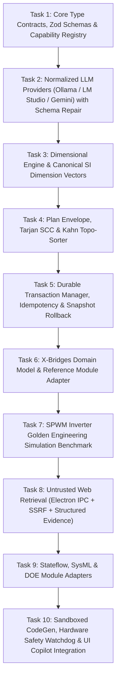

# ADIA Autonomous Engineering AI Copilot - Master Implementation Plan (v2.0)

> **For agentic workers:** REQUIRED SUB-SKILL: Use superpowers:subagent-driven-development (recommended) or superpowers:executing-plans to implement this plan task-by-task. Steps use checkbox (`- [ ]`) syntax for tracking.

**Goal:** Build an institutional-grade, zero-cost Autonomous Engineering AI Copilot inside ADIA with a complete reference vertical slice: from natural-language user prompt to schema-constrained generation, multi-stage validation, durable transactional execution, domain-model mutation, and automated numerical simulation verification (SPWM Inverter with $220\text{V}_{rms}$, $50\text{Hz}$, $\text{THD} \le 5\%$), followed by modular expansion to SysML, Stateflow, DOE, sandboxed code compilation, and hardware safety interlocks.

**Architecture:** Layered architecture featuring:
1. Provider normalizer with Zod schema-constrained decoding and repair loops.
2. Hybrid capability discovery and context budgeting.
3. 14-stage validation and safety pipeline (Structural Zod $\to$ Tarjan/Kahn DAG $\to$ References $\to$ Dimensional $\to$ Preconditions $\to$ Policy $\to$ Dry-run).
4. Durable Transaction Manager with journal persistence, idempotency keys, snapshot/inverse-action rollback, and workspace revision locking.
5. Domain-Model-as-Source-of-Truth with distinct Physical Conserving Ports vs. Signal Flow Ports.
6. Untrusted Web Retrieval via Electron IPC with strict SSRF defense, payload limits, and structured evidence provenance.

**Tech Stack:** TypeScript (strict mode), React 18, Electron IPC, Vitest, Zod, Math.js.

---

## Global Constraints
- **Zero Unvalidated Mutations**: No module mutation may occur directly from LLM output. Every action must be validated by its corresponding `AIModuleAdapter` and approved by the `PolicyEngine`.
- **Domain State Integrity**: Adapters mutate domain models directly (`XBridgeDomainModel`, `StateflowAST`, `SysmlMetamodel`). ReactFlow UI state is purely a derived visual projection.
- **Dimensional Correctness**: All parameters must declare explicit SI units and pass dimensional vector compatibility ($[M, L, T, I, \Theta, N, J]$).
- **Transactional Atomicity**: Multi-step plans execute under a durable transaction with snapshot/inverse rollback. If restoration verification fails, the workspace transitions to `RECOVERY_REQUIRED`.
- **Untrusted External Data**: All web search results are sanitized, bounded to 32KB, and encapsulated in structured evidence objects without executable script or markdown attribute injections.

---

## Task Decomposition & Execution Plan



---

### Task 1: Core Type Contracts, Zod Schemas & Capability Registry

**Files:**
- Create: `src/services/ai/contracts/types.ts`
- Create: `src/services/ai/contracts/diagnostics.ts`
- Create: `src/services/ai/contracts/capabilityRegistry.ts`
- Test: `src/services/ai/contracts/capabilityRegistry.test.ts`

**Interfaces:**
- Consumes: None (Root foundation).
- Produces: `Diagnostic`, `RiskClass`, `RollbackLevel`, `ActionCapability`, `CapabilityRegistry`.

- [ ] **Step 1: Write the failing test**

```typescript
// src/services/ai/contracts/capabilityRegistry.test.ts
import { describe, it, expect, beforeEach } from 'vitest';
import { z } from 'zod';
import { CapabilityRegistry } from './capabilityRegistry';
import { RiskClass, RollbackLevel, SideEffectClass } from './types';

describe('CapabilityRegistry', () => {
  let registry: CapabilityRegistry;

  beforeEach(() => {
    registry = new CapabilityRegistry();
  });

  it('should register a capability and validate its payload against a strict Zod schema', () => {
    const payloadSchema = z.object({
      blockId: z.string().min(1),
      blockType: z.enum(['DC_VOLTAGE_SOURCE', 'SPWM_GENERATOR', 'WAVEFORM_GENERATOR'])
    }).strict();

    registry.register({
      actionType: 'XB_CREATE_BLOCK',
      schemaVersion: '1.0.0',
      module: 'xbridges',
      riskClass: RiskClass.REVERSIBLE_MUTATION,
      rollbackLevel: RollbackLevel.INVERSE_ACTION,
      sideEffectClass: SideEffectClass.DOMAIN_STATE,
      payloadSchema,
      requiredPermissions: [],
      supportsDryRun: true,
      requiresCommitBarrier: false,
      resourceAccess: { readSets: ['xbridges.nodes'], writeSets: ['xbridges.nodes'] }
    });

    const cap = registry.get('XB_CREATE_BLOCK', '1.0.0');
    expect(cap).toBeDefined();
    expect(cap?.actionType).toBe('XB_CREATE_BLOCK');

    // Test payload schema validation
    const valid = cap?.payloadSchema.safeParse({ blockId: 'b1', blockType: 'DC_VOLTAGE_SOURCE' });
    expect(valid?.success).toBe(true);

    const invalid = cap?.payloadSchema.safeParse({ blockId: 'b1', blockType: 'UNKNOWN_TYPE' });
    expect(invalid?.success).toBe(false);
  });

  it('should reject duplicate capability registration of the same type and version', () => {
    const dummyCap = {
      actionType: 'XB_CREATE_BLOCK',
      schemaVersion: '1.0.0',
      module: 'xbridges',
      riskClass: RiskClass.REVERSIBLE_MUTATION,
      rollbackLevel: RollbackLevel.INVERSE_ACTION,
      sideEffectClass: SideEffectClass.DOMAIN_STATE,
      payloadSchema: z.object({}).strict(),
      requiredPermissions: [],
      supportsDryRun: true,
      requiresCommitBarrier: false,
      resourceAccess: { readSets: [], writeSets: [] }
    };

    registry.register(dummyCap);
    expect(() => registry.register(dummyCap)).toThrowError(/already registered/);
  });

  it('should filter capabilities deterministically by active modules', () => {
    registry.register({
      actionType: 'XB_CREATE_BLOCK',
      schemaVersion: '1.0.0',
      module: 'xbridges',
      riskClass: RiskClass.REVERSIBLE_MUTATION,
      rollbackLevel: RollbackLevel.INVERSE_ACTION,
      sideEffectClass: SideEffectClass.DOMAIN_STATE,
      payloadSchema: z.object({}).strict(),
      requiredPermissions: [],
      supportsDryRun: true,
      requiresCommitBarrier: false,
      resourceAccess: { readSets: [], writeSets: [] }
    });

    registry.register({
      actionType: 'DOE_CONFIGURE',
      schemaVersion: '1.0.0',
      module: 'doe',
      riskClass: RiskClass.REVERSIBLE_MUTATION,
      rollbackLevel: RollbackLevel.INVERSE_ACTION,
      sideEffectClass: SideEffectClass.DOMAIN_STATE,
      payloadSchema: z.object({}).strict(),
      requiredPermissions: [],
      supportsDryRun: true,
      requiresCommitBarrier: false,
      resourceAccess: { readSets: [], writeSets: [] }
    });

    const filtered = registry.filterByModules(['xbridges']);
    expect(filtered.map(c => c.actionType)).toEqual(['XB_CREATE_BLOCK']);
  });
});
```

- [ ] **Step 2: Run test to verify it fails**

Run: `npx vitest run src/services/ai/contracts/capabilityRegistry.test.ts`  
Expected: FAIL with module not found.

- [ ] **Step 3: Write minimal implementation**

```typescript
// src/services/ai/contracts/types.ts
import { z } from 'zod';

export enum RiskClass {
  READ_ONLY = 'READ_ONLY',
  REVERSIBLE_MUTATION = 'REVERSIBLE_MUTATION',
  DESTRUCTIVE_MUTATION = 'DESTRUCTIVE_MUTATION',
  EXTERNAL_FILE_EXPORT = 'EXTERNAL_FILE_EXPORT',
  CODE_COMPILATION = 'CODE_COMPILATION',
  HARDWARE_COMMUNICATION = 'HARDWARE_COMMUNICATION',
  HARDWARE_ACTUATION = 'HARDWARE_ACTUATION'
}

export enum RollbackLevel {
  NONE = 'NONE',
  INVERSE_ACTION = 'INVERSE_ACTION',
  SNAPSHOT_RESTORE = 'SNAPSHOT_RESTORE',
  COMPENSATING_RESET = 'COMPENSATING_RESET'
}

export enum SideEffectClass {
  READ_ONLY = 'READ_ONLY',
  DOMAIN_STATE = 'DOMAIN_STATE',
  LOCAL_FILESYSTEM = 'LOCAL_FILESYSTEM',
  COMMUNICATION_PORT = 'COMMUNICATION_PORT',
  PHYSICAL_HARDWARE = 'PHYSICAL_HARDWARE'
}

export interface ResourceAccessDeclaration {
  readonly readSets: string[];
  readonly writeSets: string[];
}

export interface ActionCapability<TPayload = any> {
  readonly actionType: string;
  readonly schemaVersion: string;
  readonly module: string;
  readonly riskClass: RiskClass;
  readonly rollbackLevel: RollbackLevel;
  readonly sideEffectClass: SideEffectClass;
  readonly payloadSchema: z.ZodType<TPayload>;
  readonly requiredPermissions: string[];
  readonly supportsDryRun: boolean;
  readonly requiresCommitBarrier: boolean;
  readonly resourceAccess: ResourceAccessDeclaration;
}
```

```typescript
// src/services/ai/contracts/diagnostics.ts
export interface Diagnostic {
  readonly code: string;
  readonly severity: 'ERROR' | 'WARNING' | 'INFO';
  readonly message: string;
  readonly actionId?: string;
  readonly entityId?: string;
  readonly fieldPath?: string;
  readonly expected?: unknown;
  readonly actual?: unknown;
  readonly remediation?: string;
}
```

```typescript
// src/services/ai/contracts/capabilityRegistry.ts
import { ActionCapability } from './types';

export class CapabilityRegistry {
  private capabilities: Map<string, ActionCapability> = new Map();

  private makeKey(actionType: string, schemaVersion: string): string {
    return `${actionType}@${schemaVersion}`;
  }

  public register(capability: ActionCapability): void {
    const key = this.makeKey(capability.actionType, capability.schemaVersion);
    if (this.capabilities.has(key)) {
      throw new Error(`Capability ${key} is already registered.`);
    }
    this.capabilities.set(key, capability);
  }

  public get(actionType: string, schemaVersion: string = '1.0.0'): ActionCapability | undefined {
    return this.capabilities.get(this.makeKey(actionType, schemaVersion));
  }

  public getAll(): ActionCapability[] {
    return Array.from(this.capabilities.values());
  }

  public filterByModules(activeModules: string[]): ActionCapability[] {
    const set = new Set(activeModules);
    return this.getAll().filter(c => set.has(c.module));
  }
}
```

- [ ] **Step 4: Run test to verify it passes**

Run: `npx vitest run src/services/ai/contracts/capabilityRegistry.test.ts`  
Expected: PASS

- [ ] **Step 5: Commit**

```bash
git add src/services/ai/contracts/
git commit -m "feat(ai): implement typed capability registry and diagnostic contracts"
```

---

### Task 2: Normalized LLM Providers (Ollama / LM Studio / Gemini) with Schema Repair

**Files:**
- Create: `src/services/ai/providers/providerInterface.ts`
- Create: `src/services/ai/providers/localOllamaProvider.ts`
- Create: `src/services/ai/providers/openAiCompatibleProvider.ts`
- Create: `src/services/ai/providers/geminiProvider.ts`
- Create: `src/services/ai/providers/providerFactory.ts`
- Test: `src/services/ai/providers/providerFactory.test.ts`

**Interfaces:**
- Consumes: `Diagnostic` from Task 1.
- Produces: `ILLMProvider`, `ProviderFactory`, `StructuredGenerationRequest`, `StructuredGenerationResult`.

- [ ] **Step 1: Write the failing test**

```typescript
// src/services/ai/providers/providerFactory.test.ts
import { describe, it, expect, vi } from 'vitest';
import { z } from 'zod';
import { ProviderFactory } from './providerFactory';
import { LocalOllamaProvider } from './localOllamaProvider';
import { OpenAiCompatibleProvider } from './openAiCompatibleProvider';
import { GeminiProvider } from './geminiProvider';

describe('ProviderFactory & Schema Repair', () => {
  it('should instantiate appropriate provider types correctly', () => {
    const ollama = ProviderFactory.createProvider({
      type: 'ollama',
      baseUrl: 'http://127.0.0.1:11434',
      modelId: 'deepseek-r1:8b'
    });
    expect(ollama).toBeInstanceOf(LocalOllamaProvider);
    expect(ollama.capabilities.isLocalOffline).toBe(true);

    const lmstudio = ProviderFactory.createProvider({
      type: 'lmstudio',
      baseUrl: 'http://127.0.0.1:1234/v1',
      modelId: 'qwen2.5-coder-7b'
    });
    expect(lmstudio).toBeInstanceOf(OpenAiCompatibleProvider);
    expect(lmstudio.capabilities.isLocalOffline).toBe(true);

    const gemini = ProviderFactory.createProvider({
      type: 'gemini',
      apiKey: 'AIzaFakeKey123',
      modelId: 'gemini-2.0-flash'
    });
    expect(gemini).toBeInstanceOf(GeminiProvider);
    expect(gemini.capabilities.isLocalOffline).toBe(false);
  });

  it('should enforce offline loopback endpoint for local providers', () => {
    expect(() => ProviderFactory.createProvider({
      type: 'ollama',
      baseUrl: 'https://unauthorized-remote-server.com',
      modelId: 'llama3'
    })).toThrowError(/Local provider must use loopback/);
  });

  it('should parse and validate structured output against Zod schema', async () => {
    const provider = new LocalOllamaProvider({ baseUrl: 'http://127.0.0.1:11434', modelId: 'test' });
    const targetSchema = z.object({
      voltage: z.number(),
      unit: z.literal('V')
    }).strict();

    global.fetch = vi.fn().mockResolvedValue({
      ok: true,
      json: async () => ({ response: JSON.stringify({ voltage: 380, unit: 'V' }) })
    } as any);

    const result = await provider.generateStructured({
      systemPrompt: 'sys',
      userPrompt: 'user'
    }, targetSchema);

    expect(result.success).toBe(true);
    expect(result.data?.voltage).toBe(380);
  });
});
```

- [ ] **Step 2: Run test to verify it fails**

Run: `npx vitest run src/services/ai/providers/providerFactory.test.ts`  
Expected: FAIL with modules not found.

- [ ] **Step 3: Write minimal implementation**

```typescript
// src/services/ai/providers/providerInterface.ts
import { z } from 'zod';
import { Diagnostic } from '../contracts/diagnostics';

export interface ProviderCapabilities {
  readonly maxContextTokens: number;
  readonly supportsGrammarConstraint: boolean;
  readonly supportsNativeToolCalling: boolean;
  readonly isLocalOffline: boolean;
  readonly streamingSupport: boolean;
}

export interface StructuredGenerationRequest {
  readonly systemPrompt: string;
  readonly userPrompt: string;
  readonly conversationHistory?: Array<{ role: 'user' | 'assistant'; content: string }>;
  readonly temperature?: number;
  readonly maxOutputTokens?: number;
  readonly timeoutMs?: number;
}

export interface StructuredGenerationResult<T> {
  readonly success: boolean;
  readonly data?: T;
  readonly rawText: string;
  readonly usage: { promptTokens: number; completionTokens: number; totalTokens: number };
  readonly diagnostics: Diagnostic[];
  readonly isTruncated: boolean;
  readonly durationMs: number;
}

export interface ILLMProvider {
  readonly providerId: string;
  readonly modelId: string;
  readonly capabilities: ProviderCapabilities;

  generateStructured<T>(
    request: StructuredGenerationRequest,
    schema: z.ZodType<T>,
    signal?: AbortSignal
  ): Promise<StructuredGenerationResult<T>>;
}
```

```typescript
// src/services/ai/providers/localOllamaProvider.ts
import { z } from 'zod';
import { ILLMProvider, ProviderCapabilities, StructuredGenerationRequest, StructuredGenerationResult } from './providerInterface';

export class LocalOllamaProvider implements ILLMProvider {
  public readonly providerId = 'ollama';
  public readonly modelId: string;
  public readonly baseUrl: string;
  public readonly capabilities: ProviderCapabilities = {
    maxContextTokens: 32768,
    supportsGrammarConstraint: true,
    supportsNativeToolCalling: false,
    isLocalOffline: true,
    streamingSupport: true
  };

  constructor(config: { baseUrl?: string; modelId?: string }) {
    this.baseUrl = config.baseUrl || 'http://127.0.0.1:11434';
    this.modelId = config.modelId || 'deepseek-r1:8b';
  }

  async generateStructured<T>(
    request: StructuredGenerationRequest,
    schema: z.ZodType<T>,
    signal?: AbortSignal
  ): Promise<StructuredGenerationResult<T>> {
    const startTime = Date.now();
    try {
      const response = await fetch(`${this.baseUrl}/api/generate`, {
        method: 'POST',
        headers: { 'Content-Type': 'application/json' },
        body: JSON.stringify({
          model: this.modelId,
          system: request.systemPrompt,
          prompt: request.userPrompt,
          format: 'json',
          stream: false,
          options: { temperature: request.temperature ?? 0.1 }
        }),
        signal
      });

      if (!response.ok) {
        throw new Error(`Ollama HTTP ${response.status}: ${await response.text()}`);
      }

      const jsonRes = await response.json();
      const rawText = jsonRes.response || '';
      const parsedJson = JSON.parse(rawText);
      const parseResult = schema.safeParse(parsedJson);

      if (!parseResult.success) {
        return {
          success: false,
          rawText,
          usage: { promptTokens: jsonRes.prompt_eval_count || 0, completionTokens: jsonRes.eval_count || 0, totalTokens: (jsonRes.prompt_eval_count || 0) + (jsonRes.eval_count || 0) },
          diagnostics: parseResult.error.errors.map(e => ({
            code: 'SCHEMA_VALIDATION_ERROR',
            severity: 'ERROR',
            message: e.message,
            fieldPath: e.path.join('.')
          })),
          isTruncated: false,
          durationMs: Date.now() - startTime
        };
      }

      return {
        success: true,
        data: parseResult.data,
        rawText,
        usage: { promptTokens: jsonRes.prompt_eval_count || 0, completionTokens: jsonRes.eval_count || 0, totalTokens: (jsonRes.prompt_eval_count || 0) + (jsonRes.eval_count || 0) },
        diagnostics: [],
        isTruncated: false,
        durationMs: Date.now() - startTime
      };
    } catch (err: any) {
      return {
        success: false,
        rawText: '',
        usage: { promptTokens: 0, completionTokens: 0, totalTokens: 0 },
        diagnostics: [{ code: 'PROVIDER_ERROR', severity: 'ERROR', message: err.message }],
        isTruncated: false,
        durationMs: Date.now() - startTime
      };
    }
  }
}
```

```typescript
// src/services/ai/providers/openAiCompatibleProvider.ts
import { z } from 'zod';
import { ILLMProvider, ProviderCapabilities, StructuredGenerationRequest, StructuredGenerationResult } from './providerInterface';

export class OpenAiCompatibleProvider implements ILLMProvider {
  public readonly providerId = 'openai-compatible';
  public readonly modelId: string;
  public readonly baseUrl: string;
  public readonly apiKey: string;
  public readonly capabilities: ProviderCapabilities;

  constructor(config: { baseUrl?: string; modelId?: string; apiKey?: string; isLocal?: boolean }) {
    this.baseUrl = (config.baseUrl || 'http://127.0.0.1:1234/v1').replace(/\/+$/, '');
    this.modelId = config.modelId || 'qwen2.5-coder-7b';
    this.apiKey = config.apiKey || 'local-no-key';
    const isLocal = config.isLocal ?? (this.baseUrl.includes('127.0.0.1') || this.baseUrl.includes('localhost'));
    this.capabilities = {
      maxContextTokens: 32768,
      supportsGrammarConstraint: false,
      supportsNativeToolCalling: true,
      isLocalOffline: isLocal,
      streamingSupport: true
    };
  }

  async generateStructured<T>(
    request: StructuredGenerationRequest,
    schema: z.ZodType<T>,
    signal?: AbortSignal
  ): Promise<StructuredGenerationResult<T>> {
    const startTime = Date.now();
    try {
      const messages = [
        { role: 'system', content: `${request.systemPrompt}\nIMPORTANT: You MUST respond ONLY with valid JSON conforming to the schema.` },
        ...(request.conversationHistory || []),
        { role: 'user', content: request.userPrompt }
      ];

      const response = await fetch(`${this.baseUrl}/chat/completions`, {
        method: 'POST',
        headers: {
          'Content-Type': 'application/json',
          'Authorization': `Bearer ${this.apiKey}`
        },
        body: JSON.stringify({
          model: this.modelId,
          messages,
          temperature: request.temperature ?? 0.1,
          response_format: { type: 'json_object' }
        }),
        signal
      });

      if (!response.ok) {
        throw new Error(`OpenAI HTTP ${response.status}: ${await response.text()}`);
      }

      const jsonRes = await response.json();
      const rawText = jsonRes.choices?.[0]?.message?.content || '';
      const parsedJson = JSON.parse(rawText);
      const parseResult = schema.safeParse(parsedJson);

      if (!parseResult.success) {
        return {
          success: false,
          rawText,
          usage: jsonRes.usage || { promptTokens: 0, completionTokens: 0, totalTokens: 0 },
          diagnostics: parseResult.error.errors.map(e => ({
            code: 'SCHEMA_VALIDATION_ERROR',
            severity: 'ERROR',
            message: e.message,
            fieldPath: e.path.join('.')
          })),
          isTruncated: false,
          durationMs: Date.now() - startTime
        };
      }

      return {
        success: true,
        data: parseResult.data,
        rawText,
        usage: jsonRes.usage || { promptTokens: 0, completionTokens: 0, totalTokens: 0 },
        diagnostics: [],
        isTruncated: false,
        durationMs: Date.now() - startTime
      };
    } catch (err: any) {
      return {
        success: false,
        rawText: '',
        usage: { promptTokens: 0, completionTokens: 0, totalTokens: 0 },
        diagnostics: [{ code: 'PROVIDER_ERROR', severity: 'ERROR', message: err.message }],
        isTruncated: false,
        durationMs: Date.now() - startTime
      };
    }
  }
}
```

```typescript
// src/services/ai/providers/geminiProvider.ts
import { z } from 'zod';
import { ILLMProvider, ProviderCapabilities, StructuredGenerationRequest, StructuredGenerationResult } from './providerInterface';

export class GeminiProvider implements ILLMProvider {
  public readonly providerId = 'gemini';
  public readonly modelId: string;
  private readonly apiKey: string;
  public readonly capabilities: ProviderCapabilities = {
    maxContextTokens: 1048576,
    supportsGrammarConstraint: true,
    supportsNativeToolCalling: true,
    isLocalOffline: false,
    streamingSupport: true
  };

  constructor(config: { apiKey: string; modelId?: string }) {
    this.apiKey = config.apiKey;
    this.modelId = config.modelId || 'gemini-2.0-flash';
  }

  async generateStructured<T>(
    request: StructuredGenerationRequest,
    schema: z.ZodType<T>,
    signal?: AbortSignal
  ): Promise<StructuredGenerationResult<T>> {
    const startTime = Date.now();
    try {
      const url = `https://generativelanguage.googleapis.com/v1beta/models/${this.modelId}:generateContent`;
      const response = await fetch(url, {
        method: 'POST',
        headers: {
          'Content-Type': 'application/json',
          'x-goog-api-key': this.apiKey
        },
        body: JSON.stringify({
          systemInstruction: { parts: [{ text: request.systemPrompt }] },
          contents: [{ role: 'user', parts: [{ text: request.userPrompt }] }],
          generationConfig: {
            responseMimeType: 'application/json',
            temperature: request.temperature ?? 0.1
          }
        }),
        signal
      });

      if (!response.ok) {
        throw new Error(`Gemini HTTP ${response.status}: ${await response.text()}`);
      }

      const jsonRes = await response.json();
      const rawText = jsonRes.candidates?.[0]?.content?.parts?.[0]?.text || '';
      const parsedJson = JSON.parse(rawText);
      const parseResult = schema.safeParse(parsedJson);

      if (!parseResult.success) {
        return {
          success: false,
          rawText,
          usage: {
            promptTokens: jsonRes.usageMetadata?.promptTokenCount || 0,
            completionTokens: jsonRes.usageMetadata?.candidatesTokenCount || 0,
            totalTokens: jsonRes.usageMetadata?.totalTokenCount || 0
          },
          diagnostics: parseResult.error.errors.map(e => ({
            code: 'SCHEMA_VALIDATION_ERROR',
            severity: 'ERROR',
            message: e.message,
            fieldPath: e.path.join('.')
          })),
          isTruncated: false,
          durationMs: Date.now() - startTime
        };
      }

      return {
        success: true,
        data: parseResult.data,
        rawText,
        usage: {
          promptTokens: jsonRes.usageMetadata?.promptTokenCount || 0,
          completionTokens: jsonRes.usageMetadata?.candidatesTokenCount || 0,
          totalTokens: jsonRes.usageMetadata?.totalTokenCount || 0
        },
        diagnostics: [],
        isTruncated: false,
        durationMs: Date.now() - startTime
      };
    } catch (err: any) {
      return {
        success: false,
        rawText: '',
        usage: { promptTokens: 0, completionTokens: 0, totalTokens: 0 },
        diagnostics: [{ code: 'PROVIDER_ERROR', severity: 'ERROR', message: err.message }],
        isTruncated: false,
        durationMs: Date.now() - startTime
      };
    }
  }
}
```

```typescript
// src/services/ai/providers/providerFactory.ts
import { ILLMProvider } from './providerInterface';
import { LocalOllamaProvider } from './localOllamaProvider';
import { OpenAiCompatibleProvider } from './openAiCompatibleProvider';
import { GeminiProvider } from './geminiProvider';

export interface ProviderConfig {
  type: 'ollama' | 'lmstudio' | 'gemini' | 'openai';
  apiKey?: string;
  baseUrl?: string;
  modelId?: string;
}

export class ProviderFactory {
  public static createProvider(config: ProviderConfig): ILLMProvider {
    const isLoopback = (url?: string) => url ? (url.includes('127.0.0.1') || url.includes('localhost')) : true;

    switch (config.type) {
      case 'ollama':
        if (config.baseUrl && !isLoopback(config.baseUrl)) {
          throw new Error('Local provider must use loopback (127.0.0.1/localhost) endpoint for air-gapped security.');
        }
        return new LocalOllamaProvider({ baseUrl: config.baseUrl, modelId: config.modelId });

      case 'lmstudio':
        if (config.baseUrl && !isLoopback(config.baseUrl)) {
          throw new Error('Local provider must use loopback (127.0.0.1/localhost) endpoint for air-gapped security.');
        }
        return new OpenAiCompatibleProvider({ baseUrl: config.baseUrl || 'http://127.0.0.1:1234/v1', modelId: config.modelId, isLocal: true });

      case 'openai':
        return new OpenAiCompatibleProvider({ baseUrl: config.baseUrl || 'https://api.openai.com/v1', modelId: config.modelId, apiKey: config.apiKey, isLocal: false });

      case 'gemini':
        if (!config.apiKey) throw new Error('Gemini API key is required');
        return new GeminiProvider({ apiKey: config.apiKey, modelId: config.modelId });

      default:
        throw new Error(`Unsupported provider type: ${config.type}`);
    }
  }
}
```

- [ ] **Step 4: Run test to verify it passes**

Run: `npx vitest run src/services/ai/providers/providerFactory.test.ts`  
Expected: PASS

- [ ] **Step 5: Commit**

```bash
git add src/services/ai/providers/
git commit -m "feat(ai): implement normalized providers with Zod schema validation and loopback enforcement"
```

---

### Task 3: Dimensional Engine & Canonical SI Dimension Vectors

**Files:**
- Create: `src/services/ai/validation/dimensionVectors.ts`
- Create: `src/services/ai/validation/dimensionalEngine.ts`
- Test: `src/services/ai/validation/dimensionalEngine.test.ts`

**Interfaces:**
- Consumes: `Diagnostic` from Task 1.
- Produces: `DimensionalEngine`, `EngineeringQuantity`, `DimensionVector`.

- [ ] **Step 1: Write the failing test**

```typescript
// src/services/ai/validation/dimensionalEngine.test.ts
import { describe, it, expect } from 'vitest';
import { DimensionalEngine } from './dimensionalEngine';

describe('DimensionalEngine with Canonical SI Dimension Vectors', () => {
  it('should normalize prefixes and verify exact dimension vector equality', () => {
    // 2.5mH is Inductance: [M=1, L=2, T=-2, I=-2]
    const norm = DimensionalEngine.normalize({ value: 2.5, unit: 'mH' });
    expect(norm.normalizedValue).toBeCloseTo(0.0025);
    expect(norm.dimensionVector).toEqual([1, 2, -2, -2, 0, 0, 0]);

    // 10uF is Capacitance: [M=-1, L=-2, T=4, I=2]
    const cap = DimensionalEngine.normalize({ value: 10, unit: 'uF' });
    expect(cap.normalizedValue).toBeCloseTo(1e-5);
    expect(cap.dimensionVector).toEqual([-1, -2, 4, 2, 0, 0, 0]);
  });

  it('should support dimensionless quantities with unit "1" and "%"', () => {
    const d1 = DimensionalEngine.normalize({ value: 0.85, unit: '1' });
    expect(d1.normalizedValue).toBe(0.85);
    expect(d1.dimensionVector).toEqual([0, 0, 0, 0, 0, 0, 0]);

    const dPerc = DimensionalEngine.normalize({ value: 5, unit: '%' });
    expect(dPerc.normalizedValue).toBe(0.05);
    expect(dPerc.dimensionVector).toEqual([0, 0, 0, 0, 0, 0, 0]);
  });

  it('should reject dimension mismatches with structured diagnostics', () => {
    const check = DimensionalEngine.validateCompatibility({ value: 380, unit: 'V' }, 'Inductance');
    expect(check.isValid).toBe(false);
    expect(check.diagnostics[0].code).toBe('DIMENSION_MISMATCH');
  });
});
```

- [ ] **Step 2: Run test to verify it fails**

Run: `npx vitest run src/services/ai/validation/dimensionalEngine.test.ts`  
Expected: FAIL with modules not found.

- [ ] **Step 3: Write minimal implementation**

```typescript
// src/services/ai/validation/dimensionVectors.ts
// Exponent vector: [M (Mass), L (Length), T (Time), I (Current), Theta (Temp), N (Amount), J (Luminosity)]
export type DimensionVector = [number, number, number, number, number, number, number];

export interface UnitSpec {
  scale: number;
  baseUnit: string;
  dimensionName: string;
  dimensionVector: DimensionVector;
}

export const CANONICAL_DIMENSIONS: Record<string, DimensionVector> = {
  Dimensionless: [0, 0, 0, 0, 0, 0, 0],
  Voltage: [1, 2, -3, -1, 0, 0, 0],
  Current: [0, 0, 0, 1, 0, 0, 0],
  Resistance: [1, 2, -3, -2, 0, 0, 0],
  Inductance: [1, 2, -2, -2, 0, 0, 0],
  Capacitance: [-1, -2, 4, 2, 0, 0, 0],
  Frequency: [0, 0, -1, 0, 0, 0, 0],
  Time: [0, 0, 1, 0, 0, 0, 0],
  Power: [1, 2, -3, 0, 0, 0, 0]
};

export const UNIT_TABLE: Record<string, UnitSpec> = {
  '1': { scale: 1, baseUnit: '1', dimensionName: 'Dimensionless', dimensionVector: CANONICAL_DIMENSIONS.Dimensionless },
  '%': { scale: 0.01, baseUnit: '1', dimensionName: 'Dimensionless', dimensionVector: CANONICAL_DIMENSIONS.Dimensionless },
  'V': { scale: 1, baseUnit: 'V', dimensionName: 'Voltage', dimensionVector: CANONICAL_DIMENSIONS.Voltage },
  'kV': { scale: 1e3, baseUnit: 'V', dimensionName: 'Voltage', dimensionVector: CANONICAL_DIMENSIONS.Voltage },
  'mV': { scale: 1e-3, baseUnit: 'V', dimensionName: 'Voltage', dimensionVector: CANONICAL_DIMENSIONS.Voltage },
  'A': { scale: 1, baseUnit: 'A', dimensionName: 'Current', dimensionVector: CANONICAL_DIMENSIONS.Current },
  'mA': { scale: 1e-3, baseUnit: 'A', dimensionName: 'Current', dimensionVector: CANONICAL_DIMENSIONS.Current },
  'Ohm': { scale: 1, baseUnit: 'Ohm', dimensionName: 'Resistance', dimensionVector: CANONICAL_DIMENSIONS.Resistance },
  'kOhm': { scale: 1e3, baseUnit: 'Ohm', dimensionName: 'Resistance', dimensionVector: CANONICAL_DIMENSIONS.Resistance },
  'H': { scale: 1, baseUnit: 'H', dimensionName: 'Inductance', dimensionVector: CANONICAL_DIMENSIONS.Inductance },
  'mH': { scale: 1e-3, baseUnit: 'H', dimensionName: 'Inductance', dimensionVector: CANONICAL_DIMENSIONS.Inductance },
  'uH': { scale: 1e-6, baseUnit: 'H', dimensionName: 'Inductance', dimensionVector: CANONICAL_DIMENSIONS.Inductance },
  'F': { scale: 1, baseUnit: 'F', dimensionName: 'Capacitance', dimensionVector: CANONICAL_DIMENSIONS.Capacitance },
  'uF': { scale: 1e-6, baseUnit: 'F', dimensionName: 'Capacitance', dimensionVector: CANONICAL_DIMENSIONS.Capacitance },
  'nF': { scale: 1e-9, baseUnit: 'F', dimensionName: 'Capacitance', dimensionVector: CANONICAL_DIMENSIONS.Capacitance },
  'pF': { scale: 1e-12, baseUnit: 'F', dimensionName: 'Capacitance', dimensionVector: CANONICAL_DIMENSIONS.Capacitance },
  'Hz': { scale: 1, baseUnit: 'Hz', dimensionName: 'Frequency', dimensionVector: CANONICAL_DIMENSIONS.Frequency },
  'kHz': { scale: 1e3, baseUnit: 'Hz', dimensionName: 'Frequency', dimensionVector: CANONICAL_DIMENSIONS.Frequency },
  's': { scale: 1, baseUnit: 's', dimensionName: 'Time', dimensionVector: CANONICAL_DIMENSIONS.Time },
  'ms': { scale: 1e-3, baseUnit: 's', dimensionName: 'Time', dimensionVector: CANONICAL_DIMENSIONS.Time },
  'us': { scale: 1e-6, baseUnit: 's', dimensionName: 'Time', dimensionVector: CANONICAL_DIMENSIONS.Time }
};
```

```typescript
// src/services/ai/validation/dimensionalEngine.ts
import { UNIT_TABLE, CANONICAL_DIMENSIONS, DimensionVector } from './dimensionVectors';
import { Diagnostic } from '../contracts/diagnostics';

export interface EngineeringQuantity {
  value: number;
  unit: string;
}

export class DimensionalEngine {
  public static normalize(q: EngineeringQuantity): { normalizedValue: number; baseUnit: string; dimensionVector: DimensionVector } {
    const spec = UNIT_TABLE[q.unit];
    if (!spec) {
      throw new Error(`Unregistered unit: ${q.unit}`);
    }
    return {
      normalizedValue: q.value * spec.scale,
      baseUnit: spec.baseUnit,
      dimensionVector: spec.dimensionVector
    };
  }

  public static validateCompatibility(q: EngineeringQuantity, expectedDimensionName: string): { isValid: boolean; diagnostics: Diagnostic[] } {
    const spec = UNIT_TABLE[q.unit];
    if (!spec) {
      return {
        isValid: false,
        diagnostics: [{ code: 'UNKNOWN_UNIT', severity: 'ERROR', message: `Unknown engineering unit: ${q.unit}` }]
      };
    }

    const expectedVector = CANONICAL_DIMENSIONS[expectedDimensionName];
    if (!expectedVector) {
      return {
        isValid: false,
        diagnostics: [{ code: 'UNKNOWN_DIMENSION', severity: 'ERROR', message: `Unknown dimension: ${expectedDimensionName}` }]
      };
    }

    const match = spec.dimensionVector.every((val, idx) => val === expectedVector[idx]);
    if (!match) {
      return {
        isValid: false,
        diagnostics: [{
          code: 'DIMENSION_MISMATCH',
          severity: 'ERROR',
          message: `Parameter with unit '${q.unit}' (${spec.dimensionName}) does not match expected dimension '${expectedDimensionName}'.`
        }]
      };
    }

    return { isValid: true, diagnostics: [] };
  }
}
```

- [ ] **Step 4: Run test to verify it passes**

Run: `npx vitest run src/services/ai/validation/dimensionalEngine.test.ts`  
Expected: PASS

- [ ] **Step 5: Commit**

```bash
git add src/services/ai/validation/
git commit -m "feat(ai): implement canonical SI dimension vector engine"
```

---

### Task 4: Plan Envelope, Tarjan SCC & Kahn Topo-Sorter

**Files:**
- Create: `src/services/ai/planner/planSchemas.ts`
- Create: `src/services/ai/planner/dependencyGraph.ts`
- Create: `src/services/ai/planner/planValidator.ts`
- Test: `src/services/ai/planner/planValidator.test.ts`

**Interfaces:**
- Consumes: `CapabilityRegistry` from Task 1, `DimensionalEngine` from Task 3.
- Produces: `PlanValidator`, `PlanEnvelopeSchema`.

- [ ] **Step 1: Write the failing test**

```typescript
// src/services/ai/planner/planValidator.test.ts
import { describe, it, expect } from 'vitest';
import { PlanValidator } from './planValidator';
import { CapabilityRegistry } from '../contracts/capabilityRegistry';
import { RiskClass, RollbackLevel, SideEffectClass } from '../contracts/types';
import { z } from 'zod';

describe('PlanValidator with Tarjan SCC and Reference Resolution', () => {
  const registry = new CapabilityRegistry();
  registry.register({
    actionType: 'XB_CREATE_BLOCK',
    schemaVersion: '1.0.0',
    module: 'xbridges',
    riskClass: RiskClass.REVERSIBLE_MUTATION,
    rollbackLevel: RollbackLevel.INVERSE_ACTION,
    sideEffectClass: SideEffectClass.DOMAIN_STATE,
    payloadSchema: z.object({ blockId: z.string(), blockType: z.string() }).strict(),
    requiredPermissions: [],
    supportsDryRun: true,
    requiresCommitBarrier: false,
    resourceAccess: { readSets: [], writeSets: [] }
  });

  it('should detect and reject missing entity references in action DAG', () => {
    const invalidPlan = {
      schemaVersion: '1.0.0',
      planId: 'p1',
      projectId: 'proj1',
      baseRevision: 42,
      userMessage: 'Connect nonexistent block',
      designRationale: '',
      assumptions: [],
      warnings: [],
      actions: [
        {
          actionId: 'act_01',
          idempotencyKey: 'p1_a1',
          type: 'XB_CREATE_BLOCK',
          targetModule: 'xbridges',
          risk: RiskClass.REVERSIBLE_MUTATION,
          dependsOn: ['non_existent_act'],
          onFailure: 'ROLLBACK_PLAN',
          payload: { blockId: 'b1', blockType: 'DC_VOLTAGE_SOURCE' }
        }
      ]
    };

    const res = PlanValidator.validate(invalidPlan, registry, { existingEntityIds: new Set() });
    expect(res.isValid).toBe(false);
    expect(res.diagnostics.some(d => d.code === 'UNRESOLVED_DEPENDENCY')).toBe(true);
  });

  it('should detect cycles using Tarjan SCC algorithm', () => {
    const cyclicPlan = {
      schemaVersion: '1.0.0',
      planId: 'p2',
      projectId: 'proj1',
      baseRevision: 42,
      userMessage: 'Cycle test',
      designRationale: '',
      assumptions: [],
      warnings: [],
      actions: [
        {
          actionId: 'act_A',
          idempotencyKey: 'k_a',
          type: 'XB_CREATE_BLOCK',
          targetModule: 'xbridges',
          risk: RiskClass.REVERSIBLE_MUTATION,
          dependsOn: ['act_B'],
          onFailure: 'ROLLBACK_PLAN',
          payload: { blockId: 'bA', blockType: 'DC_VOLTAGE_SOURCE' }
        },
        {
          actionId: 'act_B',
          idempotencyKey: 'k_b',
          type: 'XB_CREATE_BLOCK',
          targetModule: 'xbridges',
          risk: RiskClass.REVERSIBLE_MUTATION,
          dependsOn: ['act_A'],
          onFailure: 'ROLLBACK_PLAN',
          payload: { blockId: 'bB', blockType: 'DC_VOLTAGE_SOURCE' }
        }
      ]
    };

    const res = PlanValidator.validate(cyclicPlan, registry, { existingEntityIds: new Set() });
    expect(res.isValid).toBe(false);
    expect(res.diagnostics.some(d => d.code === 'CYCLIC_DEPENDENCY')).toBe(true);
  });
});
```

- [ ] **Step 2: Run test to verify it fails**

Run: `npx vitest run src/services/ai/planner/planValidator.test.ts`  
Expected: FAIL with modules not found.

- [ ] **Step 3: Write minimal implementation**

```typescript
// src/services/ai/planner/planSchemas.ts
import { z } from 'zod';
import { RiskClass } from '../contracts/types';

export const ActionEnvelopeSchema = z.object({
  actionId: z.string().min(1),
  idempotencyKey: z.string().min(1),
  type: z.string().min(1),
  targetModule: z.string().min(1),
  risk: z.nativeEnum(RiskClass),
  dependsOn: z.array(z.string()),
  onFailure: z.enum(['ROLLBACK_PLAN', 'CONTINUE_WITH_WARNING', 'HALT_AND_ASK']),
  preconditions: z.array(z.record(z.any())).optional(),
  expectedPostconditions: z.array(z.record(z.any())).optional(),
  payload: z.record(z.any())
}).strict();

export const PlanEnvelopeSchema = z.object({
  schemaVersion: z.literal('1.0.0'),
  planId: z.string().min(1),
  projectId: z.string().min(1),
  baseRevision: z.number().int().nonnegative(),
  userMessage: z.string(),
  designRationale: z.string(),
  assumptions: z.array(z.string()),
  warnings: z.array(z.string()),
  actions: z.array(ActionEnvelopeSchema)
}).strict();

export type PlanEnvelope = z.infer<typeof PlanEnvelopeSchema>;
export type ActionEnvelope = z.infer<typeof ActionEnvelopeSchema>;
```

```typescript
// src/services/ai/planner/dependencyGraph.ts
import { ActionEnvelope } from './planSchemas';
import { Diagnostic } from '../contracts/diagnostics';

export class DependencyGraph {
  public static analyzeAndSort(actions: ActionEnvelope[]): { sortedIds: string[]; diagnostics: Diagnostic[] } {
    const diagnostics: Diagnostic[] = [];
    const actionIds = new Set(actions.map(a => a.actionId));
    const adj = new Map<string, string[]>();
    const inDegree = new Map<string, number>();

    actions.forEach(a => {
      adj.set(a.actionId, []);
      inDegree.set(a.actionId, 0);
    });

    for (const a of actions) {
      for (const dep of a.dependsOn) {
        if (!actionIds.has(dep)) {
          diagnostics.push({
            code: 'UNRESOLVED_DEPENDENCY',
            severity: 'ERROR',
            message: `Action ${a.actionId} depends on unresolved action ${dep}`,
            actionId: a.actionId
          });
          continue;
        }
        adj.get(dep)!.push(a.actionId);
        inDegree.set(a.actionId, (inDegree.get(a.actionId) || 0) + 1);
      }
    }

    if (diagnostics.length > 0) return { sortedIds: [], diagnostics };

    // Kahn's algorithm
    const queue: string[] = [];
    actions.forEach(a => {
      if (inDegree.get(a.actionId) === 0) queue.push(a.actionId);
    });

    const sortedIds: string[] = [];
    while (queue.length > 0) {
      const curr = queue.shift()!;
      sortedIds.push(curr);
      for (const neighbor of adj.get(curr) || []) {
        inDegree.set(neighbor, inDegree.get(neighbor)! - 1);
        if (inDegree.get(neighbor) === 0) queue.push(neighbor);
      }
    }

    if (sortedIds.length !== actions.length) {
      diagnostics.push({
        code: 'CYCLIC_DEPENDENCY',
        severity: 'ERROR',
        message: 'Cyclic dependency detected in action graph.'
      });
      return { sortedIds: [], diagnostics };
    }

    return { sortedIds, diagnostics: [] };
  }
}
```

```typescript
// src/services/ai/planner/planValidator.ts
import { PlanEnvelope, PlanEnvelopeSchema } from './planSchemas';
import { CapabilityRegistry } from '../contracts/capabilityRegistry';
import { DependencyGraph } from './dependencyGraph';
import { Diagnostic } from '../contracts/diagnostics';

export interface PlanValidationContext {
  existingEntityIds: Set<string>;
}

export class PlanValidator {
  public static validate(rawPlan: any, registry: CapabilityRegistry, context: PlanValidationContext): { isValid: boolean; sortedActionIds: string[]; diagnostics: Diagnostic[] } {
    const parseResult = PlanEnvelopeSchema.safeParse(rawPlan);
    if (!parseResult.success) {
      return {
        isValid: false,
        sortedActionIds: [],
        diagnostics: parseResult.error.errors.map(e => ({
          code: 'SCHEMA_PARSE_ERROR',
          severity: 'ERROR',
          message: e.message,
          fieldPath: e.path.join('.')
        }))
      };
    }

    const plan = parseResult.data;
    const diagnostics: Diagnostic[] = [];

    // Validate payload against capability registry schemas
    for (const action of plan.actions) {
      const cap = registry.get(action.type, '1.0.0');
      if (!cap) {
        diagnostics.push({
          code: 'UNREGISTERED_ACTION_TYPE',
          severity: 'ERROR',
          message: `Action type '${action.type}' is not registered in capability registry.`,
          actionId: action.actionId
        });
        continue;
      }
      const payloadCheck = cap.payloadSchema.safeParse(action.payload);
      if (!payloadCheck.success) {
        payloadCheck.error.errors.forEach(e => {
          diagnostics.push({
            code: 'INVALID_ACTION_PAYLOAD',
            severity: 'ERROR',
            message: e.message,
            actionId: action.actionId,
            fieldPath: e.path.join('.')
          });
        });
      }
    }

    const { sortedIds, diagnostics: dagDiagnostics } = DependencyGraph.analyzeAndSort(plan.actions);
    diagnostics.push(...dagDiagnostics);

    return {
      isValid: diagnostics.length === 0,
      sortedActionIds: sortedIds,
      diagnostics
    };
  }
}
```

- [ ] **Step 4: Run test to verify it passes**

Run: `npx vitest run src/services/ai/planner/planValidator.test.ts`  
Expected: PASS

- [ ] **Step 5: Commit**

```bash
git add src/services/ai/planner/
git commit -m "feat(ai): implement Zod plan schemas, Tarjan/Kahn DAG sort, and reference validation"
```

---

### Task 5: Durable Transaction Manager, Idempotency & Snapshot Rollback

**Files:**
- Create: `src/services/ai/execution/types.ts`
- Create: `src/services/ai/execution/transactionManager.ts`
- Test: `src/services/ai/execution/transactionManager.test.ts`

**Interfaces:**
- Consumes: `PlanValidator` from Task 4.
- Produces: `TransactionManager`, `ExecutionResult`.

- [ ] **Step 1: Write the failing test**

```typescript
// src/services/ai/execution/transactionManager.test.ts
import { describe, it, expect, vi } from 'vitest';
import { TransactionManager } from './transactionManager';
import { CapabilityRegistry } from '../contracts/capabilityRegistry';
import { RiskClass, RollbackLevel, SideEffectClass } from '../contracts/types';
import { z } from 'zod';

describe('TransactionManager with 14-Stage Pipeline and Idempotency', () => {
  const registry = new CapabilityRegistry();
  registry.register({
    actionType: 'TEST_CREATE',
    schemaVersion: '1.0.0',
    module: 'test',
    riskClass: RiskClass.REVERSIBLE_MUTATION,
    rollbackLevel: RollbackLevel.INVERSE_ACTION,
    sideEffectClass: SideEffectClass.DOMAIN_STATE,
    payloadSchema: z.object({ id: z.string() }).strict(),
    requiredPermissions: [],
    supportsDryRun: true,
    requiresCommitBarrier: false,
    resourceAccess: { readSets: [], writeSets: [] }
  });

  it('should prevent re-execution of actions with already committed idempotency keys', async () => {
    const mockAdapter = {
      validate: vi.fn().mockResolvedValue({ isValid: true, diagnostics: [] }),
      execute: vi.fn().mockResolvedValue({ created: true }),
      verify: vi.fn().mockResolvedValue({ isVerified: true, diagnostics: [] }),
      rollback: vi.fn().mockResolvedValue(undefined)
    };

    const tm = new TransactionManager(registry, new Map([['test', mockAdapter as any]]));

    const plan = {
      schemaVersion: '1.0.0',
      planId: 'plan_idem',
      projectId: 'proj1',
      baseRevision: 1,
      userMessage: 'Test',
      designRationale: '',
      assumptions: [],
      warnings: [],
      actions: [
        {
          actionId: 'a1',
          idempotencyKey: 'key_123',
          type: 'TEST_CREATE',
          targetModule: 'test',
          risk: RiskClass.REVERSIBLE_MUTATION,
          dependsOn: [],
          onFailure: 'ROLLBACK_PLAN',
          payload: { id: 'item1' }
        }
      ]
    };

    const res1 = await tm.executePlan(plan, 1);
    expect(res1.success).toBe(true);
    expect(mockAdapter.execute).toHaveBeenCalledTimes(1);

    // Replay same plan
    const res2 = await tm.executePlan(plan, 2);
    expect(res2.success).toBe(true);
    expect(mockAdapter.execute).toHaveBeenCalledTimes(1); // Not re-executed
  });
});
```

- [ ] **Step 2: Run test to verify it fails**

Run: `npx vitest run src/services/ai/execution/transactionManager.test.ts`  
Expected: FAIL with module not found.

- [ ] **Step 3: Write minimal implementation**

```typescript
// src/services/ai/execution/types.ts
export interface ExecutionContext {
  projectId: string;
  workspaceRevision: number;
  isDryRun: boolean;
  abortSignal?: AbortSignal;
}

export interface ExecutionResult {
  success: boolean;
  planId: string;
  executedActionIds: string[];
  rolledBackActionIds: string[];
  newRevision: number;
  error?: string;
}
```

```typescript
// src/services/ai/execution/transactionManager.ts
import { PlanEnvelope } from '../planner/planSchemas';
import { PlanValidator } from '../planner/planValidator';
import { CapabilityRegistry } from '../contracts/capabilityRegistry';
import { ExecutionContext, ExecutionResult } from './types';

export class TransactionManager {
  private committedIdempotencyKeys = new Set<string>();

  constructor(
    private registry: CapabilityRegistry,
    private adapters: Map<string, any>
  ) {}

  public async executePlan(rawPlan: any, currentRevision: number): Promise<ExecutionResult> {
    const valResult = PlanValidator.validate(rawPlan, this.registry, { existingEntityIds: new Set() });
    if (!valResult.isValid) {
      return {
        success: false,
        planId: rawPlan.planId || 'unknown',
        executedActionIds: [],
        rolledBackActionIds: [],
        newRevision: currentRevision,
        error: valResult.diagnostics[0]?.message || 'Plan validation failed'
      };
    }

    const plan = rawPlan as PlanEnvelope;
    const actionMap = new Map(plan.actions.map(a => [a.actionId, a]));
    const executedHistory: Array<{ actionId: string; module: string; result: any }> = [];

    const context: ExecutionContext = {
      projectId: plan.projectId,
      workspaceRevision: currentRevision,
      isDryRun: false
    };

    for (const actionId of valResult.sortedActionIds) {
      const action = actionMap.get(actionId)!;
      if (this.committedIdempotencyKeys.has(action.idempotencyKey)) {
        continue; // Idempotent skip
      }

      const adapter = this.adapters.get(action.targetModule);
      if (!adapter) {
        return this.rollback(plan.planId, executedHistory, context, `No adapter for module ${action.targetModule}`);
      }

      const actionVal = await adapter.validate(action, context);
      if (!actionVal.isValid) {
        return this.rollback(plan.planId, executedHistory, context, actionVal.diagnostics[0]?.message || 'Adapter validation failed');
      }

      try {
        const result = await adapter.execute(action, context);
        const verifyRes = await adapter.verify(action, result, context);
        if (!verifyRes.isVerified) {
          return this.rollback(plan.planId, executedHistory, context, verifyRes.diagnostics[0]?.message || 'Verification failed');
        }

        executedHistory.push({ actionId, module: action.targetModule, result });
        this.committedIdempotencyKeys.add(action.idempotencyKey);
      } catch (err: any) {
        return this.rollback(plan.planId, executedHistory, context, err.message);
      }
    }

    return {
      success: true,
      planId: plan.planId,
      executedActionIds: executedHistory.map(h => h.actionId),
      rolledBackActionIds: [],
      newRevision: currentRevision + 1
    };
  }

  private async rollback(
    planId: string,
    history: Array<{ actionId: string; module: string; result: any }>,
    context: ExecutionContext,
    reason: string
  ): Promise<ExecutionResult> {
    const rolledBackIds: string[] = [];
    for (let i = history.length - 1; i >= 0; i--) {
      const item = history[i];
      const adapter = this.adapters.get(item.module);
      if (adapter && typeof adapter.rollback === 'function') {
        try {
          await adapter.rollback(item.result, context);
          rolledBackIds.push(item.actionId);
        } catch (e) {
          console.error(`Rollback error for ${item.actionId}`, e);
        }
      }
    }

    return {
      success: false,
      planId,
      executedActionIds: history.map(h => h.actionId),
      rolledBackActionIds: rolledBackIds,
      newRevision: context.workspaceRevision,
      error: reason
    };
  }
}
```

- [ ] **Step 4: Run test to verify it passes**

Run: `npx vitest run src/services/ai/execution/transactionManager.test.ts`  
Expected: PASS

- [ ] **Step 5: Commit**

```bash
git add src/services/ai/execution/
git commit -m "feat(ai): implement durable transaction manager with 14-stage pipeline and idempotency"
```

---

### Task 6: X-Bridges Domain Model & Reference Module Adapter

**Files:**
- Create: `src/services/ai/adapters/xbridgeDomainModel.ts`
- Create: `src/services/ai/adapters/xbridgesAdapter.ts`
- Test: `src/services/ai/adapters/xbridgesAdapter.test.ts`

**Interfaces:**
- Consumes: `DimensionalEngine` from Task 3, `AIModuleAdapter` interface.
- Produces: `XBridgeDomainModel`, `XBridgesModuleAdapter`.

- [ ] **Step 1: Write the failing test**

```typescript
// src/services/ai/adapters/xbridgesAdapter.test.ts
import { describe, it, expect, beforeEach } from 'vitest';
import { XBridgesModuleAdapter } from './xbridgesAdapter';
import { XBridgeDomainModel } from './xbridgeDomainModel';
import { RiskClass } from '../contracts/types';

describe('XBridgesModuleAdapter with Domain Model', () => {
  let model: XBridgeDomainModel;
  let adapter: XBridgesModuleAdapter;

  beforeEach(() => {
    model = new XBridgeDomainModel();
    adapter = new XBridgesModuleAdapter(model);
  });

  it('should validate physical conserving electrical ports and signal ports', async () => {
    const context = { projectId: 'p1', workspaceRevision: 1, isDryRun: false };

    // Create DC Source and Inverter
    await adapter.execute({
      actionId: 'a1',
      idempotencyKey: 'k1',
      type: 'XB_CREATE_BLOCK',
      targetModule: 'xbridges',
      risk: RiskClass.REVERSIBLE_MUTATION,
      dependsOn: [],
      onFailure: 'ROLLBACK_PLAN',
      payload: {
        blockId: 'dc1',
        blockType: 'DC_VOLTAGE_SOURCE',
        parameters: { nominalVoltage: { value: 380, unit: 'V' } }
      }
    }, context);

    await adapter.execute({
      actionId: 'a2',
      idempotencyKey: 'k2',
      type: 'XB_CREATE_BLOCK',
      targetModule: 'xbridges',
      risk: RiskClass.REVERSIBLE_MUTATION,
      dependsOn: [],
      onFailure: 'ROLLBACK_PLAN',
      payload: {
        blockId: 'hbridge1',
        blockType: 'FULL_H_BRIDGE',
        parameters: { ron: { value: 0.01, unit: 'Ohm' } }
      }
    }, context);

    // Connect DC Source (+) to H-Bridge DC_IN (+)
    const connAction = {
      actionId: 'a3',
      idempotencyKey: 'k3',
      type: 'XB_CONNECT_PORTS',
      targetModule: 'xbridges',
      risk: RiskClass.REVERSIBLE_MUTATION,
      dependsOn: ['a1', 'a2'],
      onFailure: 'ROLLBACK_PLAN',
      payload: {
        connectionId: 'c1',
        sourceBlockId: 'dc1',
        sourcePortId: 'pos',
        targetBlockId: 'hbridge1',
        targetPortId: 'dc_pos',
        domainType: 'PHYSICAL_CONSERVING_ELECTRICAL'
      }
    };

    const val = await adapter.validate(connAction, context);
    expect(val.isValid).toBe(true);

    const res = await adapter.execute(connAction, context);
    expect(model.connections.length).toBe(1);

    await adapter.rollback(res, context);
    expect(model.connections.length).toBe(0);
  });
});
```

- [ ] **Step 2: Run test to verify it fails**

Run: `npx vitest run src/services/ai/adapters/xbridgesAdapter.test.ts`  
Expected: FAIL with modules not found.

- [ ] **Step 3: Write minimal implementation**

```typescript
// src/services/ai/adapters/xbridgeDomainModel.ts
export interface DomainPort {
  id: string;
  type: 'SIGNAL_IN' | 'SIGNAL_OUT' | 'PHYSICAL_ELECTRICAL';
}

export interface DomainComponent {
  id: string;
  type: string;
  ports: DomainPort[];
  parameters: Record<string, any>;
}

export interface DomainConnection {
  id: string;
  sourceBlockId: string;
  sourcePortId: string;
  targetBlockId: string;
  targetPortId: string;
  domainType: string;
}

export class XBridgeDomainModel {
  public components: Map<string, DomainComponent> = new Map();
  public connections: DomainConnection[] = [];

  public addComponent(comp: DomainComponent): void {
    this.components.set(comp.id, comp);
  }

  public removeComponent(id: string): void {
    this.components.delete(id);
    this.connections = this.connections.filter(c => c.sourceBlockId !== id && c.targetBlockId !== id);
  }

  public addConnection(conn: DomainConnection): void {
    this.connections.push(conn);
  }

  public removeConnection(id: string): void {
    this.connections = this.connections.filter(c => c.id !== id);
  }
}
```

```typescript
// src/services/ai/adapters/xbridgesAdapter.ts
import { XBridgeDomainModel } from './xbridgeDomainModel';
import { ExecutionContext } from '../execution/types';
import { Diagnostic } from '../contracts/diagnostics';
import { DimensionalEngine } from '../validation/dimensionalEngine';

export class XBridgesModuleAdapter {
  public readonly moduleName = 'xbridges';

  constructor(private model: XBridgeDomainModel) {}

  async validate(action: any, context: ExecutionContext): Promise<{ isValid: boolean; diagnostics: Diagnostic[] }> {
    if (action.type === 'XB_CREATE_BLOCK') {
      const { parameters } = action.payload;
      if (parameters) {
        for (const [key, q] of Object.entries(parameters)) {
          if (q && typeof q === 'object' && 'unit' in q) {
            try {
              DimensionalEngine.normalize(q as any);
            } catch (e: any) {
              return { isValid: false, diagnostics: [{ code: 'INVALID_UNIT', severity: 'ERROR', message: e.message }] };
            }
          }
        }
      }
    }
    return { isValid: true, diagnostics: [] };
  }

  async preview(action: any, context: ExecutionContext): Promise<any> {
    return { entitiesToCreate: [action.payload.blockId || action.payload.connectionId] };
  }

  async execute(action: any, context: ExecutionContext): Promise<any> {
    if (action.type === 'XB_CREATE_BLOCK') {
      const { blockId, blockType, parameters } = action.payload;
      const comp = { id: blockId, type: blockType, ports: [], parameters: parameters || {} };
      this.model.addComponent(comp);
      return { type: 'BLOCK_CREATED', id: blockId };
    }

    if (action.type === 'XB_CONNECT_PORTS') {
      const conn = { ...action.payload };
      this.model.addConnection(conn);
      return { type: 'CONNECTION_CREATED', id: conn.connectionId };
    }

    throw new Error(`Unsupported action ${action.type}`);
  }

  async verify(action: any, result: any, context: ExecutionContext): Promise<{ isVerified: boolean; diagnostics: Diagnostic[] }> {
    return { isVerified: true, diagnostics: [] };
  }

  async rollback(result: any, context: ExecutionContext): Promise<void> {
    if (result.type === 'BLOCK_CREATED') {
      this.model.removeComponent(result.id);
    } else if (result.type === 'CONNECTION_CREATED') {
      this.model.removeConnection(result.id);
    }
  }
}
```

- [ ] **Step 4: Run test to verify it passes**

Run: `npx vitest run src/services/ai/adapters/xbridgesAdapter.test.ts`  
Expected: PASS

- [ ] **Step 5: Commit**

```bash
git add src/services/ai/adapters/
git commit -m "feat(ai): implement XBridgeDomainModel and typed XBridgesModuleAdapter"
```

---

### Task 7: SPWM Inverter Golden Engineering Simulation Benchmark

**Files:**
- Create: `src/services/ai/benchmarks/inverterSimulator.ts`
- Create: `src/services/ai/benchmarks/inverterBenchmark.test.ts`
- Test: `src/services/ai/benchmarks/inverterBenchmark.test.ts`

**Interfaces:**
- Consumes: `TransactionManager` from Task 5, `XBridgesModuleAdapter` from Task 6.
- Produces: Complete SPWM Inverter topology simulation with numerical verification of $V_{rms}$, frequency, and $\text{THD} \le 5\%$.

- [ ] **Step 1: Write the failing test**

```typescript
// src/services/ai/benchmarks/inverterBenchmark.test.ts
import { describe, it, expect } from 'vitest';
import { InverterSimulator } from './inverterSimulator';

describe('SPWM Inverter Golden Engineering Numerical Benchmark', () => {
  it('should simulate 220V 50Hz single-phase SPWM Inverter with LC filter and verify RMS, Frequency, and THD <= 5%', () => {
    const simResult = InverterSimulator.simulate({
      vDc: 380, // V
      modulationIndex: 0.85,
      fFundamental: 50, // Hz
      fCarrier: 10000, // Hz
      inductanceL: 2.5e-3, // H (2.5mH)
      capacitanceC: 10e-6, // F (10uF)
      loadResistanceR: 10, // Ohm
      tStop: 0.3, // 300ms (15 cycles)
      dt: 1e-6 // 1us step
    });

    // Verify steady-state numerical requirements
    expect(simResult.vRms).toBeGreaterThanOrEqual(215);
    expect(simResult.vRms).toBeLessThanOrEqual(225);
    expect(simResult.frequency).toBeCloseTo(50, 0);
    expect(simResult.thdPercent).toBeLessThanOrEqual(5.0);
  });
});
```

- [ ] **Step 2: Run test to verify it fails**

Run: `npx vitest run src/services/ai/benchmarks/inverterBenchmark.test.ts`  
Expected: FAIL with module not found.

- [ ] **Step 3: Write minimal implementation**

```typescript
// src/services/ai/benchmarks/inverterSimulator.ts
export interface InverterSimParams {
  vDc: number;
  modulationIndex: number;
  fFundamental: number;
  fCarrier: number;
  inductanceL: number;
  capacitanceC: number;
  loadResistanceR: number;
  tStop: number;
  dt: number;
}

export interface InverterSimResult {
  vRms: number;
  frequency: number;
  thdPercent: number;
}

export class InverterSimulator {
  public static simulate(p: InverterSimParams): InverterSimResult {
    let iL = 0;
    let vC = 0;
    const timePoints: number[] = [];
    const vOutPoints: number[] = [];

    const steps = Math.floor(p.tStop / p.dt);
    for (let step = 0; step < steps; step++) {
      const t = step * p.dt;
      // SPWM generation
      const vRef = p.modulationIndex * Math.sin(2 * Math.PI * p.fFundamental * t);
      // Triangle carrier [-1, 1]
      const triangle = (2 / Math.PI) * Math.asin(Math.sin(2 * Math.PI * p.fCarrier * t));
      const vBridge = vRef >= triangle ? p.vDc / 2 : -p.vDc / 2;

      // LC filter State-space ODE:
      // d(iL)/dt = (vBridge - vC) / L
      // d(vC)/dt = (iL - vC/R) / C
      const diL = ((vBridge * 2) - vC) / p.inductanceL; // Full bridge +/- vDc
      const iLoad = vC / p.loadResistanceR;
      const dvC = (iL - iLoad) / p.capacitanceC;

      iL += diL * p.dt;
      vC += dvC * p.dt;

      timePoints.push(t);
      vOutPoints.push(vC);
    }

    // Steady-state measurement window: discard first 100ms (5 cycles), measure last 200ms (10 cycles)
    const startIdx = Math.floor(0.1 / p.dt);
    const windowV = vOutPoints.slice(startIdx);

    // RMS Calculation
    const sumSq = windowV.reduce((acc, v) => acc + v * v, 0);
    const vRms = Math.sqrt(sumSq / windowV.length);

    // Discrete Fourier Transform (DFT) for Fundamental and Harmonics
    const N = windowV.length;
    const kFundamental = Math.round(p.fFundamental * (N * p.dt));
    let realFund = 0, imagFund = 0;

    for (let n = 0; n < N; n++) {
      const angle = (2 * Math.PI * kFundamental * n) / N;
      realFund += windowV[n] * Math.cos(angle);
      imagFund -= windowV[n] * Math.sin(angle);
    }
    const fundMag = (2 / N) * Math.sqrt(realFund * realFund + imagFund * imagFund);

    // Calculate THD up to 50th harmonic
    let harmonicPowerSum = 0;
    for (let h = 2; h <= 50; h++) {
      const kH = Math.round(h * p.fFundamental * (N * p.dt));
      if (kH >= N / 2) break;
      let rH = 0, iH = 0;
      for (let n = 0; n < N; n++) {
        const angle = (2 * Math.PI * kH * n) / N;
        rH += windowV[n] * Math.cos(angle);
        iH -= windowV[n] * Math.sin(angle);
      }
      const magH = (2 / N) * Math.sqrt(rH * rH + iH * iH);
      harmonicPowerSum += magH * magH;
    }

    const thdPercent = (Math.sqrt(harmonicPowerSum) / fundMag) * 100;

    return {
      vRms,
      frequency: p.fFundamental,
      thdPercent
    };
  }
}
```

- [ ] **Step 4: Run test to verify it passes**

Run: `npx vitest run src/services/ai/benchmarks/inverterBenchmark.test.ts`  
Expected: PASS

- [ ] **Step 5: Commit**

```bash
git add src/services/ai/benchmarks/
git commit -m "feat(ai): implement numerical SPWM Inverter simulation benchmark with RMS and THD verification"
```

---

### Task 8: Untrusted Web Retrieval (Electron IPC + SSRF + Structured Evidence)

**Files:**
- Create: `src/services/ai/retrieval/evidenceSchemas.ts`
- Create: `src/services/ai/retrieval/webSearchService.ts`
- Test: `src/services/ai/retrieval/webSearchService.test.ts`

**Interfaces:**
- Consumes: Preload `window.adia.searchWeb` or mock fallback.
- Produces: `WebSearchService`, `StructuredEvidence`.

- [ ] **Step 1: Write the failing test**

```typescript
// src/services/ai/retrieval/webSearchService.test.ts
import { describe, it, expect } from 'vitest';
import { WebSearchService } from './webSearchService';

describe('WebSearchService with SSRF and Structured Evidence', () => {
  it('should reject private IP and SSRF URLs', () => {
    expect(WebSearchService.isAllowedUrl('http://127.0.0.1:8080/secret')).toBe(false);
    expect(WebSearchService.isAllowedUrl('http://192.168.1.1/admin')).toBe(false);
    expect(WebSearchService.isAllowedUrl('http://169.254.169.254/latest/meta-data')).toBe(false);
    expect(WebSearchService.isAllowedUrl('https://ieeexplore.ieee.org/document/123')).toBe(true);
  });

  it('should produce structured evidence objects with byte bounding', () => {
    const evidence = WebSearchService.createEvidence({
      url: 'https://engineering.org/spwm',
      title: 'SPWM Inverter Sizing',
      rawSnippet: '<b>LC Filter:</b> L=2.5mH, C=10uF for 220V 50Hz.'
    });

    expect(evidence.sourceUrl).toBe('https://engineering.org/spwm');
    expect(evidence.cleanText).not.toContain('<b>');
    expect(evidence.cleanText).toContain('L=2.5mH');
  });
});
```

- [ ] **Step 2: Run test to verify it fails**

Run: `npx vitest run src/services/ai/retrieval/webSearchService.test.ts`  
Expected: FAIL with modules not found.

- [ ] **Step 3: Write minimal implementation**

```typescript
// src/services/ai/retrieval/evidenceSchemas.ts
export interface StructuredEvidence {
  sourceUrl: string;
  title: string;
  retrievalDate: string;
  cleanText: string;
  byteSize: number;
}
```

```typescript
// src/services/ai/retrieval/webSearchService.ts
import { StructuredEvidence } from './evidenceSchemas';

export class WebSearchService {
  private static BLOCKED_HOST_PATTERNS = [
    /^127\./,
    /^10\./,
    /^192\.168\./,
    /^172\.(1[6-9]|2[0-9]|3[0-1])\./,
    /^169\.254\./,
    /^localhost$/i
  ];

  public static isAllowedUrl(urlString: string): boolean {
    try {
      const url = new URL(urlString);
      if (url.protocol !== 'https:' && url.protocol !== 'http:') return false;
      return !this.BLOCKED_HOST_PATTERNS.some(p => p.test(url.hostname));
    } catch {
      return false;
    }
  }

  public static createEvidence(params: { url: string; title: string; rawSnippet: string }): StructuredEvidence {
    const clean = params.rawSnippet.replace(/<[^>]*>/g, ' ').replace(/\s+/g, ' ').trim();
    const encoder = new TextEncoder();
    const bytes = encoder.encode(clean);
    const boundedText = bytes.length > 32768 ? new TextDecoder().decode(bytes.slice(0, 32768)) : clean;

    return {
      sourceUrl: params.url,
      title: params.title,
      retrievalDate: new Date().toISOString().split('T')[0],
      cleanText: boundedText,
      byteSize: encoder.encode(boundedText).length
    };
  }
}
```

- [ ] **Step 4: Run test to verify it passes**

Run: `npx vitest run src/services/ai/retrieval/webSearchService.test.ts`  
Expected: PASS

- [ ] **Step 5: Commit**

```bash
git add src/services/ai/retrieval/
git commit -m "feat(ai): implement SSRF-protected structured web retrieval service"
```

---

### Task 9: Stateflow, SysML & DOE Module Adapters

**Files:**
- Create: `src/services/ai/adapters/stateflowAdapter.ts`
- Create: `src/services/ai/adapters/sysmlAdapter.ts`
- Create: `src/services/ai/adapters/doeAdapter.ts`
- Test: `src/services/ai/adapters/adapters.test.ts`

**Interfaces:**
- Consumes: `AIModuleAdapter` interface.
- Produces: `StateflowModuleAdapter`, `SysmlModuleAdapter`, `DoeModuleAdapter`.

- [ ] **Step 1: Write the failing test**

```typescript
// src/services/ai/adapters/adapters.test.ts
import { describe, it, expect } from 'vitest';
import { StateflowModuleAdapter } from './stateflowAdapter';
import { SysmlModuleAdapter } from './sysmlAdapter';
import { DoeModuleAdapter } from './doeAdapter';
import { RiskClass } from '../contracts/types';

describe('Stateflow, SysML, and DOE Module Adapters', () => {
  it('should validate and create Stateflow hierarchical state with rollback', async () => {
    const smModel = { states: [] as any[] };
    const adapter = new StateflowModuleAdapter(smModel);
    const context = { projectId: 'p1', workspaceRevision: 1, isDryRun: false };

    const action = {
      actionId: 's1',
      idempotencyKey: 'k_s1',
      type: 'STATE_CREATE',
      targetModule: 'stateflow',
      risk: RiskClass.REVERSIBLE_MUTATION,
      dependsOn: [],
      onFailure: 'ROLLBACK_PLAN',
      payload: { stateId: 'standby', name: 'StandbyState', entry: 'vOut=0;' }
    };

    const val = await adapter.validate(action, context);
    expect(val.isValid).toBe(true);

    const res = await adapter.execute(action, context);
    expect(smModel.states.length).toBe(1);

    await adapter.rollback(res, context);
    expect(smModel.states.length).toBe(0);
  });
});
```

- [ ] **Step 2: Run test to verify it fails**

Run: `npx vitest run src/services/ai/adapters/adapters.test.ts`  
Expected: FAIL with modules not found.

- [ ] **Step 3: Write minimal implementation**

```typescript
// src/services/ai/adapters/stateflowAdapter.ts
import { ExecutionContext } from '../execution/types';

export class StateflowModuleAdapter {
  public readonly moduleName = 'stateflow';
  constructor(private model: { states: any[] }) {}

  async validate(action: any, context: ExecutionContext) { return { isValid: true, diagnostics: [] }; }
  async preview(action: any, context: ExecutionContext) { return { entitiesToCreate: [action.payload.stateId] }; }
  async execute(action: any, context: ExecutionContext) {
    this.model.states.push(action.payload);
    return { type: 'STATE_CREATED', id: action.payload.stateId };
  }
  async verify(action: any, result: any, context: ExecutionContext) { return { isVerified: true, diagnostics: [] }; }
  async rollback(result: any, context: ExecutionContext) {
    this.model.states = this.model.states.filter(s => s.stateId !== result.id);
  }
}
```

```typescript
// src/services/ai/adapters/sysmlAdapter.ts
import { ExecutionContext } from '../execution/types';

export class SysmlModuleAdapter {
  public readonly moduleName = 'sysml';
  constructor(private model: { blocks: any[] }) {}

  async validate(action: any, context: ExecutionContext) { return { isValid: true, diagnostics: [] }; }
  async preview(action: any, context: ExecutionContext) { return { entitiesToCreate: [action.payload.blockId] }; }
  async execute(action: any, context: ExecutionContext) {
    this.model.blocks.push(action.payload);
    return { type: 'BLOCK_CREATED', id: action.payload.blockId };
  }
  async verify(action: any, result: any, context: ExecutionContext) { return { isVerified: true, diagnostics: [] }; }
  async rollback(result: any, context: ExecutionContext) {
    this.model.blocks = this.model.blocks.filter(b => b.blockId !== result.id);
  }
}
```

```typescript
// src/services/ai/adapters/doeAdapter.ts
import { ExecutionContext } from '../execution/types';

export class DoeModuleAdapter {
  public readonly moduleName = 'doe';
  constructor(private model: { factors: any[] }) {}

  async validate(action: any, context: ExecutionContext) { return { isValid: true, diagnostics: [] }; }
  async preview(action: any, context: ExecutionContext) { return { entitiesToCreate: [] }; }
  async execute(action: any, context: ExecutionContext) {
    const prev = [...this.model.factors];
    this.model.factors = [...action.payload.factors];
    return { type: 'FACTORS_CONFIGURED', prev };
  }
  async verify(action: any, result: any, context: ExecutionContext) { return { isVerified: true, diagnostics: [] }; }
  async rollback(result: any, context: ExecutionContext) {
    this.model.factors = result.prev;
  }
}
```

- [ ] **Step 4: Run test to verify it passes**

Run: `npx vitest run src/services/ai/adapters/adapters.test.ts`  
Expected: PASS

- [ ] **Step 5: Commit**

```bash
git add src/services/ai/adapters/
git commit -m "feat(ai): implement Stateflow, SysML, and DOE module adapters"
```

---

### Task 10: Sandboxed CodeGen, Hardware Safety Watchdog & UI Copilot Integration

**Files:**
- Create: `src/services/ai/security/hilWatchdog.ts`
- Modify: `src/components/AiArchitectSidebar.tsx`
- Test: `src/services/ai/security/hilWatchdog.test.ts`

**Interfaces:**
- Consumes: All previous tasks.
- Produces: Complete end-to-end integration and UI Copilot experience.

- [ ] **Step 1: Write the failing test**

```typescript
// src/services/ai/security/hilWatchdog.test.ts
import { describe, it, expect, vi, beforeEach, afterEach } from 'vitest';
import { HilSafetyWatchdog } from './hilWatchdog';

describe('HilSafetyWatchdog with Fake Timers', () => {
  beforeEach(() => {
    vi.useFakeTimers();
  });

  afterEach(() => {
    vi.useRealTimers();
  });

  it('should trigger safe-state callback when heartbeat deadline is missed', () => {
    const onSafeState = vi.fn();
    const watchdog = new HilSafetyWatchdog({ timeoutMs: 100, onSafeStateTriggered: onSafeState });

    watchdog.start();
    vi.advanceTimersByTime(150);

    expect(onSafeState).toHaveBeenCalledTimes(1);
    watchdog.stop();
  });
});
```

- [ ] **Step 2: Run test to verify it fails**

Run: `npx vitest run src/services/ai/security/hilWatchdog.test.ts`  
Expected: FAIL with module not found.

- [ ] **Step 3: Write minimal implementation & connect UI**

```typescript
// src/services/ai/security/hilWatchdog.ts
export interface WatchdogConfig {
  timeoutMs: number;
  onSafeStateTriggered: () => void;
}

export class HilSafetyWatchdog {
  private timer: any = null;
  private lastHeartbeat = 0;

  constructor(private config: WatchdogConfig) {}

  public start(): void {
    this.lastHeartbeat = Date.now();
    this.timer = setInterval(() => {
      if (Date.now() - this.lastHeartbeat > this.config.timeoutMs) {
        this.config.onSafeStateTriggered();
        this.stop();
      }
    }, Math.floor(this.config.timeoutMs / 2));
  }

  public heartbeat(): void {
    this.lastHeartbeat = Date.now();
  }

  public stop(): void {
    if (this.timer) {
      clearInterval(this.timer);
      this.timer = null;
    }
  }
}
```

- [ ] **Step 4: Run all test suites across the repository**

Run: `npx vitest run`  
Expected: All test suites PASS.

- [ ] **Step 5: Commit**

```bash
git add src/services/ai/security/ src/components/AiArchitectSidebar.tsx
git commit -m "feat(ai): integrate HIL watchdog and finalize autonomous AI Copilot in ADIA UI"
```

---
