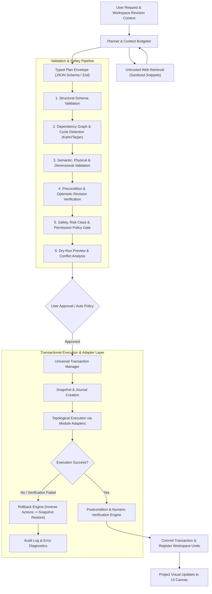

# ADIA Autonomous Engineering AI Copilot - System Design & Safety Specification (v2.1)

**Date**: 2026-08-18  
**Status**: Approved Architecture & Safety Specification - Implementation-Ready  
**Scope**: End-to-End Autonomous Engineering Copilot (Normalized LLM Provider Abstraction + Untrusted Retrieval Defense-in-Depth + Asynchronous Adapter Architecture + Transactional Journaling & Rollback + Physical/Signal Domain Semantics + Security & HIL Safety Interlocks + Formal Engineering Acceptance Criteria)

---

## 1. Executive Summary & Architectural Goals
The objective of this specification is to establish an institutional-grade, robust, and safe **Autonomous Engineering Copilot** embedded inside the ADIA suite. The copilot transforms high-level engineering intents (e.g., *"Design and simulate a 220V 50Hz single-phase SPWM Inverter with LC output filter, 5% THD limit, resistive load, and voltage regulation"*) into verifiable, physical- and signal-consistent domain models and executable actions without relying on paid APIs or unconstrained model execution.

### Key Tenets
1. **Zero Unvalidated Mutations**: LLM output is untrusted input. No module state mutation occurs directly from JSON. All commands pass through structural, semantic, dimensional, policy, and dry-run validation pipelines.
2. **Transactional & Reversible Execution**: Multi-step plans execute as atomic dependency graphs with automatic rollback, inverse-action generation, idempotency keys, and full integration into the workspace Undo/Redo stack.
3. **Domain Model as Source of Truth**: UI rendering (such as ReactFlow nodes/edges) is strictly a projection of underlying domain models (X-Bridges physical/signal networks, SysML metamodels, Stateflow ASTs, DOE matrices).
4. **Physical vs. Signal Semantic Separation**: Conserving electrical/physical ports and directional signal flows are strictly typed with dimensional analysis.
5. **Zero-Cost & Air-Gapped / Privacy First**: First-class support for local LLM engines (Ollama, LM Studio) and zero-cost cloud tiers (Gemini Free Tier), with an enforceable offline air-gapped profile, zero leaked secrets, and sandboxed web retrieval via Electron IPC.
6. **Hardware & Code Execution Safety**: Multi-tier risk classification, confirmation gates, emergency stop watchdogs, device-specific safe states, and sandboxed compilation for HIL and firmware generation.

---

## 2. System Architecture & The Execution Pipeline



---

## 3. Normalized LLM Provider & Capability Selection

### 3.1. Provider Abstraction Interface
To decouple ADIA from specific model names or commercial providers:
```typescript
export interface ProviderCapabilities {
  readonly maxContextTokens: number;
  readonly supportsGrammarConstraint: boolean;
  readonly supportsNativeToolCalling: boolean;
  readonly isLocalOffline: boolean;
  readonly streamingSupport: boolean;
}

export interface StructuredGenerationRequest {
  readonly systemPrompt: string;
  readonly userPrompt: string;
  readonly conversationHistory: Array<{ role: 'user' | 'assistant'; content: string }>;
  readonly temperature?: number;
  readonly maxOutputTokens?: number;
  readonly timeoutMs?: number;
}

export interface StructuredGenerationResult<T> {
  readonly success: boolean;
  readonly data?: T;
  readonly rawText: string;
  readonly usage: { promptTokens: number; completionTokens: number; totalTokens: number };
  readonly diagnostics: Diagnostic[];
  readonly isTruncated: boolean;
  readonly durationMs: number;
}

export interface ILLMProvider {
  readonly providerId: string;
  readonly modelId: string;
  readonly capabilities: ProviderCapabilities;

  generateStructured<T>(
    request: StructuredGenerationRequest,
    schema: any,
    signal: AbortSignal
  ): Promise<StructuredGenerationResult<T>>;
}
```

### 3.2. Hybrid Capability Discovery & Context Budgeting
Instead of flooding the LLM context with full schemas of every tool in ADIA:
1. **Deterministic & Contextual Routing**: Evaluates active workspace modules and query keywords (e.g., query about "Inverter with LC filter" activates `xbridges`, `physical_components`, and `reporting`, while keeping `doe` and `hil` unloaded).
2. **Dynamic Capability Pruning**: Injects only the relevant subset of Block Definitions and Action Schemas into the prompt.
3. **Workspace Summarization**: Compresses existing project state to essential topology graphs (UUIDs, types, connected terminals) rather than raw UI layouts.
4. **Repair Loop**: If structured output fails schema validation, up to 2 targeted repair loops are executed with precise schema diagnostics before returning a structured error.

---

## 4. Untrusted Web Retrieval & Defense-in-Depth

### 4.1. Search Provider & Isolation Boundary
- **Transport**: Executed exclusively in the Electron Main Process via IPC `search-web-provider` using headless DuckDuckGo / Open Source Search fallback with strict timeouts (5000ms), deduplication, and domain allowlists.
- **Renderer & Network Protections**:
  - `contextIsolation: true`, `nodeIntegration: false`.
  - Content-type enforcement (HTML/Text only, binary/executable downloads blocked).
  - Private IP & DNS rebinding protection (blocks `127.0.0.1`, `10.0.0.0/8`, `192.168.0.0/16`, `169.254.0.0/16`).
  - Strict size limit: Max 32KB sanitized text per query.

### 4.2. Prompt-Injection Defenses
- **Out-of-Model Guardrails**: Retrieved web snippets are strictly tagged as `<untrusted_external_evidence>` and stripped of HTML/script payloads. The execution pipeline ignores any action that was not synthesized into a valid, schema-checked Action Plan.
- **Provenance Tracking**: Every externally derived parameter or formula retains provenance metadata:
```json
{
  "parameter": "inductor_sizing_formula",
  "formulaId": "SPWM_SINGLE_PHASE_LC_RIPPLE_V1",
  "applicableTopology": "FULL_BRIDGE_SPWM_BIPOLAR",
  "operatingRange": { "minModulation": 0.1, "maxModulation": 0.95 },
  "formulaText": "L = (V_dc) / (4 * f_sw * Delta_I_L_max)",
  "provenance": {
    "sourceUrl": "https://engineering.standards.org/inverter-design",
    "retrievalDate": "2026-08-18",
    "confidence": 0.95,
    "isInferred": true
  }
}
```

---

## 5. Formal Typed Action Protocol & Envelope Specification

### 5.1. The Plan Envelope Schema
Every response from the planner must conform to a strict, versioned discriminated union (`additionalProperties: false`):

```json
{
  "$schema": "https://adia.engineering/schemas/v1/ai-plan.json",
  "schemaVersion": "1.0.0",
  "planId": "plan_7f8a9e21",
  "projectId": "proj_inverter_01",
  "baseRevision": 42,
  "userMessage": "Designing and synthesizing 220V 50Hz SPWM Inverter topology with LC filter and scope instrumentation.",
  "designRationale": "Single-phase full-bridge topology selected for 220V AC output from 380V DC nominal bus (providing 15% modulation and loss headroom). SPWM modulation at 10kHz carrier frequency with 2nd order LC filter tuned to 1kHz cutoff frequency.",
  "assumptions": [
    "Input DC bus is nominal 380V DC supply (worst-case minimum 365V)",
    "Load is pure resistive 10 Ohm (rated ~4.8kW output)",
    "Inductor ripple current target is 20% of peak load current"
  ],
  "warnings": [
    "Simulation time-step must be <= 1e-6s for switched model or use variable-step stiff solver (Ode23t)"
  ],
  "actions": [
    {
      "actionId": "act_01",
      "idempotencyKey": "plan_7f8a9e21_act_01",
      "type": "XB_CREATE_BLOCK",
      "targetModule": "xbridges",
      "risk": "REVERSIBLE_MUTATION",
      "dependsOn": [],
      "onFailure": "ROLLBACK_PLAN",
      "preconditions": [
        { "type": "BLOCK_DOES_NOT_EXIST", "blockId": "dc_bus" }
      ],
      "expectedPostconditions": [
        { "type": "BLOCK_EXISTS", "blockId": "dc_bus" }
      ],
      "payload": {
        "blockId": "dc_bus",
        "blockType": "DC_VOLTAGE_SOURCE",
        "label": "DC Bus (380V)",
        "parameters": {
          "nominalVoltage": { "value": 380.0, "unit": "V" },
          "minimumAllowedVoltage": { "value": 363.0, "unit": "V" },
          "tolerance": { "value": 5.0, "unit": "%" }
        }
      }
    },
    {
      "actionId": "act_02",
      "idempotencyKey": "plan_7f8a9e21_act_02",
      "type": "XB_CREATE_BLOCK",
      "targetModule": "xbridges",
      "risk": "REVERSIBLE_MUTATION",
      "dependsOn": [],
      "onFailure": "ROLLBACK_PLAN",
      "payload": {
        "blockId": "sine_ref",
        "blockType": "WAVEFORM_GENERATOR",
        "label": "Sine Ref (50Hz)",
        "parameters": {
          "waveformType": "Sine",
          "frequency": { "value": 50.0, "unit": "Hz" },
          "modulationIndex": { "value": 0.85, "unit": "1" },
          "offset": { "value": 0.0, "unit": "1" }
        }
      }
    },
    {
      "actionId": "act_02_modulator",
      "idempotencyKey": "plan_7f8a9e21_act_02_modulator",
      "type": "XB_CREATE_BLOCK",
      "targetModule": "xbridges",
      "risk": "REVERSIBLE_MUTATION",
      "dependsOn": [],
      "onFailure": "ROLLBACK_PLAN",
      "payload": {
        "blockId": "spwm_modulator",
        "blockType": "SPWM_GENERATOR",
        "label": "SPWM Carrier Modulator (10kHz)",
        "parameters": {
          "carrierFrequency": { "value": 10000.0, "unit": "Hz" },
          "deadTime": { "value": 1.5e-6, "unit": "s" }
        }
      }
    },
    {
      "actionId": "act_03",
      "idempotencyKey": "plan_7f8a9e21_act_03",
      "type": "XB_CONNECT_PORTS",
      "targetModule": "xbridges",
      "risk": "REVERSIBLE_MUTATION",
      "dependsOn": ["act_02", "act_02_modulator"],
      "onFailure": "ROLLBACK_PLAN",
      "payload": {
        "connectionId": "conn_sine_to_pwm",
        "sourceBlockId": "sine_ref",
        "sourcePortId": "out_signal",
        "targetBlockId": "spwm_modulator",
        "targetPortId": "in_modulation",
        "domainType": "SIGNAL_FLOW"
      }
    }
  ]
}
```

---

## 6. Action Risk Classes & Transaction Boundaries

### 6.1. Risk Classifications & Policies
Every action is tagged with a mandatory `risk` level:

| Risk Class | Description | Examples | Execution Policy |
|---|---|---|---|
| `READ_ONLY` | Non-mutating queries, metric calculations, lint checks | `INSPECT_MODEL`, `CALCULATE_METRICS`, `VALIDATE_INTEGRITY` | Auto-executed silently |
| `REVERSIBLE_MUTATION` | Creating/modifying blocks, variables, transitions, factors | `XB_CREATE_BLOCK`, `XB_CONNECT_PORTS`, `STATE_CREATE`, `DOE_CONFIGURE` | Auto-executed with Snapshot + Undo registration |
| `DESTRUCTIVE_MUTATION` | Deleting entire subsystems, clearing workspace, overwriting model files | `CLEAR_WORKSPACE`, `DELETE_SUBSYSTEM`, `OVERWRITE_PROJECT` | Requires explicit user confirmation dialog |
| `EXTERNAL_FILE_EXPORT`| Generating files or exporting data outside the model | `EXPORT_CSV`, `REPORT_GENERATE_DOCUMENT` | Best-effort compensation (file cleanup) |
| `CODE_COMPILATION` | Invoking GCC toolchains, compiling Arduino sketch | `BUILD_ARDUINO_FIRMWARE`, `GENERATE_C_CODE` | Sandboxed execution in scratch directory, allowlisted binaries |
| `HARDWARE_COMMUNICATION`| Serial port opening, Factory I/O gateway binding | `CONNECT_SERIAL_DEVICE`, `BIND_FACTORY_IO` | Requires user confirmation of device & baud; non-reversible side-effect barrier |
| `HARDWARE_ACTUATION` | Driving physical output pins, real-time HIL actuation | `SYNC_HIL_PINS`, `START_HIL_STREAMING` | Hard interlocked: requires safety confirmation, deadman watchdog, emergency stop binding |

### 6.2. Irreversible Side Effects & Commit Barriers
Actions with irreversible side effects (e.g. `HARDWARE_ACTUATION`, flashing firmware) must be separated by a **Commit Barrier**. The transaction manager commits all preceding domain mutations to the workspace before proceeding to hardware actuation, preventing inconsistent state rollbacks.

---

## 7. Transactional Execution, Rollback & Undo Integration

### 7.1. Dependency Graph & Deterministic Kahn/Tarjan Ordering
Before executing any action:
1. **Strongly Connected Component (SCC) Detection**: Run Tarjan's algorithm on the action graph. If any SCC has $>1$ vertex or a self-loop, reject the plan immediately with `AI_PLAN_CYCLIC_DEPENDENCY`.
2. **Topological Sort**: Execute Kahn's algorithm with deterministic tie-breaking (ordered by original plan index, then lexicographical `actionId`).
3. **Resource Conflict Detection**: Verify that parallel actions within the same tier do not share conflicting read/write sets.

### 7.2. Snapshot & 7-Stage Rollback Hierarchy
```text
State Transitions:
CREATED -> VALIDATED -> APPROVED -> EXECUTING -> COMMITTED
                                 -> ROLLING_BACK -> ROLLED_BACK
                                 -> RECOVERY_REQUIRED
```

1. **Pre-Validation**: Validate complete plan DAG and entity references before any state mutation.
2. **Transaction Journaling**: Record plan metadata and idempotency keys (`planId + actionId`).
3. **Snapshot Creation**: Serialize affected module state deltas in memory.
4. **Step-by-Step Execution**: Record actual outputs and mutation tokens.
5. **Inverse-Action Application**: If action $k$ fails, execute adapter inverse actions for steps $k-1 \dots 1$.
6. **Snapshot Fallback**: If inverse actions fail, restore the full in-memory snapshot.
7. **Post-Restoration Verification**: Verify restored state integrity. If integrity verification fails, transition to `RECOVERY_REQUIRED` and alert user.
8. **Undo/Redo Stack**: Wrap successful executions as single named Undo steps (`Ctrl+Z`).

---

## 8. Domain Model vs. Visual Projection & Dimensional Semantics

### 8.1. Separation of Domain Model and UI Visuals
- The **Domain Model** is the authoritative source of truth:
  - Component definitions, unique UUIDs, component types.
  - Strictly typed terminals: **Signal Ports** (scalar/vector floats, booleans) vs. **Conserving Physical Ports** (Electrical positive/negative pins, thermal nodes, mechanical rotational ports).
  - Physical parameters with verified units and tolerances.
- The **UI Visualizer** (ReactFlow) projects the domain model to coordinates using deterministic layout algorithms without mutating the engineering model. User-locked nodes are preserved.

### 8.2. Dimensional Analysis Engine
- Controlled Unit Registry with canonical SI dimension exponent vectors:
  $$\text{Dimension} = [M, L, T, I, \Theta, N, J]$$
- Verifies dimensional compatibility (e.g. $[I^1 \cdot T^1]$ for Charge $\neq [M^1 \cdot L^2 \cdot T^{-3} \cdot I^{-1}]$ for Voltage).
- Supports dimensionless quantities (`unit: "1"`), percentages (`%`), and automatic SI prefix scaling ($2.2\mu\text{F} \to 2.2 \times 10^{-6}\text{F}$).

---

## 9. Modular Adapter Architecture (`AIModuleAdapter`)

Each ADIA module implements the asynchronous adapter interface:

```typescript
export interface Diagnostic {
  readonly code: string;
  readonly severity: 'ERROR' | 'WARNING' | 'INFO';
  readonly message: string;
  readonly actionId?: string;
  readonly entityId?: string;
  readonly fieldPath?: string;
  readonly expected?: unknown;
  readonly actual?: unknown;
  readonly remediation?: string;
}

export interface ValidationResult {
  readonly isValid: boolean;
  readonly diagnostics: Diagnostic[];
}

export interface ActionPreview {
  readonly entitiesToCreate: string[];
  readonly entitiesToUpdate: string[];
  readonly entitiesToDelete: string[];
  readonly parameterChanges: Array<{ entityId: string; param: string; from: any; to: any }>;
  readonly riskClass: string;
  readonly diagnostics: Diagnostic[];
}

export interface VerificationResult {
  readonly isVerified: boolean;
  readonly diagnostics: Diagnostic[];
  readonly metrics?: Record<string, number>;
}

export interface ExecutionContext {
  readonly projectId: string;
  readonly workspaceRevision: number;
  readonly isDryRun: boolean;
  readonly abortSignal: AbortSignal;
}

export interface AIModuleAdapter<TAction = any, TResult = any> {
  readonly moduleName: string;
  validate(action: TAction, context: ExecutionContext): Promise<ValidationResult>;
  preview(action: TAction, context: ExecutionContext): Promise<ActionPreview>;
  execute(action: TAction, context: ExecutionContext): Promise<TResult>;
  verify(action: TAction, result: TResult, context: ExecutionContext): Promise<VerificationResult>;
  rollback(result: TResult, context: ExecutionContext): Promise<void>;
}
```

### Module Traceability & Capability Matrix

| Module Name | Adapter Class | Registered Actions | Domain Entity Mutated | Rollback Mechanism |
|---|---|---|---|---|
| **X-Bridges** | `XBridgesModuleAdapter` | `XB_CREATE_BLOCK`<br/>`XB_CONNECT_PORTS`<br/>`XB_SET_PARAM`<br/>`XB_DELETE_BLOCK`<br/>`XB_RUN_SIMULATION` | `XBlockNode`, `XEdge`, `XModelTopology` | Node removal / parameter restoration / stop ODE solver |
| **SysML** | `SysmlModuleAdapter` | `SYSML_CREATE_BLOCK`<br/>`SYSML_ADD_PORT`<br/>`SYSML_CONNECT_PORTS`<br/>`SYSML_CREATE_IBD` | `SysMLBlock`, `SysMLPort`, `SysMLConnector` | Element deletion / connector detachment |
| **Stateflow** | `StateflowModuleAdapter` | `STATE_CREATE`<br/>`STATE_CONNECT_TRANSITION`<br/>`VARIABLE_CREATE`<br/>`JUNCTION_CREATE` | `StateNode`, `Transition`, `VariableDefinition` | State pruning / transition cleanup |
| **DOE** | `DoeModuleAdapter` | `DOE_CONFIGURE_FACTORS`<br/>`DOE_RUN_RSM`<br/>`DOE_RUN_GMDH`<br/>`DOE_RUN_TAGUCHI` | `DoeFactor[]`, `DoeResponse`, `DoeModelData` | Factor array revert / model cache reset |
| **3D & V-Lab** | `VLabModuleAdapter` | `VLAB_LOAD_ASSET`<br/>`VLAB_BIND_ACTUATOR`<br/>`VLAB_TRIGGER_PHYSICS` | `ThreeDXScene`, `ActuatorBinding` | Asset unbind / physics reset |
| **HIL & Hardware** | `HilModuleAdapter` | `HIL_MAP_PINS`<br/>`HIL_START_STREAMING`<br/>`HIL_EMERGENCY_STOP` | `HilPinConfig`, `SerialStreamChannel` | Output safe-state / channel shutdown |
| **Code Generation**| `CodeGenModuleAdapter` | `CODEGEN_EXPORT_C`<br/>`CODEGEN_BUILD_FIRMWARE`<br/>`CODEGEN_EXPORT_SIMULINK` | Disk artifacts in `scratch/build/` | Build artifact deletion |
| **Reports** | `ReportModuleAdapter` | `REPORT_GENERATE_DOCUMENT` | Output PDF/Markdown file | Document file deletion |

---

## 10. Objective Engineering Acceptance Criteria (e.g. Inverter Topology)

When the Copilot synthesizes an engineering system (such as the SPWM Inverter), postcondition verification must pass rigorous numerical and physical procedures:

### 10.1. Inverter Sizing & Consistency Verification:
1. **DC Bus Voltage Verification**:
   $$V_{dc\_nom} \ge \frac{\sqrt{2} \cdot V_{rms\_out}}{m_{max}} \cdot (1 + \text{Margin}_{loss}) = \frac{\sqrt{2} \cdot 220}{0.90} \cdot 1.05 \approx 363\text{V} \implies V_{dc\_nom} = 380\text{V}$$
   *Rule: Plans with $V_{dc} < 363\text{V}$ for $220\text{V}_{rms}$ are rejected with `AI_PLAN_INSUFFICIENT_DC_BUS`.*
2. **LC Filter Sizing & Resonance Verification**:
   - Inductance $L$: Calculated for ripple current $\Delta I_{L\_max} \le 0.20 \cdot I_{load\_peak}$.
   - Cutoff Frequency $f_c$: Must satisfy $10 \cdot f_{fundamental} \le f_c \le 0.10 \cdot f_{switching}$ ($500\text{Hz} \le f_c \le 1000\text{Hz}$).
   - Damping: Passive/active damping verification to prevent resonance peaking under varying load power factors ($0.8 \text{ lagging} \dots 1.0$).

### 10.2. Simulation Verification Procedure & Measurement Standards:
- **Discard Interval**: First 5 cycles (100ms) discarded to eliminate startup transients.
- **Measurement Window**: 10 fundamental cycles (200ms) in steady-state.
- **Sampling Frequency**: $f_s \ge 100\text{kHz}$ with FFT binning up to the 50th harmonic (2500Hz).
- **Pass Criteria**:
  - RMS Voltage: $220\text{V}_{rms} \pm 2\%$.
  - Fundamental Frequency: $50\text{Hz} \pm 0.5\%$.
  - Total Harmonic Distortion ($\text{THD}_v$): $\le 5.0\%$ under rated resistive/inductive load.
  - Solver Convergence: Zero `NaN`/`Inf` errors with energy balance error $< 0.1\%$.

---

## 11. Security, Sandbox & HIL Safety Specifications

### 11.1. Secret Storage & Enforced Offline Air-Gapped Profile
- API keys (if Gemini or OpenRouter are used) are encrypted via Electron `safeStorage` / OS credential vaults and persisted only in protected configuration areas.
- **Enforced Offline Profile**: When local mode is active, all outbound network calls are hardware-blocked by Electron session filters, and an active "Air-Gapped Local Mode" badge is displayed.

### 11.2. HIL Safety, Watchdog & Device-Configured Safe States
- **Read-Only Commissioning**: HIL starts in passive monitoring mode. Driving physical pins requires explicit confirmation.
- **Device-Specific Safe States**: Each channel is configured for its specific safe condition (e.g. Active-Low shutdown, PWM disable, brake engage, contactor open) rather than generic high-impedance.
- **Real-Time Watchdog**: Device-level deadman timer with safety heartbeat. If communication drops for $>100\text{ms}$ (or application watchdog fails), target device immediately forces hardware safe state.
- **Software Stop**: Top-level UI stop button mapped to immediate IPC abort.

### 11.3. Code Generation & Toolchain Sandbox
- All compilation tasks (`avr-gcc`, `arm-none-eabi-gcc`, `clang`) execute in isolated scratch subdirectories (`<workspace>/scratch/build/<task-id>/`) with strict argument allowlists to prevent shell injection or directory traversal.

---

## 12. Verification & Testing Strategy

### 12.1. Test Suites Matrix
1. **Schema & Fuzzing Tests (`aiActionProcessor.test.ts`)**:
   - Validate discriminated union parsing against malformed JSON, unknown actions, and extra properties.
   - Test Kahn/Tarjan dependency cycle detection and topological sorting.
2. **Transactional & Rollback Tests (`transactionManager.test.ts`)**:
   - Simulate partial failure at step 4 of 6 and verify that steps 1–3 are completely reverted.
   - Test Undo/Redo integration with React state.
   - Verify revision mismatch rejection (optimistic locking).
3. **Domain & Dimensional Tests (`dimensionalAnalysis.test.ts`)**:
   - Test unit compatibility, prefix conversions, and conservation port typing.
4. **Module Adapter Conformance Tests**:
   - Conformance test harness validating `XBridgesModuleAdapter`, `SysmlModuleAdapter`, `StateflowModuleAdapter`, and `DoeModuleAdapter`.
5. **Security, IPC & Air-Gap Tests**:
   - Verify SSRF protection, prompt injection evidence isolation, and network denial in offline profile.
6. **Engineering Benchmark Tests**:
   - Synthesize reference topologies (SPWM Inverter, Buck Converter, PID Closed-Loop Control, Stateflow Traffic Controller) and verify numerical convergence and tolerances against golden benchmarks.

---

## 13. Implementation Roadmap (10 Phases)

1. **Phase 1**: Core Contracts, Structured Diagnostics, Capability Registry, and Provider Normalizer.
2. **Phase 2**: Action Plan Envelope, Zod/JSON Schemas, and Kahn/Tarjan Dependency Topo-Sorter.
3. **Phase 3**: Universal Transaction Manager, Snapshot/Inverse-Action Rollback Engine, and Undo Stack Bridge.
4. **Phase 4**: Adapter Conformance Test Harness & Reference X-Bridges Adapter.
5. **Phase 5**: Dimensional Analysis Engine & Physical vs Signal Port Semantics.
6. **Phase 6**: SysML, Stateflow, and DOE Adapters.
7. **Phase 7**: Electron IPC Web Search Retrieval with SSRF/Prompt-Injection Defense-in-Depth.
8. **Phase 8**: Code Generation Sandbox & External Side-Effect Commit Barriers.
9. **Phase 9**: V-Lab 3D & HIL Hardware Safety Architecture with Real-Time Watchdogs.
10. **Phase 10**: System-Level Golden Engineering Benchmarks & Automated Acceptance Suite.
