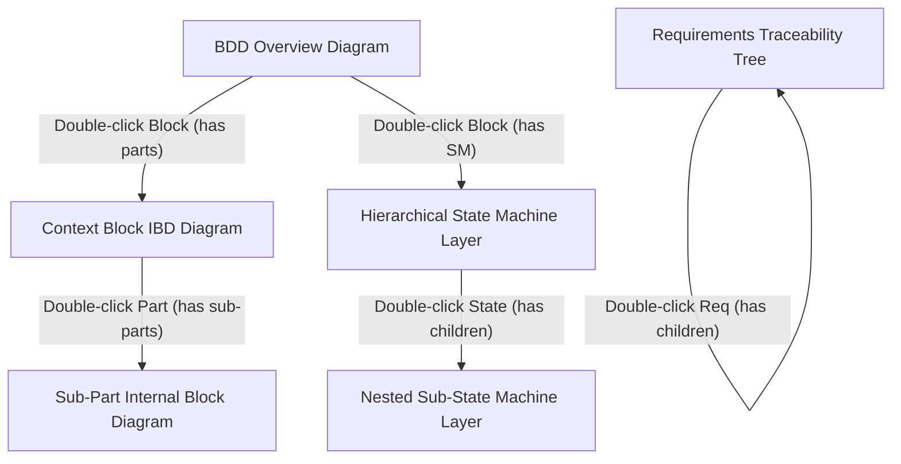

# ADAI Report Generation — Interactive Diagrams, Connection Routing & Multi-Layer Drill-Down Specification

**Date**: 2026-08-30  
**Status**: Approved  
**Target Areas**: `src/App.tsx`, `src/features/reporting/`, `src/components/reporting/`

---

## 1. Executive Summary & Problem Statement

In the ADAI report generation workflow:
1. **Missing / Incomplete Diagram Connections**: Block Definition Diagram (BDD) relationships (composition, generalization, aggregation, associations) and Internal Block Diagram (IBD) port-to-port connectors were either not rendered with accurate markers, had dropped labels, or lacked clear orthogonal routing.
2. **Static & Non-Interactive Diagrams**: Diagrams in the generated report lacked deep drill-down interactivity. Users could not explore the hierarchical architecture (e.g., drilling down into a block's internal structure or a state's sub-state machine).
3. **Modal Preview Sanitization**: When previewing reports inside `GlobalReportPreviewModal`, DOMPurify stripped inline event handlers, disabling dynamic interaction.

This specification defines the complete architecture for:
- Full SysML connection rendering and marker support across BDD, IBD, and Stateflow diagrams.
- An interactive in-place drill-down engine that opens the next hierarchical layer on double-click with breadcrumb navigation.
- Seamless execution in both the app's Report Preview Modal and standalone exported `.html` files.

---

## 2. Multi-Layer Hierarchical Architecture

### 2.1 Hierarchy Mapping Model



### 2.2 Layer Resolution Rules
- **BDD Block $\rightarrow$ IBD Layer**: Triggered if `parts.some(p => p.blockId === block.id)` or `block.ports.length > 0`. Renders internal parts, port buses, and connectors for that context block.
- **IBD Part $\rightarrow$ Sub-IBD Layer**: Triggered if `parts.some(p => p.blockId === part.typeId)`. Renders the internal structural composition of the component type.
- **State Machine State $\rightarrow$ Sub-State Layer**: Triggered if `layers.some(l => l.parentStateId === state.id)` or `state.children.length > 0`. Renders the active sub-state region, internal transitions, and history junctions.
- **Requirements $\rightarrow$ Decomposed Requirements**: Shows child derived/refined requirements and verified SysML blocks.

---

## 3. Connection Routing & Visual Standards

### 3.1 SysML Block Definition Diagram (BDD) Relationships
| Relationship Type | Line Style | Start Marker | End Marker | Label Format |
|---|---|---|---|---|
| **Composition** | Solid `#334155` (1.5px) | Filled Diamond (`rf-diamond-filled`) | None | Multiplicities (`1`, `1..*`) |
| **Aggregation** | Solid `#334155` (1.5px) | Hollow Diamond (`rf-diamond-hollow`) | None | Multiplicities (`0..1`, `*`) |
| **Generalization** | Solid `#334155` (1.5px) | None | Hollow Triangle (`rf-triangle-hollow`) | None |
| **Derive / Satisfy / Verify / Trace** | Dashed `4,2` (`#546e7a`) | None | Open Arrowhead (`rf-arrow`) | `«derive»`, `«satisfy»`, `«verify»`, `«trace»` |
| **Allocation** | Dashed `5,5` (`#546e7a`) | None | Open Arrowhead (`rf-arrow`) | `«allocate»` |
| **Association** | Solid `#334155` (1.5px) | None | None / Open Arrow | Label + Multiplicities |

### 3.2 Internal Block Diagram (IBD) Connections
- **Port-to-Port Manhattan Routing**: Deterministic orthogonal paths connecting source port pins to target port pins without overlapping part node boxes.
- **Item Flow Badges**: Styled rounded pills (e.g. `«TemperatureSensorBus»`, `«PWM_Drive_Signal»`) centered along the connector path.
- **Context Boundary Frame**: Outer dashed rounded rectangle representing the containing block with external boundary ports and item flow pass-throughs.

### 3.3 State Machine Transitions
- **Curved Bézier Paths**: Smooth quadratic curves with filled arrowheads (`#f97316` / `#334155`).
- **Transition Payloads**: Styled pills displaying `[guard_condition]` in brackets and `/action_payload` in monospace.

---

## 4. Interactive Navigation & UI Mechanics

### 4.1 Diagram Card Anatomy
Each diagram in the report is rendered inside an interactive container:
```html
<div class="diagram-card" id="diagram-container-xyz">
  <!-- Top Navigation Header -->
  <div class="diagram-header">
    <div class="diagram-breadcrumbs">
      <button class="diagram-back-btn" onclick="diagramNavBack('xyz')">⬅ Back</button>
      <span class="crumb" onclick="diagramNavJump('xyz', 0)">BDD Root</span>
      <span class="crumb-sep">/</span>
      <span class="crumb active">ThermalSystem [IBD]</span>
    </div>
    <div class="diagram-controls">
      <button onclick="diagramZoom('xyz', 1.2)">➕ Zoom</button>
      <button onclick="diagramZoom('xyz', 0.8)">➖ Zoom</button>
      <button onclick="diagramResetZoom('xyz')">↺ Reset</button>
      <button onclick="diagramFullscreen('xyz')">⛶ Fullscreen</button>
    </div>
  </div>

  <!-- Interactive SVG Canvas with Double-Click Handlers -->
  <div class="diagram-body" id="diagram-canvas-xyz">
    <svg ...>
      <!-- Clickable/Double-Clickable Node Groups -->
      <g class="node-group has-layer" ondblclick="diagramDrillDown('xyz', 'block-123')">
        <rect ... />
        <text ...>Controller</text>
        <g class="drilldown-badge"><text>⧉ Double-click to open IBD</text></g>
      </g>
    </svg>
  </div>
  
  <div class="diagram-footer-hint">
    💡 Double-click any block, part, or state with ⧉ to explore its internal layer. Drag to pan, scroll to zoom.
  </div>
</div>
```

### 4.2 Pan & Zoom Engine
- Interactive mouse-wheel zoom (from 0.2x to 5.0x).
- Click-and-drag panning.
- High-definition vector scaling with sharp text and crisp lines at any zoom level.

### 4.3 Hover Trace Glow
- Hovering over any connection line highlights the edge with `#f97316` glowing drop shadow and temporarily elevates the source and destination port pins.

---

## 5. Report Preview & Standalone Export Pipeline

1. **In-App Report Preview Modal (`GlobalReportPreviewModal`)**:
   - Uses a self-contained iframe srcdoc / sandbox bridge to host the report document.
   - Preserves full event execution (double-clicks, zoom, pan, drill-down) while preventing main application state pollution.
2. **Offline HTML Export**:
   - Produces a single, self-contained `.html` file with embedded styles, vector definitions, and navigation engine.
   - Zero internet access or CDN scripts required.
3. **Word (.doc) & PDF Export**:
   - Exports high-resolution rasterized/vectorized snapshots of top-level diagrams and full tabular traceability matrices.

---

## 6. Verification & Test Plan

1. **Unit & Rendering Tests (`reportDiagrams.test.ts`, `reportDiagramLayout.test.ts`)**:
   - Validate BDD connection SVG output for composition, aggregation, generalization, and dependencies.
   - Validate IBD orthogonal connector routing for multiple parallel and cross connectors.
   - Validate layer hierarchy tree generator.
2. **Interactivity & Integration Tests**:
   - Verify double-click events switch diagram layer contexts accurately.
   - Verify breadcrumb path updates and back navigation restores prior view state.
   - Verify standalone HTML export file executes cleanly without browser console errors.
