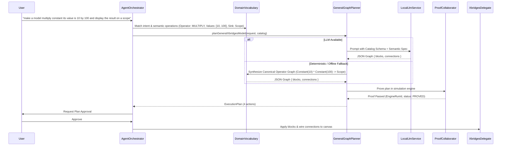

# Design Document: Generic Dynamic Synthesizer & Comprehensive Domain Vocabulary for X-Bridges

**Date:** 2026-09-20  
**Status:** In Review (Brainstorming & Design Phase)  
**Author:** ADIA Core Agent Team  

---

## 1. Objective & Problem Statement

### 1.1 The Problem
When a user asks for general engineering or mathematical operations—such as:
```text
"make a model multiply constant its value is 10 by 100 and display the result on a scope"
```
The agent previously fell back to a simplistic 2-block graph (`Constant` $\to$ `Scope`), ignoring the multiplication operation. This was caused by relying on a static, rigid list of keyword `if/else` archetypes.

### 1.2 The Goal
1. **Comprehensive Domain Vocabulary:** Build a rich, multi-domain semantic dictionary that maps engineering keywords, synonyms, operators, and natural language verbs across all X-Bridges domains to their exact block definitions, port semantics, and parameters.
2. **Dynamic Graph Synthesizer (Option A):** Implement a zero-shot, dynamic graph synthesis engine that takes arbitrary natural language prompts, matches them against the full active X-Bridges catalog, and constructs valid, connected block diagrams (`blocks` + `connections`) without relying on hardcoded keyword branches.
3. **Resilient Dual-Engine Execution:**
   - **Primary:** Local LLM guided by the catalog capability index and semantic vocabulary.
   - **Deterministic Fallback:** Robust semantic operator graph builder that resolves math expressions, signal routing, and control loops even when the LLM is offline or in loopback.
   - **Simulation Proof Gate:** Every synthesized model is verified in the isolated X-Bridges simulation engine before presenting to the user.

---

## 2. Multi-Domain Semantic Vocabulary Architecture

We define `src/services/ai/catalog/xbridgesDomainVocabulary.ts`, establishing semantic bindings across all 12 X-Bridges domains:

### 2.1 Domain Vocabulary Breakdown

| Domain | Canonical Blocks | Natural Language Keywords & Operators | Typical Connection Semantics |
|---|---|---|---|
| **Elementary Math & Arithmetic** | `VectorAdd`, `VectorSub`, `VectorMul`, `VectorDiv`, `VectorPow`, `Abs`, `UnaryNeg`, `Sum` | `add`, `plus`, `sum`, `subtract`, `minus`, `difference`, `multiply`, `product`, `times`, `by`, `divide`, `quotient`, `over`, `power`, `squared`, `sqrt`, `abs`, `magnitude`, `negate` | Sources (`Constant`, `Step`) $\to$ Math Block (`in1`, `in2`) $\to$ Sink (`Scope`, `Display`) |
| **Signal Sources** | `Constant`, `Step`, `WaveformGen`, `Clock`, `Sine` | `constant`, `step`, `source`, `generator`, `sine`, `cosine`, `wave`, `clock`, `bias`, `dc`, `setpoint`, `input` | Output (`out`) connected to downstream processing or plant |
| **Calculus & Dynamic Systems** | `Integrator`, `TRANSFER_FUNCTION`, `Gain`, `STATE_SPACE` | `integrate`, `integrator`, `integral`, `transfer function`, `state space`, `continuous`, `plant`, `poles`, `zeros`, `damping`, `natural frequency`, `differential` | Input $\to$ Plant (`in`) $\to$ Output (`out`) $\to$ Sink |
| **Filters & Signal Processing** | `TRANSFER_FUNCTION`, `LMS_ADAPTIVE_FILTER` | `filter`, `lowpass`, `highpass`, `bandpass`, `noise reduction`, `cutoff`, `attenuation`, `smoothing` | Signal Source $\to$ Filter $\to$ Sink |
| **Linear Algebra** | `MatrixMul`, `Transpose`, `Inverse`, `Determinant` | `matrix multiply`, `dot product`, `transpose`, `invert matrix`, `determinant`, `vector transformation` | Matrices $\to$ LinAlg Block $\to$ Output |
| **Nonlinear & Discontinuities** | `SATURATION`, `DEADZONE`, `RATE_LIMITER`, `RELAY` | `saturate`, `clamp`, `limit`, `deadzone`, `deadband`, `rate limiter`, `ramp rate`, `relay`, `hysteresis`, `threshold` | Plant control signal $\to$ Limiter $\to$ Actuator |
| **Digital Logic** | `AND`, `OR`, `NOT`, `NAND`, `NOR`, `XOR` | `and`, `or`, `not`, `xor`, `nand`, `nor`, `logic gate`, `boolean`, `truth table`, `interlock` | Binary inputs $\to$ Logic gates $\to$ Latch / Output |
| **Sequential & Timing** | `DFlipFlop`, `JKFlipFlop`, `Register`, `Counter`, `Clock` | `flip flop`, `latch`, `register`, `counter`, `clock divider`, `sequence`, `state machine`, `memory` | Clock + Data $\to$ Sequential $\to$ State out |
| **Feedback Control** | `PID_CONTROLLER`, `Sum`, `Gain`, `Integrator` | `pid`, `proportional`, `integral`, `derivative`, `closed loop`, `feedback`, `error`, `setpoint`, `tuning`, `kp`, `ki`, `kd` | Setpoint & Feedback $\to$ `Sum` (error) $\to$ `PID` $\to$ Plant $\to$ Feedback loop |
| **Power Electronics & Inverters** | `THREE_PHASE_INVERTER`, `DC_VOLTAGE_SOURCE`, `THREE_PHASE_LOAD`, `SINGLE_PHASE_H_BRIDGE` | `inverter`, `three phase`, `3 phase`, `h-bridge`, `dc bus`, `converter`, `switching`, `vfd`, `rectifier` | DC Source $\to$ Inverter $\to$ 3-Phase Load |
| **Modulation & Transforms** | `PWM_GENERATOR`, `THREE_PHASE_PWM`, `CLARKE_TRANSFORM`, `PARK_TRANSFORM`, `INVERSE_PARK` | `pwm`, `svpwm`, `space vector`, `modulation`, `carrier`, `duty cycle`, `clarke`, `park`, `dq`, `alpha beta`, `foc` | Reference signals $\to$ Transform $\to$ PWM $\to$ Inverter |
| **Observability & Sinks** | `Scope`, `Display`, `Outport` | `scope`, `display`, `plot`, `show`, `monitor`, `observe`, `visualize`, `readout`, `graph`, `sink` | Receives signal at `in1` or `in` |

---

## 3. Dynamic Graph Synthesizer (Option A) Architecture

### 3.1 Synthesis Pipeline



### 3.2 Semantic Operator Graph Synthesizer (Deterministic Backbone)
When the user asks for mathematical expressions or pipelines (e.g., `A * B`, `A + B`, `A / B`, `gain * input`), the semantic synthesizer parses:
1. **Source Entities:** Identifies all numeric operands (`10`, `100`), signal types (`Constant`, `Step`, `Sine`), and their values.
2. **Operator Resolution:**
   - Multiplication of two signals $\to$ `VectorMul` (or `Product`) with inputs `in1`, `in2`.
   - Scaling a single signal by a constant $\to$ `Gain` (with `gain: 100`) or `VectorMul`.
   - Addition / Subtraction $\to$ `Sum` (with `signs: '++'` or `signs: '+-'`).
   - Division $\to$ `VectorDiv` with inputs `in1`, `in2`.
3. **Sink Resolution:** Identifies observer block (`Scope`, `Display`), wires the final operation output to the sink.
4. **Coordinate Placement:** Computes visually appealing non-overlapping layout:
   - Sources column: $x = 100$
   - Math / Processor column: $x = 450$
   - Observers / Sinks column: $x = 800$

---

## 4. Test & Verification Plan

### 4.1 Unit Tests
- `xbridgesDomainVocabulary.test.ts`: Verify that keywords across all 12 domains resolve to correct catalog blocks, operations, and port names.
- `generalGraphPlanner.test.ts`:
  - `multiply constant 10 by 100 and display on scope` synthesizes `Constant(10) & Constant(100) -> VectorMul/Product -> Scope`.
  - Scalar scaling synthesizes `Constant(10) -> Gain(100) -> Scope`.
  - Division, subtraction, and multi-operator expressions (`(A + B) * C`).

### 4.2 End-to-End Orchestrator Tests
- `agentOrchestrator.test.ts`: Complete lifecycle test for multiplication prompt with transaction approval, proof, and canvas placement.

---

## 5. User Review & Feedback

Does this design meet your vision for making the agent smart, broad, and deeply knowledgeable across all X-Bridges domains?
Once you approve, we will write the implementation plan and execute it step-by-step.
